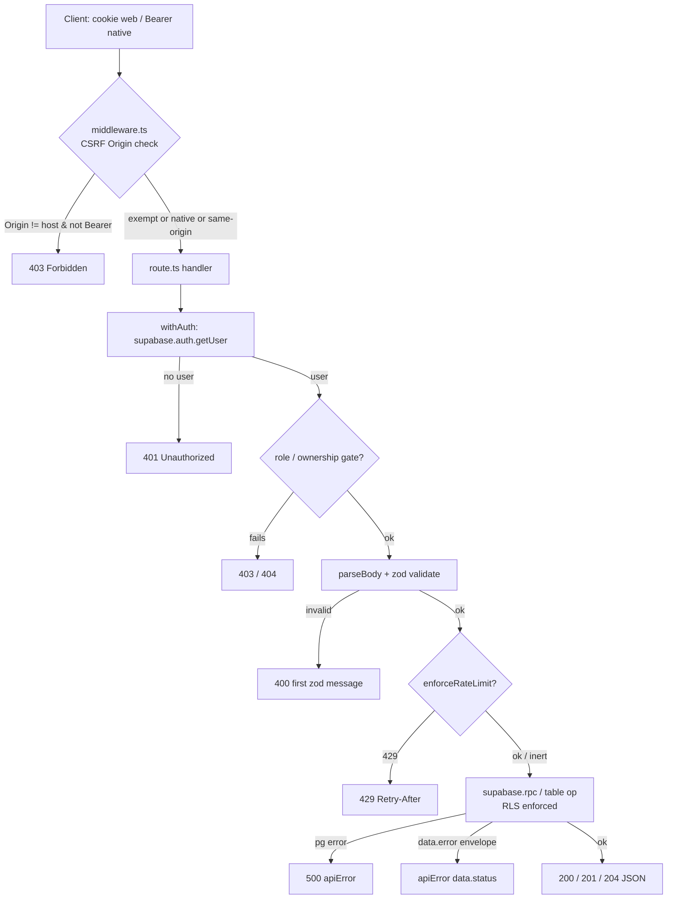

# API Routes
> The `src/app/api/*` HTTP surface: a thin layer that authenticates, validates, rate-limits, and delegates to Supabase RPCs/tables (RLS-enforced), with uniform JSON error shaping.

See [ARCHITECTURE](./ARCHITECTURE.md) for the system hub. This doc owns the shared request conventions and a complete route inventory. Auth session mechanics live in [AUTH](./AUTH.md); the web↔native plugin in [BRIDGE](./BRIDGE.md).

## Request lifecycle

Every mutating request (`POST/PATCH/PUT/DELETE`) takes the same path. The middleware does only a coarse CSRF Origin check; per-route auth, validation, and rate limiting happen inside the handler.

- CSRF gate: `src/middleware.ts:13`-`src/middleware.ts:29`.
- Auth gate: `src/lib/auth.ts:21`-`src/lib/auth.ts:28`.
- Validation: `src/lib/validators.ts:85`-`src/lib/validators.ts:101` (`parseBody`).
- Rate limit: `src/lib/rate-limit.ts:61`-`src/lib/rate-limit.ts:83`.
- Error shaping: `src/lib/api-error.ts:3`-`src/lib/api-error.ts:12`.

Note the ordering is per-route and not uniform: some routes validate before rate-limiting (`src/app/api/friends/route.ts:19`-`src/app/api/friends/route.ts:22`), the send-message route rate-limits then authorizes the thread (`src/app/api/dm/[threadId]/route.ts:40`-`src/app/api/dm/[threadId]/route.ts:49`), and admin routes gate role first, then rate limit (`src/app/api/admin/coins/route.ts:23`-`src/app/api/admin/coins/route.ts:27`).

## Shared conventions

### Auth & ownership gates
`withAuth(handler)` wraps every protected route. It builds a Supabase client (`createClient()`), calls `supabase.auth.getUser()`, returns `401 {error:"Unauthorized"}` when no user, then awaits the dynamic `params` promise and invokes the handler with `{ user, supabase, params }` (`src/lib/auth.ts:11`-`src/lib/auth.ts:36`). The wrapper is generic over the params type, e.g. `withAuth<{ threadId: string }>` (`src/app/api/dm/[threadId]/route.ts:33`).

The `supabase` client passed to handlers is the **user-scoped** client (anon key + the caller's JWT/cookie), so all its queries run under that user's RLS policies — the route layer adds explicit gates *on top of* RLS, not instead of it. Layered gates, all in `src/lib/auth.ts`:
- `requireAdminRole` / `requireModeratorRole` — call the `user_has_role` RPC; return a `403` response (caller early-returns) or `null` to proceed (`src/lib/auth.ts:38`-`src/lib/auth.ts:50`, `src/lib/auth.ts:91`-`src/lib/auth.ts:103`). Used by `admin/coins/*` and `moderation/photos/*`.
- `hasSubscriberRole` — boolean, used by stripe checkout/subscribe to short-circuit already-premium users (`src/lib/auth.ts:130`-`src/lib/auth.ts:139`).
- `verifyThreadParticipant` — loads `dm_threads`, returns the row only if caller is `participant_1_id`/`participant_2_id`, else `null` → route returns `404` (`src/lib/auth.ts:52`-`src/lib/auth.ts:67`).
- `verifyFriendshipParticipant` — same pattern for `friendships` before the unfriend RPC (`src/lib/auth.ts:110`-`src/lib/auth.ts:128`).
- `isBlocked` — bidirectional `user_blocks` check, used by the call-invite path (`src/lib/auth.ts:69`-`src/lib/auth.ts:89`).

DM message edit/delete additionally enforce **sender ownership** (`message.sender_id !== user.id` → `403`) and a 15-minute edit window (`src/app/api/dm/[threadId]/[messageId]/route.ts:31`-`src/app/api/dm/[threadId]/[messageId]/route.ts:49`).

### Validation (zod)
Shared schemas live in `src/lib/validators.ts`; the helper `parseBody(request, schema)` reads JSON and returns `[data, null]` or `[null, NextResponse]` where the response is `400` with the first zod issue message (`src/lib/validators.ts:85`-`src/lib/validators.ts:101`). Usage idiom: `const [body, err] = await parseBody(...); if (err) return err;`.

Notable schemas: `usernameSchema` (3–20 chars, `[a-zA-Z0-9_]`), `profileUpdateSchema` (`.strict()`, bounded lengths, `avatar_url` must pass `isValidMediaUrl`), `dmMessageSchema` (trimmed 1–4000 chars, `text`/`image`, media URLs validated), `dmMessageEditSchema`, `coordsSchema` (lat/lng range), `moderationActionSchema` (reject requires a reason), `photoUpdateSchema` (`src/lib/validators.ts:7`-`src/lib/validators.ts:82`).

`src/lib/validation.ts` holds two synchronous primitives used directly in path-param routes: `isValidUUID` (regex, used to reject malformed dynamic segments with `400` before any DB hit) and `isValidMediaUrl` — which **whitelists a single Supabase storage host** `ttojvnwpnpuhkyjncwxn.supabase.co` over HTTPS only (`src/lib/validation.ts:7`-`src/lib/validation.ts:16`). A few routes still hand-roll validation instead of zod: `bots`, `coins/meeting`, `dm/[threadId]/call`, and `admin/coins` POST parse `request.json()` directly.

### Rate limiting
`enforceRateLimit(name, identifier)` uses Upstash Redis sliding-window limiters, keyed by `user.id`. It mirrors the role-gate contract: returns `null` (proceed) or a `429` response carrying `Retry-After`, `X-RateLimit-Limit`, `X-RateLimit-Remaining` headers (`src/lib/rate-limit.ts:61`-`src/lib/rate-limit.ts:83`). It is **fail-open and inert without Redis env vars** — if `UPSTASH_REDIS_REST_URL`/`_TOKEN` (or the `KV_REST_API_*` Vercel Marketplace aliases) are absent, or `.limit()` throws, it logs and returns `null`, so dev/CI/tests need no mocking (`src/lib/rate-limit.ts:12`-`src/lib/rate-limit.ts:30`, `src/lib/rate-limit.ts:78`-`src/lib/rate-limit.ts:82`).

Limits are defined in `src/lib/constants.ts:47`-`src/lib/constants.ts:52`:

| Name | Limit / window | Used by |
| --- | --- | --- |
| `sendMessage` | 30 / 60s | `POST /api/dm/[threadId]` |
| `friendRequest` | 20 / 60s | `POST /api/friends` |
| `coinMeeting` | 10 / 60s | `POST /api/coins/meeting` |
| `adminCoins` | 60 / 60s | `POST /api/admin/coins` |

Only these four abuse-prone endpoints are rate-limited. The high-frequency polling endpoints `location` and `nearby` **had their rate limiting removed** in commit `4ef95f6` ("perf: remove Redis rate limiting from high-frequency polling endpoints") — a Redis round-trip per poll was wasteful and auth + zod already protect them.

### Error shaping
`apiError(message, status, code?)` returns `NextResponse.json({ error, code? }, { status })` (`src/lib/api-error.ts:3`-`src/lib/api-error.ts:12`). The standard error envelope is `{ error: string, code?: string }`. Routes that predate `apiError` use inline `NextResponse.json({ error }, { status })` directly (e.g. `dm/[threadId]/[messageId]`, `dm/[threadId]/read`).

Many RPCs return a *soft* error envelope `{ error, message?, status? }` in `data` even when the PG call succeeds; the route forwards it with `data.status || 400` (e.g. `src/app/api/friends/route.ts:35`-`src/app/api/friends/route.ts:40`, `src/app/api/dm/threads/route.ts:31`-`src/app/api/dm/threads/route.ts:36`, `src/app/api/users/[userId]/block/route.ts:22`-`src/app/api/users/[userId]/block/route.ts:27`). Hard PG errors (`result.error`) are logged server-side and returned as `500`.

### Server secrets / service role
`createServiceClient()` builds a Supabase client with `SUPABASE_SERVICE_ROLE_KEY` — bypasses RLS — and must only be used server-side (`src/lib/supabase/server.ts:52`-`src/lib/supabase/server.ts:63`). Consumers:
- `account/delete` — soft-deletes the profile (`deleted_at`) with the service client so the write isn't blocked by RLS, then signs the user out (`src/app/api/account/delete/route.ts:9`-`src/app/api/account/delete/route.ts:21`).
- `stripe/webhook` — service client to mutate `subscriptions` from webhook events (`src/app/api/stripe/webhook/route.ts:32`).
- `[transport]` MCP route — service client for its tool queries (`src/app/api/[transport]/route.ts:301`, `:355`).

Separately, `dm/[threadId]/call` and `dm/[threadId]/typing` use the raw `SUPABASE_SERVICE_ROLE_KEY` env var as a Bearer token to call the Supabase Realtime broadcast HTTP API directly (not via `createServiceClient`) (`src/app/api/dm/[threadId]/call/route.ts:49`-`src/app/api/dm/[threadId]/call/route.ts:65`, `src/app/api/dm/[threadId]/typing/route.ts:16`-`src/app/api/dm/[threadId]/typing/route.ts:35`).

### The preload aggregator
`GET /api/preload` is the single round-trip that hydrates the client store on app load. It runs two RPCs in parallel — `get_preload(p_user_id)` and `get_user_coins_data(p_user_id)` — merges them into one payload (`{ ...preload, coins }`, defaulting coins to `{ balance: 5, metFriendIds: [] }`), and returns `500` on RPC error or the RPC's own `data.error` (`src/app/api/preload/route.ts:4`-`src/app/api/preload/route.ts:26`). The same logic exists as a callable function `getPreloadData(supabase, userId)` in `src/lib/preload-server.ts:4`-`src/lib/preload-server.ts:19` for server-component hydration without an HTTP hop. Client store typing: `PreloadResponse` in `src/stores/appStore.ts`.

## Route inventory

Auth column: **withAuth** = authenticated user required; **+role** = additional role/ownership gate; **public** = no auth wrapper; **webhook-sig** = Stripe signature; **service** = uses service-role client. All `withAuth` routes accept **Bearer-or-cookie** (native vs web) via `createClient()`.

| Method(s) | Path | Auth | Rate limit | Purpose |
| --- | --- | --- | --- | --- |
| GET | `/api/preload` | withAuth | — | Aggregated store hydration (preload + coins) |
| GET, PATCH | `/api/profile` | withAuth | — | Read / update own profile (+roles) |
| GET | `/api/profile/[userId]` | withAuth | — | Another user's profile via `get_user_profile` RPC (block-aware) |
| PATCH | `/api/profile/username` | withAuth | — | Set username; `23505` → `409` taken |
| POST | `/api/profile/complete-onboarding` | withAuth | — | Finish onboarding; sets `pp_onboarded` cookie |
| POST | `/api/profile/cover` | withAuth | — | Upload cover image to `covers` bucket |
| GET, POST | `/api/profile/interests` | withAuth | — | List / add interest (max 5 via trigger) |
| DELETE | `/api/profile/interests/[interestId]` | withAuth | — | Remove an interest |
| GET, POST | `/api/profile/photos` | withAuth | — | List / upload profile photo (max via `MAX_PHOTOS`, `approval_status:pending`) |
| PATCH, DELETE | `/api/profile/photos/[photoId]` | withAuth | — | Update (order/avatar/private) / delete a photo |
| POST, DELETE | `/api/profile/push-token` | withAuth | — | Register / remove APNs push token → [PUSH](./PUSH.md) |
| POST | `/api/auth/profile` | withAuth | — | Idempotent profile bootstrap from auth metadata → [AUTH](./AUTH.md) |
| GET | `/api/friends` | withAuth | — | Friends list via `get_friends` RPC |
| POST | `/api/friends` | withAuth | `friendRequest` | Send friend request (`send_friend_request` RPC) |
| GET | `/api/friends/requests` | withAuth | — | Incoming + sent pending requests |
| PATCH, DELETE | `/api/friends/[friendshipId]` | +ownership | — | Accept/decline / unfriend (`verifyFriendshipParticipant`) |
| GET, POST | `/api/dm/threads` | withAuth | — | List threads / create-or-find a thread |
| GET, POST | `/api/dm/[threadId]` | +participant | `sendMessage` (POST) | Get conversation / send message (push notify) |
| DELETE | `/api/dm/[threadId]/messages` | +participant | — | Clear my messages in thread (`clear_thread_messages` RPC) |
| PATCH, DELETE | `/api/dm/[threadId]/[messageId]` | +participant +sender | — | Edit (15-min window) / soft-delete a message |
| POST | `/api/dm/[threadId]/read` | +participant | — | Mark inbound messages read |
| POST | `/api/dm/[threadId]/typing` | +participant, service | — | Broadcast typing indicator via Realtime |
| POST | `/api/dm/[threadId]/call` | +participant, service | — | Video call signaling (invite/cancel/reject) + push; block-checked |
| POST | `/api/dm/[threadId]/delete` | +participant | — | Delete thread + messages (`delete_thread_and_messages` RPC) |
| GET | `/api/coins` | withAuth | — | Own coin balance |
| POST | `/api/coins/meeting` | withAuth | `coinMeeting` | Record a meeting, award coins (`record_meeting` RPC) |
| GET, POST | `/api/bots` | withAuth | — | Nearby collectible coins (bounding box) / collect (`collect_coin_bot` RPC) |
| POST | `/api/nearby` | withAuth | — (removed) | Nearby users within 2km; coords rounded to 3dp |
| POST | `/api/location` | withAuth | — (removed) | Upsert own location |
| GET | `/api/interests` | public | — | Public interest-tag catalog (still gated by middleware redirect for pages, but route has no `withAuth`) |
| POST | `/api/upload` | withAuth | — | Upload media (image + optional thumbnail) to `media` bucket |
| GET | `/api/moderation/photos` | +moderator | — | Paginated photo moderation queue |
| PATCH | `/api/moderation/photos/[photoId]` | +moderator | — | Approve/reject a photo (reject needs reason) |
| GET, POST | `/api/admin/coins` | +admin | `adminCoins` (POST) | List / place admin coins on the map |
| DELETE | `/api/admin/coins/[coinId]` | +admin | — | Delete an admin coin (`204`) |
| POST | `/api/users/[userId]/block` | withAuth | — | Block user (`block_user` RPC) |
| DELETE | `/api/users/[userId]/block` | withAuth | — | Unblock user (`unblock_user` RPC) |
| POST | `/api/account/delete` | withAuth, service | — | Soft-delete account (`deleted_at`) + sign out |
| GET | `/api/apple-app-site-association` | public | — | AASA JSON for iOS universal links (rewritten from `/.well-known/...`) |
| GET | `/api/stripe/price` | public | — | Premium price → [PAYMENTS](./PAYMENTS.md) |
| POST | `/api/stripe/checkout` | withAuth | — | Create checkout session → [PAYMENTS](./PAYMENTS.md) |
| POST | `/api/stripe/portal` | withAuth | — | Billing portal session → [PAYMENTS](./PAYMENTS.md) |
| POST | `/api/stripe/payment-method-subscribe` | withAuth | — | Subscribe via saved PM → [PAYMENTS](./PAYMENTS.md) |
| POST | `/api/stripe/webhook` | webhook-sig, service | — | Stripe events (CSRF-exempt) → [PAYMENTS](./PAYMENTS.md) |
| GET, POST, DELETE | `/api/[transport]` | MCP transport | — | MCP server (nearby-map widget) → [MCP](./MCP.md) |

## Resource groups

**profile/\*** — `profile` (GET/PATCH own profile, joined with `get_user_roles`); `profile/[userId]` (other users via the block-aware `get_user_profile` RPC); `profile/username` (relies on the DB unique constraint, maps `23505`→`409`); `profile/complete-onboarding` (enforces a non-temp username and `MIN_INTERESTS_REQUIRED` interests, then sets the `pp_onboarded` fast-path cookie read by middleware); `profile/cover` and `profile/photos` (multipart uploads to storage buckets, photos start `approval_status:"pending"` and clean up storage on insert failure); `profile/interests` (max-5 enforced by a DB trigger surfaced as `400`). `profile/push-token` is documented in [PUSH](./PUSH.md).

**friends/\* (+requests)** — `friends` GET lists via `get_friends`; POST sends a request (rate-limited, `send_friend_request` RPC). `friends/requests` returns incoming/sent pending rows via direct table joins. `friends/[friendshipId]` PATCH responds (accept/decline → `respond_friend_request`) and DELETE unfriends after `verifyFriendshipParticipant`, returning coin-refund info.

**dm/\*** — Thread lifecycle and messaging. `dm/threads` lists/creates (`get_threads`, `create_or_find_thread`). `dm/[threadId]` GET reads a conversation (`get_conversation`), POST sends a message (rate-limited `sendMessage`, RPC `send_message`, fires a best-effort push via `sendPushToUser`). `dm/[threadId]/read` flips inbound messages to read. `dm/[threadId]/typing` and `dm/[threadId]/call` post directly to the Supabase Realtime broadcast API with the service-role key; `call` supports invite/cancel/reject with a block check on invite and a push for incoming calls. `dm/[threadId]/messages` DELETE clears the caller's messages; `dm/[threadId]/delete` removes the whole thread. `dm/[threadId]/[messageId]` PATCH edits (sender-only, 15-minute `EDIT_WINDOW_MINUTES` window, sets `is_edited`) and DELETE soft-deletes (sets `is_deleted`, nulls `content`).

**coins/\* (+meeting)** — `coins` GET reads the caller's `user_coins.balance`. `coins/meeting` POST records a friend meeting via the atomic `record_meeting` RPC (rate-limited), returning `{ awarded, already_met, balance }`.

**nearby** — POST validates coords (`coordsSchema`) and calls `nearby_users(lat, lng, radius_km=2)`, mapping rows to a `NearbyUser[]` with lat/lng **rounded to 3 decimal places** to coarsen precision. No rate limit (removed). See [MAPS](./MAPS.md).

**location** — POST upserts the caller's row in `user_locations`. No rate limit (removed). See [MAPS](./MAPS.md).

**interests** — Public GET of the `interest_tags` catalog ordered by `display_order`; the only API route under `src/app/api` that uses `createClient()` directly without `withAuth`.

**upload** — POST accepts `multipart/form-data` (`file` + optional `thumbnail`), validates via `validateImageFile`/`validateThumbnail`, sanitizes the extension, stores under `${user.id}/${timestamp}.${ext}` in the `media` bucket, and rolls back the main file if the thumbnail is rejected. Returns `{ url, thumbnailUrl }`.

**moderation/\*** — Moderator/admin only. `moderation/photos` GET is a paginated queue filtered by `approval_status` (`pending|approved|rejected`, page/limit clamped). `moderation/photos/[photoId]` PATCH approves/rejects, recording `reviewed_by`/`reviewed_at`/`rejection_reason`.

**admin/\*** — Admin only. `admin/coins` GET lists all admin coins; POST places one (rate-limited `adminCoins`, coords range-checked, `201`). `admin/coins/[coinId]` DELETE removes one (`204`).

**account/delete** — POST soft-deletes via the service client (`deleted_at`) then signs out. The header comment warns native clients must also call `PeekPokeBridge.clearAuth()` to wipe Keychain tokens before sign-out, or they'd be reposted to `/auth/native-handoff` after deletion (see [BRIDGE](./BRIDGE.md), [AUTH](./AUTH.md)).

**bots** — GET returns nearby `admin_coins` within a ~10km bounding box (capped at 50); POST collects one via the atomic `collect_coin_bot` RPC. See [MAPS](./MAPS.md).

**users/[userId]/block** — POST/DELETE block/unblock via `block_user`/`unblock_user` RPCs; both validate the UUID and forward soft RPC errors.

## Key files

| File | Role |
| --- | --- |
| `src/lib/auth.ts` | `withAuth` wrapper + role/ownership/block gates |
| `src/lib/validators.ts` | zod schemas + `parseBody` helper |
| `src/lib/validation.ts` | `isValidUUID`, `isValidMediaUrl` (host whitelist) |
| `src/lib/rate-limit.ts` | Upstash sliding-window limiter, fail-open |
| `src/lib/api-error.ts` | `apiError(message, status, code)` envelope |
| `src/lib/constants.ts` | `RATE_LIMITS`, `MAX_PHOTOS`, `MIN_INTERESTS_REQUIRED`, `EDIT_WINDOW_MINUTES` |
| `src/lib/supabase/server.ts` | `createClient` (Bearer-or-cookie) + `createServiceClient` |
| `src/middleware.ts` | CSRF Origin check + native Bearer exemption + page auth redirects |
| `src/app/api/preload/route.ts` | Store-hydration aggregation endpoint |
| `src/lib/preload-server.ts` | Same aggregation as a server-callable function |

## Gotchas / invariants

- **Two Supabase clients per concern.** `createClient()` auto-detects a `Bearer ` Authorization header (native) vs cookies (web) and returns an anon-key, user-scoped client (`src/lib/supabase/server.ts:7`-`src/lib/supabase/server.ts:50`). `createServiceClient()` is service-role and RLS-bypassing — reserve for `account/delete`, `stripe/webhook`, and MCP.
- **RLS is the real authority.** Route-layer gates (`verifyThreadParticipant`, ownership checks) are defense-in-depth and return friendlier `404/403`s; the user-scoped client still runs under RLS for every query.
- **Atomic RPCs vs read-modify-write.** Coin/social mutations that must be atomic go through SECURITY-DEFINER RPCs (`record_meeting`, `send_friend_request`, `respond_friend_request`, `unfriend`, `block_user`, `collect_coin_bot`, `send_message`). A few routes still do direct read-modify-write: `dm/[threadId]/read` (bulk update), `profile/photos` POST (count→insert→cleanup), `admin/coins` (direct insert/delete). Treat the RPC paths as the canonical pattern for new mutations.
- **Soft-error envelopes.** RPCs return `{ error, status }` inside `data` on logical failures; the PG call itself "succeeds". Routes must check both `error` (hard, `500`) and `data?.error` (soft, `data.status || 400`).
- **CSRF is Origin-based, with exemptions.** Middleware blocks cross-origin mutations by comparing `Origin` host to `Host`, but exempts `/api/stripe/webhook`, `/api/mcp`, `/api/sse`, `/api/message`, and **any request carrying a `Bearer ` token** (native apps don't send cookies, so Origin checks don't apply) — `src/middleware.ts:16`-`src/middleware.ts:27`. Webhook integrity instead comes from Stripe signature verification.
- **Rate limiter is inert in dev/CI** and fail-open in prod — never assume a `429` will fire in tests. Removed entirely from `location`/`nearby` polling (commit `4ef95f6`).
- **Media URL whitelist is a single hardcoded host.** `isValidMediaUrl` only accepts `https://ttojvnwpnpuhkyjncwxn.supabase.co`; rotating Supabase projects requires editing `src/lib/validation.ts:7`.
- **`profile/complete-onboarding` sets the `pp_onboarded` cookie** that middleware uses as a fast path to skip the onboarding DB check (`src/middleware.ts:73`-`src/middleware.ts:91`); the cookie is deleted on detected soft-deletion.
- **`interests` GET is the lone unauthenticated `src/app/api` route** (no `withAuth`); everything else under `api/` is authenticated, webhook-signed, or its own transport.
- **Method-export convention.** Handlers are exported as named `GET/POST/PATCH/DELETE` consts wrapping `withAuth`; the MCP route re-exports a single handler for all three verbs (`export { handler as GET, handler as POST, handler as DELETE }`, `src/app/api/[transport]/route.ts:395`).

## Related
- [ARCHITECTURE](./ARCHITECTURE.md) — system hub
- [AUTH](./AUTH.md) — session mechanics, native handoff, the `auth/*` routes
- [BRIDGE](./BRIDGE.md) — web↔native plugin (e.g. `clearAuth`)
- [DATA](./DATA.md) — Supabase tables, RPCs, RLS
- [MAPS](./MAPS.md) — `nearby`, `location`, `bots`
- [PAYMENTS](./PAYMENTS.md) — `stripe/*`
- [PUSH](./PUSH.md) — `profile/push-token`, push delivery
- [MCP](./MCP.md) — the `[transport]` route
