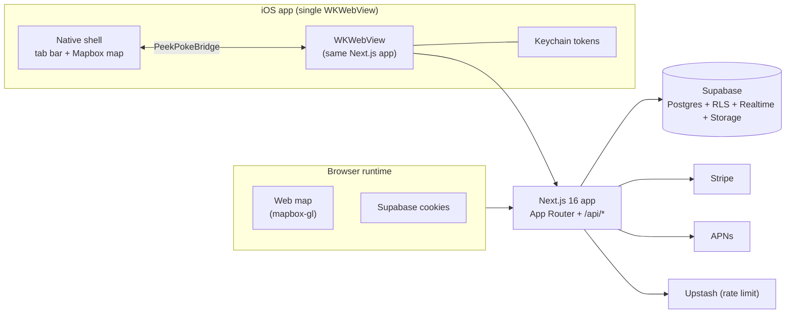
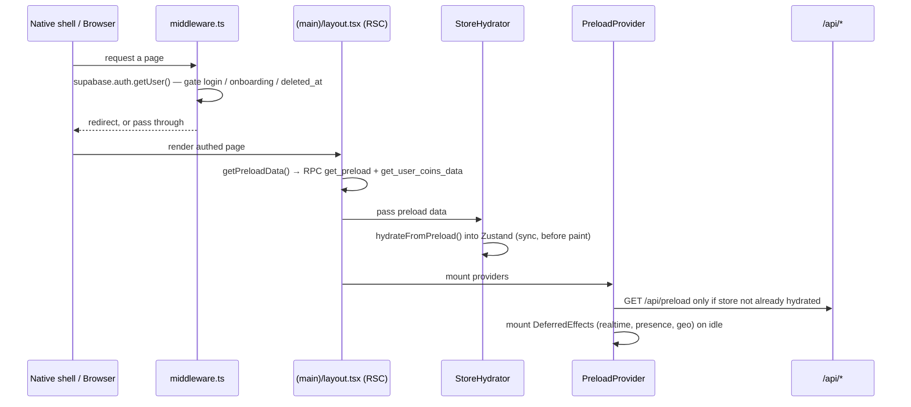

# Architecture

> peek-and-poke is one Next.js 16 app that runs in two skins: a browser SPA and a single persistent iOS WKWebView wrapped by a native Swift shell. This doc is the top-level map; each subsystem has its own deep-dive.

## The big idea: one web app, two runtimes

The exact same React/Next.js bundle is served to the browser **and** loaded into a single `WKWebView` inside a native iOS app (Capacitor 8). The native shell adds a UITabBar and a real Mapbox map living *behind* a transparent WebView. The web app and native shell talk over exactly one channel: the **`PeekPokeBridge`** Capacitor plugin.

Which runtime you're in is decided by `isNativeApp()` (`src/lib/native.ts`), and the iOS app points its WebView at either `localhost:3000` (dev) or `https://www.peek-poke.com` (prod) — `capacitor.config.ts:16`. So "native" is the production website running inside an app shell, not a separate build.



What differs between the two runtimes:

| Concern | Browser | iOS WebView |
| --- | --- | --- |
| Auth transport | Supabase cookies | Keychain tokens → `Authorization: Bearer` |
| Map | `react-map-gl`/`mapbox-gl` in a hidden div | native Mapbox map driven via the bridge |
| Navigation | Next router | native tab taps → `navigate` bridge event → router |
| Push / badges | n/a | APNs + app/tab badges via the bridge |

See [BRIDGE](./BRIDGE.md) for the plugin contract, [AUTH](./AUTH.md) for the dual auth transport, and [MAPS](./MAPS.md) for the dual map pipeline.

## Request lifecycle (cold launch → interactive)



1. **Middleware gate.** `src/middleware.ts` runs on every non-static request (matcher `src/middleware.ts:138`). It validates the session with `supabase.auth.getUser()` (`src/middleware.ts:54`), then enforces: unauthenticated → `/login`, incomplete onboarding → `/onboarding`, soft-deleted accounts (`deleted_at`) → signed out. For `/api/*` mutations it instead does a CSRF Origin check, exempting native Bearer requests, the Stripe webhook, and MCP transports (`src/middleware.ts:13-31`). Details in [AUTH](./AUTH.md) and [API](./API.md).
2. **Server-side preload.** The authed layout is a Server Component: it reads the session from cookies (`src/app/(main)/layout.tsx:19`) and fetches the user's whole working set in two RPCs — `get_preload` + `get_user_coins_data` (`src/lib/preload-server.ts:8-11`).
3. **Synchronous hydration.** `StoreHydrator` pushes that data into the Zustand store inside a `useState` initializer so it lands before first paint (`src/components/StoreHydrator.tsx:6-9`, `src/stores/appStore.ts:235`).
4. **Client fallback + live effects.** `PreloadProvider` calls `preloadAll()` (`GET /api/preload`) only when SSR didn't already hydrate (`src/components/PreloadProvider.tsx:46-54`), and on idle mounts `DeferredEffects` — realtime sync, presence, geolocation, nearby presence, meeting detection, incoming-call listener (`src/components/PreloadProvider.tsx:19-27`).
5. **Native sync providers.** On native only, `AuthBridgeProvider` mirrors every Supabase auth event into the Keychain via `setAuth`/`clearAuth` and syncs the admin role (`src/components/AuthBridgeProvider.tsx:20-76`), while `NativeBridgeProvider` wires native→web navigation, OAuth return, resume re-validation, and push init (`src/components/NativeBridgeProvider.tsx`).

The provider nesting that makes this work (`src/app/(main)/layout.tsx:25-43`):

```
QueryProvider
└─ StoreHydrator (SSR data → Zustand)
   └─ PreloadProvider (client preload + deferred realtime effects)
      └─ NativeBridgeProvider (native nav / oauth / resume / push)
         └─ AuthBridgeProvider (token + role → Keychain; hides splash)
            └─ shell: PersistentMapHost · DesktopNav · ContentWrapper · MobileNav · CallProvider
```

## State & data flow

Client state is a single Zustand store, `src/stores/appStore.ts` — profile, friends, threads/messages, coins, blocked users, presence, and all map/location state live there; `src/stores/selectors.ts` exposes memoized reads. Server state arrives three ways: the SSR preload RPC, the REST surface under `src/app/api/*` (see [API](./API.md)), and Supabase Realtime channels via the `useRealtime*` hooks that keep the store live. WebRTC calling has its own `src/stores/callStore.ts`.

## Directory tour

| Path | What lives here |
| --- | --- |
| `src/app/(auth)/` | Unauthenticated pages: `login`, `welcome`, and server `actions.ts` (sign-in/up/out). See [AUTH](./AUTH.md). |
| `src/app/(main)/` | Authed pages: map at `/`, plus `inbox`, `profile`, `chat/[threadId]`, `friends`, `messages`, `admin`, `onboarding`. Wrapped by the preload/provider layout. |
| `src/app/api/` | The HTTP surface (REST routes) + the MCP server at `[transport]`. See [API](./API.md), [MCP](./MCP.md). |
| `src/app/auth/` | OAuth `callback`, plus `native-handoff` / `native-callback` for native session minting. See [AUTH](./AUTH.md). |
| `src/middleware.ts` | Session gate + onboarding/deleted enforcement + API CSRF. |
| `src/components/map/` | The dual map: `PersistentMapHost`, web `MapView`, `NativeMapBridge`, pins. See [MAPS](./MAPS.md). |
| `src/components/{sheet,inbox,profile,call,layout,ui}/` | Chat sheet, inbox tabs, profile, WebRTC call UI, nav/layout, and the design-system primitives. |
| `src/components/*Provider.tsx`, `StoreHydrator` | The provider chain described above. |
| `src/hooks/` | Realtime + device hooks (`useRealtime*`, `usePresence`, `useGeolocation`, `useWebRTCCall`, `useMeetingDetection`, …). |
| `src/lib/` | Cross-cutting libs: `supabase/`, `push/`, `webrtc/`, `search/`, `auth.ts`, `rate-limit.ts`, `validators.ts`, `stripe*.ts`, `peekpoke-bridge.ts`, `native.ts`, `geo.ts`, `preload-server.ts`. |
| `src/stores/` | Zustand `appStore`, `callStore`, `selectors`. |
| `src/types/` | `database.ts` (generated Supabase types — schema source of truth) and `native.d.ts`. See [DATA](./DATA.md). |
| `ios/App/App/` | Native shell: `AppDelegate.swift`, `Native/` (SceneDelegate, root shell + tab bar, native Mapbox map tab, `AuthStore`, `AppConfig`), `Plugins/PeekPokeBridgePlugin.swift`. See [BRIDGE](./BRIDGE.md). |
| `e2e/`, `test/`, `src/**/__tests__/` | Playwright E2E and Vitest unit/integration tests. |
| `public/` | Static assets (images, 3D `models/`, `leaflet/`). |

## Tech stack

Next.js 16 (App Router) · React 19 · TypeScript · Tailwind · Zustand · TanStack Query · Supabase (`@supabase/ssr`, Postgres + RLS + Realtime + Storage) · Capacitor 8 (iOS) · Mapbox + supercluster · Stripe · Upstash Redis (rate limiting) · `@parse/node-apn` (push) · `mcp-handler` + `@modelcontextprotocol/sdk` (the app's own MCP server) · WebRTC (calling). See `package.json`.

## Gotchas / invariants

- **Single WebView is persistent.** A hard `window.location` redirect (or 401 that reloads the page) re-initializes the whole native WebView, so auth failures are handled with *soft* client-side `router.push` instead (`src/stores/appStore.ts:269-275`, `src/components/PreloadProvider.tsx:42-44`).
- **SSR-hydrate-then-maybe-fetch.** The layout hydrates the store server-side; the client only re-fetches `/api/preload` when that didn't happen (`src/components/PreloadProvider.tsx:48-53`). Treat the preload RPC and `/api/preload` as two views of the same payload shape (`PreloadResponse`, `src/stores/appStore.ts:42-65`).
- **`isNativeApp()` gates everything native.** Native-only effects (bridge listeners, Keychain sync, push, native map) are all behind it; the browser runtime no-ops the bridge (`src/lib/peekpoke-bridge.ts:120-134`).
- **Auth transport forks server-side.** `createClient()` returns a Bearer-token client when an `Authorization` header is present, else the cookie client (`src/lib/supabase/server.ts:7-50`) — so the same route works for web and native.
- **Map persists across routes.** `PersistentMapHost` keeps the map mounted (hidden via CSS off-route) rather than unmounting it, to avoid re-initializing Mapbox/native map on every navigation (`src/components/map/PersistentMapHost.tsx`).

## Subsystem docs

**Platform & infrastructure**

- [BRIDGE](./BRIDGE.md) — the PeekPokeBridge plugin contract (methods, events, round-trip).
- [AUTH](./AUTH.md) — Supabase auth/session, web + native OAuth, Keychain handoff.
- [API](./API.md) — the `src/app/api/*` HTTP surface, validation, rate limiting, secrets.
- [MCP](./MCP.md) — the app's own MCP server at `api/[transport]`.
- [DATA](./DATA.md) — tables, RPCs, RLS, and migration management.
- [REALTIME](./REALTIME.md) — Supabase Realtime channels keeping the Zustand store live.
- [DEEPLINKS](./DEEPLINKS.md) — Universal Links, `peekpoke://` scheme, invite links.

**Feature subsystems**

- [MAPS](./MAPS.md) — Mapbox + supercluster, web and native pipelines.
- [CALLING](./CALLING.md) — WebRTC 1:1 audio/video calling between DM participants.
- [COINS](./COINS.md) — coins, proximity meeting detection, and collectible bots.
- [SEARCH](./SEARCH.md) — query parsing + user/tag search RPCs.
- [UPLOAD](./UPLOAD.md) — image compression, Supabase Storage, photo moderation.
- [PAYMENTS](./PAYMENTS.md) — Stripe checkout, webhook, subscriber role.
- [PUSH](./PUSH.md) — APNs delivery, token registration, badges.
