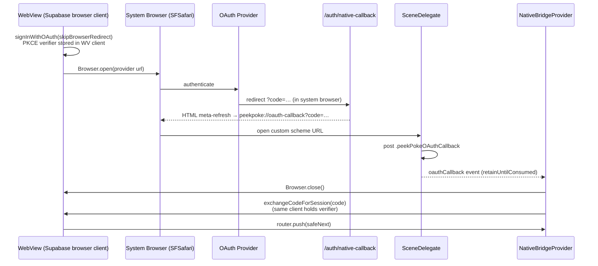
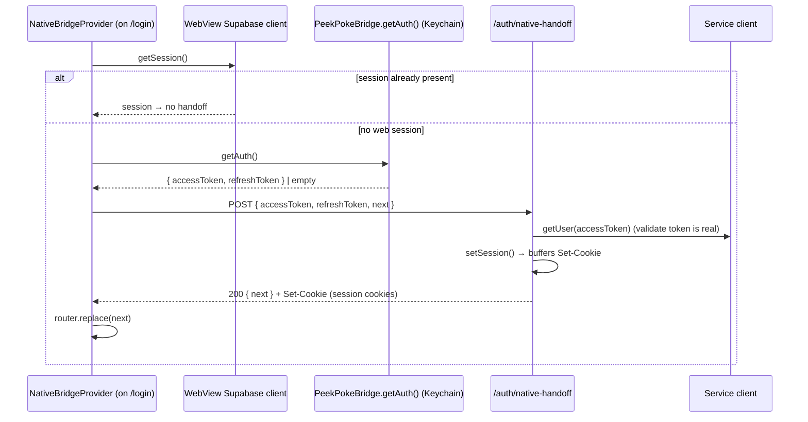

# Auth & Session

> How peek-and-poke authenticates and gates users across both the web SPA and the single-WebView iOS shell, on top of Supabase + `@supabase/ssr`.

## How it works

Supabase issues a JWT access token + refresh token per session. On the web those land in cookies managed by `@supabase/ssr`; in the native app they live in the iOS Keychain and are surfaced to the WebView's Supabase client. Three server-side clients exist:

- **Browser singleton** — `createClient()` returns one memoized `createBrowserClient` so every component shares the same session/PKCE storage (`src/lib/supabase/client.ts:6-17`).
- **Request-scoped server client** — `createClient()` inspects the `Authorization` header: a `Bearer …` token (native/API) builds a stateless `createSupabaseClient` with `autoRefreshToken: false, persistSession: false` (`src/lib/supabase/server.ts:12-26`); otherwise it builds a cookie-backed `createServerClient` (`src/lib/supabase/server.ts:29-49`).
- **Service-role client** — `createServiceClient()` uses `SUPABASE_SERVICE_ROLE_KEY` to bypass RLS for privileged writes like profile bootstrap (`src/lib/supabase/server.ts:52-63`).

Session gating is centralized in middleware. It runs on everything except a small static/asset allowlist (`src/middleware.ts:137-139`). For `/api/*` it only does a CSRF Origin check then passes through (`src/middleware.ts:13-31`); for page routes it calls `supabase.auth.getUser()` and redirects (`src/middleware.ts:54-134`).

### Web email/password

1. The login page is a client component that calls server actions and renders error/confirmation states (`src/app/(auth)/login/page.tsx:62-126`). `/welcome` is a stub that just `redirect("/login")` (`src/app/(auth)/welcome/page.tsx:3-5`).
2. **Sign in** — `login()` validates input, calls `signInWithPassword`, maps `Email not confirmed` to an `emailNotConfirmed` flag, and on success ensures a `profiles` row exists (creating one via the service client if missing), then `redirect("/")` (`src/app/(auth)/actions.ts:11-78`). Cookie writes happen inside the server client's `setAll` during the action.
3. **Sign up** — `signup()` enforces an 8-char minimum and runs `validateEmail` (format + typo + disposable), then `signUp` with `emailRedirectTo: ${appUrl}/auth/callback` (`src/app/(auth)/actions.ts:80-120`). Profile creation is intentionally deferred to `/auth/callback` so unverified bots can't create profiles (`src/app/(auth)/actions.ts:138-139`). No `data.session` ⇒ returns `{ emailConfirmation: true }`; an immediate session ⇒ `redirect("/onboarding")` (`src/app/(auth)/actions.ts:142-147`).
4. **Sign out** — `signOut()` calls `supabase.auth.signOut()`, deletes the `pp_onboarded` fast-path cookie, and redirects to `/login` (`src/app/(auth)/actions.ts:150-156`).

### Web OAuth

1. `signInWithGoogle(redirectTo?)` / `signInWithApple(redirectTo?)` build a callback URL `${appUrl}/auth/callback` (optionally carrying a validated `next`), call `signInWithOAuth`, and `redirect(data.url)` to the provider (`src/app/(auth)/actions.ts:167-200`). Google additionally passes `prompt: "select_account"`.
2. The provider redirects back to `GET /auth/callback` with `?code=…`. The route exchanges it via `exchangeCodeForSession(code)` — this works on web because the PKCE verifier was stored in the same cookie jar (`src/app/auth/callback/route.ts:27-36`).
3. For first-time OAuth users it inserts a `profiles` row (service client, temp username `user_<id8>`) and redirects to `/onboarding` (preserving `?invite=` if `next` matched `/invite/<id>`); existing users go to `next` (`src/app/auth/callback/route.ts:38-77`).

`/auth/callback` is **excluded** from the middleware matcher so the code exchange isn't intercepted (`src/middleware.ts:138`).

### Native OAuth

Providers block OAuth inside embedded WebViews, so the native flow runs in the system browser (SFSafariViewController) and bounces the auth code back through a custom URL scheme. `nativeOAuthSignIn(provider, next)` calls `signInWithOAuth` with `skipBrowserRedirect: true` and `redirectTo: /auth/native-callback?next=…`, then opens the provider URL with `Browser.open` (`src/lib/native-oauth.ts:14-36`). The login page chooses this path when `isNativeApp()` is true (`src/app/(auth)/login/page.tsx:98-103`,`115-120`).

- `/auth/native-callback` returns an **HTML page** (not a 302) with a `meta refresh` to `peekpoke://oauth-callback?code=…`, because Safari may suppress silent redirects to custom schemes; it includes a visible tap-target fallback and escapes the URL (`src/app/auth/native-callback/route.ts:28-68`). On provider error it forwards `error_description` instead of a code (`src/app/auth/native-callback/route.ts:37-42`).
- iOS receives `peekpoke://` in `SceneDelegate` (both cold-launch `connectionOptions` and warm `openURLContexts`), which posts `.peekPokeOAuthCallback` with the URL string (`ios/App/App/Native/SceneDelegate.swift:26-46`). The plugin re-emits it as the `oauthCallback` web event with `retainUntilConsumed: true` so a still-cold-launching WebView won't miss it (`ios/App/App/Plugins/PeekPokeBridgePlugin.swift:258-263`).
- The web handler closes the browser, then `exchangeCodeForSession(code)` on the singleton client (the only one holding the PKCE verifier), validates `next`, and routes (`src/components/NativeBridgeProvider.tsx:67-99`).

### Native cold-launch handoff

On a fresh install / cleared `WKHTTPCookieStore`, the WebView has no Supabase cookies but the Keychain may still hold valid tokens. Rather than show `/login`, the WebView mints web cookies from the Keychain tokens.

- Trigger: `isNativeApp()` && `pathname === "/login"`, guarded once per mount by `handoffAttempted` (`src/components/NativeBridgeProvider.tsx:139-154`). It first checks `getSession()` and bails if a web session already exists.
- `mintWebSessionFromNativeAuth()` reads Keychain tokens via `PeekPokeBridge.getAuth()`, POSTs them to `/auth/native-handoff` with `credentials: "same-origin"` (`src/components/NativeBridgeProvider.tsx:101-127`).
- The route validates the access token with `serviceClient.auth.getUser(accessToken)` before minting anything, then builds a cookie-backed SSR client and `setSession({ access_token, refresh_token })`, buffering the `Set-Cookie` writes into the JSON response (`src/app/auth/native-handoff/route.ts:50-87`). A bare `GET` redirects to `/login` (`src/app/auth/native-handoff/route.ts:90-92`).
- `/auth/native-handoff` is **excluded** from the middleware matcher so the unauthenticated POST isn't redirected (`src/middleware.ts:138`).
- 401/403 means tokens are definitively dead, so the client calls `PeekPokeBridge.clearAuth()` (wiping Keychain → native hides the tab bar); transient/5xx failures keep the tokens (`src/components/NativeBridgeProvider.tsx:116-123`).

### Session validation on resume

When iOS foregrounds the scene, `sceneWillEnterForeground` calls `notifyCurrentBridgeAppResumed()` → emits the `appResumed` web event (`ios/App/App/Native/SceneDelegate.swift:66-68`, `ios/App/App/Native/RootTabBarController.swift:107-109`). The web listener throttles to once per 5 minutes, then does an authoritative `supabase.auth.getUser()` (network) and pushes `/login` if the user is gone (`src/components/NativeBridgeProvider.tsx:199-207`). A companion `authRefresh` listener calls `setSession` to adopt tokens pushed from native (`src/components/NativeBridgeProvider.tsx:211-213`) — see the lifecycle note below about its current dormancy.

## Token storage & lifecycle

| Surface | Where tokens live | Refresh | Cleared by |
|---|---|---|---|
| Web | Supabase auth cookies via `@supabase/ssr` (`createServerClient`/`createBrowserClient`) | Browser client auto-refreshes; SSR refreshes during `getUser()` and writes new cookies via `setAll` (`src/middleware.ts:41-52`) | `signOut()` (`src/app/(auth)/actions.ts:150-156`); middleware on `deleted_at` (`src/middleware.ts:86-89`,`103-106`) |
| Native | iOS Keychain (`kSecClassGenericPassword`, service `com.peekpoke.app`, `kSecAttrAccessibleAfterFirstUnlock`) via `AuthStore` (`ios/App/App/Native/AuthStore.swift:14-101`) | The WebView's browser client refreshes, then `AuthBridgeProvider` pushes the new session to the Keychain on every Supabase auth event (`src/components/AuthBridgeProvider.tsx:25-53`) | `clearAuth()` from `AuthBridgeProvider` on `SIGNED_OUT` only, or from the handoff dead-token path; native `AuthStore.clear()` (`ios/App/App/Plugins/PeekPokeBridgePlugin.swift:85-90`) |

Token mechanics flow through the `PeekPokeBridge` plugin (`setAuth`/`getAuth`/`clearAuth` and the `authRefresh` event) — the channel itself is documented in [BRIDGE](./BRIDGE.md). Semantics here:

- **Native is a mirror, not the source of truth.** The WebView's Supabase client owns refresh; `AuthBridgeProvider` mirrors each session into the Keychain on `getSession()` and `onAuthStateChange` (`src/components/AuthBridgeProvider.tsx:47-53`). `setAuth` only persists; it does not trigger any native HTTP refresh (`ios/App/App/Plugins/PeekPokeBridgePlugin.swift:69-83`).
- **Clear is conservative.** `syncSession` only wipes the Keychain when the event is an explicit `SIGNED_OUT`, never on an incidental null session, so a hidden/redirecting WebView can't accidentally log the user out (`src/components/AuthBridgeProvider.tsx:35-39`).
- **`expiresAt` is stored but advisory** — persisted in Keychain (`ios/App/App/Native/AuthStore.swift:25-29`,`38-42`) yet nothing native acts on expiry.
- **`authRefresh` is currently dormant.** The web listener and the `notifyAuthRefresh` emitter both exist (`src/components/NativeBridgeProvider.tsx:211-213`, `ios/App/App/Native/SharedBridgeViewController.swift:55-61`), but `notifyAuthRefresh` has **no callers** in native code — there is no native proactive token refresh today; refresh is entirely WebView-driven.
- The DEBUG TCP channel can inject tokens directly into `AuthStore` for simulator automation (`ios/App/App/Native/RootTabBarController.swift:276-279`).

## Authorization primitives

These are building blocks composed by individual API routes; see [API](./API.md) for per-route usage and [DATA](./DATA.md) for the roles tables and the `user_has_role` RPC. All live in `src/lib/auth.ts`.

| Helper | Signature | What it enforces |
|---|---|---|
| `withAuth` | `withAuth
(handler) → routeHandler` | Wraps a route: resolves the request-scoped client, requires `getUser()`, returns `401` if absent, else invokes `handler(req, { user, supabase, params })` (`src/lib/auth.ts:11-36`) |
| `requireAdminRole` | `(supabase, userId) → NextResponse \| null` | `403` unless `user_has_role(admin)`; `null` = allowed (`src/lib/auth.ts:91-103`) |
| `requireModeratorRole` | `(supabase, userId) → NextResponse \| null` | `403` unless `moderator` **or** `admin` (`src/lib/auth.ts:38-50`) |
| `hasSubscriberRole` | `(supabase, userId) → boolean` | `true` iff `user_has_role(subscriber)` — for premium gating (`src/lib/auth.ts:130-139`) |
| `verifyThreadParticipant` | `(supabase, threadId, userId) → thread \| null` | Returns the DM thread only if `userId` is participant 1 or 2 (`src/lib/auth.ts:52-67`) |
| `verifyFriendshipParticipant` | `(supabase, friendshipId, userId) → friendship \| null` | Returns the friendship only if `userId` is requester or addressee (`src/lib/auth.ts:110-128`) |
| `isBlocked` | `(supabase, userAId, userBId) → boolean` | `true` if either user blocks the other (bidirectional check) (`src/lib/auth.ts:69-89`) |

## Key files

| File | Role |
|---|---|
| `src/lib/supabase/client.ts` | Browser Supabase singleton (shared session + PKCE storage) |
| `src/lib/supabase/server.ts` | Request-scoped server client (Bearer vs cookie) + service-role client |
| `src/middleware.ts` | Session gating, redirects, onboarding/`deleted_at` enforcement, `/api/*` CSRF, matcher |
| `src/app/(auth)/actions.ts` | Server actions: `login`, `signup`, `signOut`, `signInWithGoogle/Apple` |
| `src/app/(auth)/login/page.tsx` | Auth UI; routes OAuth to native vs web by `isNativeApp()` |
| `src/app/(auth)/welcome/page.tsx` | Stub → `redirect("/login")` |
| `src/app/auth/callback/route.ts` | Web OAuth/email PKCE code exchange + first-login profile bootstrap |
| `src/app/auth/native-callback/route.ts` | Native OAuth landing → HTML bounce to `peekpoke://oauth-callback` |
| `src/app/auth/native-handoff/route.ts` | Cold-launch: validate Keychain tokens, mint web session cookies |
| `src/lib/native-oauth.ts` | Starts native OAuth in the system browser (PKCE verifier kept in WebView) |
| `src/components/NativeBridgeProvider.tsx` | `oauthCallback` exchange, cold-launch handoff trigger, `appResumed`/`authRefresh` handling |
| `src/components/AuthBridgeProvider.tsx` | Mirrors web session → Keychain on every auth event; syncs admin role |
| `src/hooks/useAuth.ts` | Client hook: `getSession()` + profile fetch via `/api/auth/profile` |
| `src/lib/auth.ts` | Authorization primitives (`withAuth`, role/participant checks) |
| `src/app/api/auth/profile/route.ts` | `withAuth` POST: fetch-or-create the caller's profile |
| `src/app/api/profile/complete-onboarding/route.ts` | Sets the `pp_onboarded` fast-path cookie |
| `ios/App/App/Native/AuthStore.swift` | Keychain token persistence (source of truth on native) |
| `ios/App/App/AppDelegate.swift` | URL/universal-link plumbing; APNs token forwarding |
| `ios/App/App/Native/SceneDelegate.swift` | `peekpoke://` capture → `oauthCallback`; foreground → `appResumed` |

## Gotchas / invariants

- **PKCE verifier must stay in the same client.** Both the web (`/auth/callback`) and native (`oauthCallback`) code exchanges only succeed because the verifier created by `signInWithOAuth` lives in the same storage — the singleton browser client on native (`src/components/NativeBridgeProvider.tsx:84-86`, `src/lib/native-oauth.ts:9-12`), the cookie jar on web. Never start native OAuth in one client and exchange in another.
- **Module-scoped OAuth listener.** `oauthListenerAttached` is a module global, not per-mount, because the sign-in itself crosses the `login ↔ main` layout-group boundary and remounts providers; a per-mount listener would have a gap exactly when the callback fires (`src/components/NativeBridgeProvider.tsx:62-99`). Same reasoning as the `navigate` listener.
- **HTML bounce, not 302.** `/auth/native-callback` must emit an HTML `meta refresh`; iOS Safari can silently drop a 302 to a custom scheme (`src/app/auth/native-callback/route.ts:44-46`).
- **`pp_onboarded` fast path.** With this cookie middleware skips the `onboarding_completed` lookup but **still** queries `deleted_at` every request and force-signs-out deleted accounts (`src/middleware.ts:73-91`). The cookie is httpOnly/1-year and set only by `complete-onboarding` (`src/app/api/profile/complete-onboarding/route.ts:49-55`); it's deleted on sign-out and on deleted-account eviction.
- **Soft 401 vs hard redirect.** API routes via `withAuth` return JSON `401`/`403` (`src/lib/auth.ts:26-27`,`47`,`100`) so clients handle them in-place; page navigations get a hard `307` to `/login` with `redirectTo` preserved (`src/middleware.ts:61-68`). The two layers are independent.
- **Native Bearer skips CSRF.** Mutating `/api/*` requests require a matching `Origin`/`Host`, but a `Bearer` auth header marks the request native and bypasses the Origin check (native isn't cookie-authenticated, so CSRF doesn't apply) (`src/middleware.ts:18-27`). Webhook/MCP/SSE paths are exempted separately (`src/middleware.ts:16`).
- **`useAuth` trusts middleware.** The hook reads `getSession()` (local, no network) instead of `getUser()`, relying on middleware having already validated the session, and only refetches the profile when the user **id** actually changes — not on token refresh (`src/hooks/useAuth.ts:36-38`,`73-80`).
- **Profile creation is racy by design.** `login`, `/auth/callback`, and `/api/auth/profile` all "ensure profile exists" and tolerate failure/duplicate-insert because creation may be retried or hit a race (`src/app/(auth)/actions.ts:51-73`, `src/app/api/auth/profile/route.ts:28-37`).
- **Handoff: clear only on a hard 401/403.** Transient handoff failures must not wipe the Keychain, or a flaky network would log native users out (`src/components/NativeBridgeProvider.tsx:116-123`).
- **`authRefresh` path is wired but unused** — don't assume native refreshes tokens on cold launch; today refresh is WebView-driven only (see Token lifecycle).

## Related

- [ARCHITECTURE](./ARCHITECTURE.md) — system hub
- [BRIDGE](./BRIDGE.md) — the `PeekPokeBridge` web↔native channel (`setAuth`/`getAuth`/`clearAuth`, event delivery)
- [API](./API.md) — per-route use of the authorization primitives
- [DATA](./DATA.md) — roles tables, RLS, and the `user_has_role` RPC
- [PUSH](./PUSH.md) — push registration gated on the signed-in user
