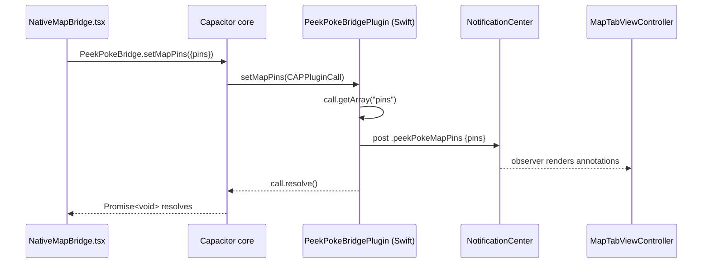
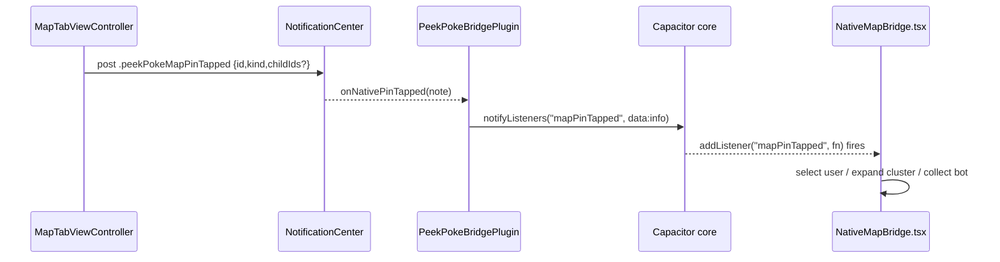

# Bridge — the PeekPokeBridge contract

> The single, typed Capacitor plugin (`PeekPokeBridge`) that is the *only* channel between the web app and the native iOS shell — web calls methods, native fires events back.

This is part of the [ARCHITECTURE](./ARCHITECTURE.md) doc set. Token semantics live in [AUTH](./AUTH.md), map rendering/clustering in [MAPS](./MAPS.md), and badge/notification delivery in [PUSH](./PUSH.md); this doc covers only the wire contract.

## How it works

There is one persistent `WKWebView` (see [ARCHITECTURE](./ARCHITECTURE.md)). All web↔native traffic flows through a single Capacitor plugin registered under the JS name `PeekPokeBridge`. Two directions:

### Web → Native (method call → handler → resolve)

1. TS imports the typed proxy `PeekPokeBridge` from `src/lib/peekpoke-bridge.ts:136` (created via `registerPlugin<PeekPokeBridgePlugin>('PeekPokeBridge', …)`).
2. Calling e.g. `PeekPokeBridge.setMapPins({ pins })` is marshalled by Capacitor's core: the options object is JSON-serialized and posted to the native bridge keyed by plugin name + method name.
3. Capacitor finds the matching `@objc` handler on `PeekPokeBridgePlugin` (registered through the `pluginMethods` table, `ios/App/App/Plugins/PeekPokeBridgePlugin.swift:29-43`) and invokes it with a `CAPPluginCall`.
4. The handler reads typed args off the call (`call.getString`, `call.getDouble`, `call.getBool`, `call.getArray`, `ios/.../PeekPokeBridgePlugin.swift:69-235`), does its work, and resolves the JS promise via `call.resolve()` / `call.resolve(result)` (or `call.reject(...)` on bad input, e.g. `openExternal`, `:158`).
5. Most handlers do not touch UIKit directly — they hop to the main queue and broadcast a `NotificationCenter` notification (`peekPokeMapPins`, `peekPokeMapCamera`, `peekPokeActiveRouteChanged`, …) that the relevant native view controller observes. This keeps the plugin decoupled from the shell.

### Native → Web (event → notifyListeners → TS listener)

1. A native source raises a signal. Map events come from `MapTabViewController.swift` as notifications (`.peekPokeMapCameraDidChange` `:318`, `.peekPokeMapPinTapped` `:359`, `.peekPokeMapTapped` `:182`). The OAuth callback comes from `SceneDelegate` (`src/.../SceneDelegate.swift:39-46`). Lifecycle events (`navigate`, `appResumed`, `authRefresh`) are emitted directly by the bridge view controller (`SharedBridgeViewController.swift:47-61`).
2. For the notification-backed events, `PeekPokeBridgePlugin.load()` registered observers (`PeekPokeBridgePlugin.swift:47-65`); the observer pulls `note.userInfo` and forwards it.
3. The plugin calls `notifyListeners(eventName, data:)` (`PeekPokeBridgePlugin.swift:246-262`; lifecycle events go through `MainBridgeViewController.emit` → `notifyListeners` at `SharedBridgeViewController.swift:65-67`). Capacitor serializes `data` and dispatches it into the WebView.
4. TS listeners registered via `PeekPokeBridge.addListener(name, fn)` fire. Consumers: navigation/auth/oauth in `src/components/NativeBridgeProvider.tsx`, map events in `src/components/map/NativeMapBridge.tsx`.

### Web stub (browser / SSR)

When *not* in the native shell, `registerPlugin` falls back to `PeekPokeBridgeWeb extends WebPlugin` (`peekpoke-bridge.ts:120-134`) — every method is an empty async no-op (`getAuth` returns `{}`). So calling bridge methods on the web is safe and silent; events simply never fire. Callers still gate on `isNativeApp()` (`src/lib/native.ts:7`, via `useIsNative()` in `src/hooks/useIsNative.ts`) before doing native-only work, but the stub means an un-gated call won't throw.

## Method reference

All native handlers are in `ios/App/App/Plugins/PeekPokeBridgePlugin.swift`. TS signatures are in `src/lib/peekpoke-bridge.ts:93-118`.

| Method | TS signature | Native handler (file:line) | Effect |
|---|---|---|---|
| `setAuth` | `(options: { accessToken: string; refreshToken: string \| null; expiresAt: number \| null }) => Promise<void>` | `PeekPokeBridgePlugin.swift:69` | Writes Supabase tokens to Keychain via `AuthStore.shared.update`. No-op if `accessToken`/`refreshToken` missing. Token semantics → [AUTH](./AUTH.md). Called from `AuthBridgeProvider.tsx:30` on every Supabase auth event. |
| `clearAuth` | `() => Promise<void>` | `:85` | Clears Keychain (`AuthStore.shared.clear`); shell hides the tab bar via its `isAuthenticated` subscription. Called on sign-out (`AuthBridgeProvider.tsx:38`, `SettingsSheet.tsx:76`) and on dead-token handoff (`NativeBridgeProvider.tsx:120`). |
| `getAuth` | `() => Promise<GetAuthResult>` | `:92` | Reads stored tokens back out of Keychain (`{}` if none). Used by the cold-launch handoff in `NativeBridgeProvider.tsx:102`. |
| `setRole` | `(options: { isAdmin: boolean }) => Promise<void>` | `:102` | Posts `.peekPokeRoleChanged`; shell shows/hides the Admin tab (`RootTabBarController.swift:198`). Called from `AuthBridgeProvider.tsx:70` when the admin role flips. |
| `setActiveRoute` | `(options: { route: string }) => Promise<void>` | `:116` | Posts `.peekPokeActiveRouteChanged`; shell syncs tab selection + map visibility (`RootTabBarController.swift:189`). Called from `NativeBridgeProvider.tsx:177` on every pathname change. |
| `setTabBadge` | `(options: { tab: string; count: number }) => Promise<void>` | `:131` | Sets a `UITabBarItem.badgeValue` via `shell().setBadge` (`RootTabBarController.swift:96`). Called from `PreloadProvider.tsx:68` for the inbox tab. Badge sourcing → [PUSH](./PUSH.md). |
| `setAppBadge` | `(options: { count: number }) => Promise<void>` | `:140` | Sets `UIApplication.shared.applicationIconBadgeNumber`. Called from `PreloadProvider.tsx:69`. → [PUSH](./PUSH.md). |
| `openExternal` | `(options: { url: string }) => Promise<void>` | `:155` | Opens the URL in the system browser via `UIApplication.open`; `reject("Invalid URL")` on parse failure. Called from `LocationGate.tsx:37` (`app-settings:`) and `SettingsSheet.tsx:177,197` (legal links). |
| `setMapInteractiveRects` | `(options: { rects: Array<{x,y,width,height}> }) => Promise<void>` | `:167` | Maps rects → `CGRect[]`, posts `.peekPokeMapInteractiveRects` so native can pass touches through transparent gaps of the WebView onto the map. Called from `src/app/(main)/page.tsx:34`. → [MAPS](./MAPS.md). |
| `setMapPins` | `(options: { pins: MapPin[] }) => Promise<void>` | `:190` | Forwards raw pin array via `.peekPokeMapPins`; native renders annotations. Called from `NativeMapBridge.tsx:345`. Pin shape & rendering → [MAPS](./MAPS.md). |
| `setMapCamera` | `(options: SetMapCameraOptions) => Promise<void>` | `:202` | Posts `.peekPokeMapCamera` with lat/lng/zoom/bearing/pitch/animated/durationMs (defaults applied in Swift). Called from `NativeMapBridge.tsx:86,101,124`. |
| `setMapOrbit` | `(options: { active: boolean }) => Promise<void>` | `:225` | Posts `.peekPokeMapOrbit`; native starts/stops the slow bearing orbit. Called from `NativeMapBridge.tsx:110` (start) / `:114` (stop). |
| `setMapClusterConfig` | `(options: { radius: number; maxZoom: number }) => Promise<void>` | `:237` | **No-op / reserved** — native clustering config is currently hard-set in `MapTabViewController`. No TS call site found. → [MAPS](./MAPS.md). |

> Note: `setMapOrbit` is in the `pluginMethods` table (`:41`) and has a handler, but is intentionally **omitted** from the TS `PeekPokeBridgePlugin` doc-comment in the Swift header (`:13-14`) — the comment is stale, not the contract. The TS interface (`peekpoke-bridge.ts:107`) and the web stub (`:132`) both include it.

## Event reference

TS event payload types are in `src/lib/peekpoke-bridge.ts:15-91`; `addListener` overloads at `:109-116`.

| Event | Payload | Emitted by (file:line) | Consumed by (file:line) |
|---|---|---|---|
| `navigate` | `{ route: string; source: 'tab' \| 'deeplink' \| 'map' }` | `MainBridgeViewController.navigateTo` (`SharedBridgeViewController.swift:47`), invoked by tab taps (`RootTabBarController.swift:223`), role demotion (`:209`), and deep links (`SceneDelegate.swift:59`) | `NativeBridgeProvider.tsx:55` (module-scoped permanent listener → `router.push`) |
| `appResumed` | `{ route: string }` (payload currently `{}`) | `MainBridgeViewController.notifyAppResumed` (`SharedBridgeViewController.swift:51`) via `SceneDelegate.sceneWillEnterForeground` → `RootTabBarController.swift:107` | `NativeBridgeProvider.tsx:199` (re-validates session, throttled 5 min) |
| `authRefresh` | `{ accessToken: string; refreshToken: string; expiresAt: number }` | `MainBridgeViewController.notifyAuthRefresh` (`SharedBridgeViewController.swift:55`) | `NativeBridgeProvider.tsx:211` (`supabase.auth.setSession`). → [AUTH](./AUTH.md) |
| `mapCameraChanged` | `{ lat, lng, zoom, bearing, pitch: number; isUserGesture: boolean; bounds?: [w,s,e,n] }` | `MapTabViewController.swift:318` posts `.peekPokeMapCameraDidChange` → `PeekPokeBridgePlugin.onNativeCameraChanged` (`:244`) | `NativeMapBridge.tsx:142` (updates visible users, recomputes pins). → [MAPS](./MAPS.md) |
| `mapPinTapped` | `{ id: string; kind: MapPinKind; childIds?: string[] }` | `MapTabViewController.swift:359` posts `.peekPokeMapPinTapped` → `onNativePinTapped` (`:249`) | `NativeMapBridge.tsx:167` (cluster expand / bot collect / user select). → [MAPS](./MAPS.md) |
| `mapTapped` | *(none — empty `{}`)* | `MapTabViewController.swift:182` posts `.peekPokeMapTapped` → `onNativeMapTapped` (`:254`) | `NativeMapBridge.tsx:200` (clears selections) |
| `oauthCallback` | `{ url: string }` (full `peekpoke://oauth-callback?code=…&next=…`) | `SceneDelegate.swift:41` posts `.peekPokeOAuthCallback` → `onOAuthCallback` (`:260`), sent with `retainUntilConsumed: true` | `NativeBridgeProvider.tsx:70` (PKCE code exchange). → [AUTH](./AUTH.md) |

## Key files

| File | Role |
|---|---|
| `src/lib/peekpoke-bridge.ts` | TS plugin definition: typed interface, payload types, `registerPlugin`, and the `WebPlugin` no-op stub. |
| `ios/App/App/Plugins/PeekPokeBridgePlugin.swift` | Native `CAPPlugin`/`CAPBridgedPlugin`: `pluginMethods` table, `@objc` handlers, notification observers, `notifyListeners` for native→web events. |
| `ios/App/App/Native/SharedBridgeViewController.swift` | `MainBridgeViewController` (`CAPBridgeViewController`): hosts the single WebView, registers the plugin instance (`capacitorDidLoad`), and emits `navigate`/`appResumed`/`authRefresh`. |
| `ios/App/App/Native/RootTabBarController.swift` | `RootShellViewController`: permanent shell — native map + WebView + `UITabBar`. Observes role/route notifications, drives `navigate`, sets badges, toggles tab bar on auth. Also defines all `Notification.Name`s (`:290-305`) and the DEBUG TCP automation channel on port 7766. |
| `ios/App/App/Native/SceneDelegate.swift` | Installs the shell once; handles `peekpoke://` cold/warm OAuth returns and `/invite` universal links; fires `appResumed` on foreground. |
| `ios/App/App/Native/AuthStore.swift` | Keychain-backed token store driven by `setAuth`/`clearAuth`/`getAuth`; publishes `isAuthenticated` the shell subscribes to. |
| `ios/App/App/Native/AppConfig.swift` | Build-time constants: `webOrigin` (localhost vs prod) and `mapboxAccessToken` from Info.plist. |
| `ios/App/App/Native/MapTabViewController.swift` | Native Mapbox map; emits `mapCameraChanged`/`mapPinTapped`/`mapTapped` and consumes the map command notifications. Detailed in [MAPS](./MAPS.md). |
| `capacitor.config.ts` | App id `com.peekpoke.app`, server URL (dev LAN vs `https://www.peek-poke.com`), iOS WebView config, plugin config. |
| `src/components/NativeBridgeProvider.tsx` | Primary web consumer of `navigate`, `appResumed`, `authRefresh`, `oauthCallback`; reports routes via `setActiveRoute`. |
| `src/components/AuthBridgeProvider.tsx` | Pushes `setAuth`/`clearAuth`/`setRole` to native on auth/role changes. |
| `src/components/map/NativeMapBridge.tsx` | The map-side consumer/producer: all `setMap*` calls and all map event listeners. |
| `src/lib/native.ts`, `src/hooks/useIsNative.ts`, `src/types/native.d.ts` | `isNativeApp()` detection (`Capacitor.isNativePlatform()`), the hydration-safe `useIsNative()` hook, and a legacy `window.isNativeApp` type. |

## Gotchas / invariants

- **Module-scoped permanent listeners.** `navigate` (`NativeBridgeProvider.tsx:52-60`) and `oauthCallback` (`:67-99`) are attached *once at module scope*, not per-mount. Reason in-code (`:40-44`, `:62-64`): crossing the login↔main layout group remounts the provider, and a per-mount listener leaves a gap where a native tab tap fires with no listener — Capacitor then retains the event and delivers it to the *wrong/next* subscriber. The global listener routes through a mutable `navigation` ref kept current by effects (`:165-170`).
- **`retainUntilConsumed: true`** is used for lifecycle and OAuth events (`SharedBridgeViewController.swift:66`, `PeekPokeBridgePlugin.swift:262`) so an event fired during cold launch — before the WebView has attached its JS listener — is buffered and delivered once a listener appears. Map events use the default (not retained), since they only matter while the live map is on screen.
- **Web stub never throws.** Because the browser fallback is a no-op `WebPlugin` (`peekpoke-bridge.ts:120-134`), bridge calls are safe off-device. Native-only logic is still gated on `isNativeApp()`, but a missed gate degrades silently rather than crashing.
- **Handlers are mostly notification relays, not direct UI mutations.** Except `setAuth`/`getAuth`/`clearAuth` (Keychain) and `openExternal`/`setAppBadge` (direct UIApplication calls), every handler hops to `DispatchQueue.main` and posts a `NotificationCenter` notification. The shell/map VCs are the actual observers — keeps the plugin free of view references.
- **The plugin singleton location.** `setTabBadge` resolves the shell by walking `connectedScenes → windows.first.rootViewController as? RootShellViewController` (`PeekPokeBridgePlugin.swift:149-153`). This assumes the shell is always the window root — which `SceneDelegate` guarantees (`SceneDelegate.swift:21`).
- **`setMapClusterConfig` is a deliberate no-op** (`PeekPokeBridgePlugin.swift:237-240`) — defined in the interface for forward-compatibility but native clustering is configured in `MapTabViewController`. No TS caller exists today.
- **Stale Swift doc-comment.** The header comment block in `PeekPokeBridgePlugin.swift:6-23` omits `setMapOrbit`, `setActiveRoute` detail, and the `mapTapped`/`oauthCallback` events. The authoritative contract is the TS interface (`peekpoke-bridge.ts`) + the `pluginMethods` table + the `load()` observers.
- **WebView is never torn down on auth change.** `clearAuth` only flips `AuthStore.isAuthenticated`, which the shell observes to hide the tab bar (`RootTabBarController.swift:68-74`); the single WebView and all in-memory state survive. Sign-in/out are SPA navigations, not reloads.

## Related

- [ARCHITECTURE](./ARCHITECTURE.md) — single-WebView shell overview and how subsystems fit together.
- [AUTH](./AUTH.md) — token lifecycle, Keychain handoff, OAuth/PKCE exchange.
- [MAPS](./MAPS.md) — pin/cluster rendering, camera, orbit, interactive-rect passthrough.
- [PUSH](./PUSH.md) — badge sourcing and push notification delivery.
- [API](./API.md), [MCP](./MCP.md), [DATA](./DATA.md), [PAYMENTS](./PAYMENTS.md) — other subsystems.
