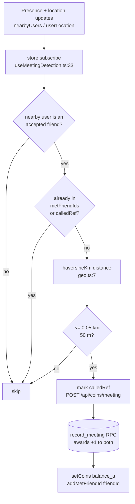
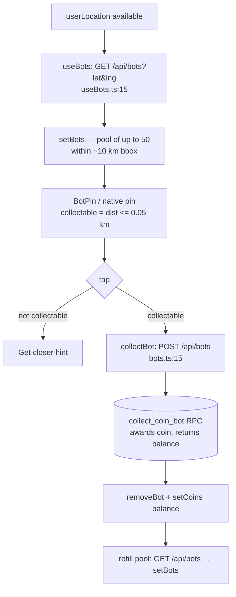

# Coins, Meetings & Bots
> The gamification loop: a per-user coin wallet, proximity-based "meetings" that earn coins, and collectible coin bots scattered on the map.

## How it works

Three intertwined loops share one wallet (`coins` in the store, balance capped at 5):

1. **Coin balance / spend** — every user starts at 5 coins (`src/stores/appStore.ts:219`). Sending a friend request spends 1 coin (`src/components/ui/AddFriendButton.tsx:35,51`). When the balance hits 0, the [`InsufficientCoinsDialog`](#coins) tells the user to meet friends in real life.
2. **Meeting detection** — when two *accepted friends* are physically within 50 m, the client auto-POSTs to `/api/coins/meeting`, which awards both of them a coin via the atomic `record_meeting` RPC (`src/hooks/useMeetingDetection.ts:70-92`).
3. **Collectible bots** — coin "bots" placed by admins are fetched around the user's position; tapping one within 50 m collects it and credits the wallet via `collect_coin_bot` (`src/lib/bots.ts:11-36`, `src/app/api/bots/route.ts:33`).

The atomic RPCs (`record_meeting`, `collect_coin_bot`, `get_user_coins_data`) and the underlying `user_coins` / `admin_coins` tables (including the balance CHECK and RLS) live in [DATA](./DATA.md); this doc names them and cites their callers but defers the schema.

### Meeting-detection loop

### Bot-collection loop

## Coins

**Balance source.** The wallet is `user_coins.balance`, read directly by `GET /api/coins` (`src/app/api/coins/route.ts:5-18`). On SSR/preload it comes from the `get_user_coins_data` RPC, which returns `{ balance, metFriendIds }` (`src/lib/preload-server.ts:10,17` and the parallel call in `src/app/api/preload/route.ts:7`). The store hydrates from that payload, defaulting to `balance: 5` if absent (`src/stores/appStore.ts:256-257`).

**Spend path.** The only spend is sending a friend request. `AddFriendButton` checks `coins < 1` and shows `InsufficientCoinsDialog` instead of calling the API (`src/components/ui/AddFriendButton.tsx:35`); otherwise `POST /api/friends` performs the spend server-side and returns the new `balance`, which the client writes back via `setCoins` (`src/components/ui/AddFriendButton.tsx:51`). (The friend-request spend RPC itself is in [API](./API.md) / [DATA](./DATA.md).)

**Earn paths.** Two: a meeting (`record_meeting`, +1 to both users) and a bot collection (`collect_coin_bot`). Both return the post-award balance, which the client trusts via `setCoins` rather than incrementing locally (`src/hooks/useMeetingDetection.ts:82`, `src/lib/bots.ts:23`).

**Store state** (`src/stores/appStore.ts`):
- `coins: number` — current balance, init 5 (`:89`, `:219`), reset to 5 on logout (`:311`).
- `metFriendIds: Set<string>` — friend IDs already met, init empty Set (`:90`, `:222`), hydrated from preload (`:257`).
- `coinSpent: boolean` + `coinSpentCount: number` — drive the "-1" spend animation (`:152-153`).
- `setCoins(n)` (`:464`), `addMetFriendId(id)` (de-duped via `new Set(...).add` — `:473-475`), `triggerCoinSpent()` (`:465-471`).

**Coin indicator + spend animation.** `MapTopLabels` renders the coin pill `{coins} / 5 coins` and, when `coinSpent` is true, a `-1` element keyed by `coinSpentCount` so each spend re-triggers the CSS `coin-spent-anim` (a 0.6 s rise-and-fade — `src/app/globals.css:453-460`). The store's `triggerCoinSpent` sets `coinSpent=true`, bumps the count, and clears the flag after 600 ms via a single shared timer (`src/stores/appStore.ts:465-471`).
> TODO: verify — `triggerCoinSpent` is defined and tested but has no production caller (only `src/stores/appStore.ts`, its test, and the `MapTopLabels` *read* reference it). The "-1" animation appears wired but never fired.

## Meeting detection

**Proximity math.** Distance uses the shared haversine helper `haversineKm(lat1, lng1, lat2, lng2)` (Earth radius 6371 km, returns **kilometers** — `src/lib/geo.ts:7-17`). The meeting threshold is `MEETING_RADIUS_KM = 0.05` i.e. 50 m (`src/hooks/useMeetingDetection.ts:7`).

**Detection mechanism.** `useMeetingDetection(userId)` (wired once in `src/components/PreloadProvider.tsx:24`) subscribes to the store and, on changes to `nearbyUsers / friends / metFriendIds / userLocation`, iterates nearby users. For each it requires: the user is an *accepted friend*, is **not** already in `metFriendIds`, and has **not** been called this session (`calledRef`) (`:57-61`). If within 50 m it marks `calledRef` immediately and POSTs `{ friend_id }` to `/api/coins/meeting` (`:70-78`). On `awarded` it writes the returned balance and adds the friend to `metFriendIds`; on `already_met` it just records the friend; on error it removes the friend from `calledRef` to allow a retry (`:81-92`).

**Server side.** `POST /api/coins/meeting` rate-limits (`coinMeeting`: 10/60 s — `src/lib/constants.ts:50`), validates `friend_id` is a UUID, and calls `record_meeting(p_user_a, p_user_b)` (`src/app/api/coins/meeting/route.ts:8-24`). The RPC returns `{ success, awarded, already_met, balance_a }`, surfaced to the client as `{ success, awarded, already_met, balance }` (`:38-43`). The RPC enforces friendship, the once-per-pair rule, and the +1-to-both award atomically — see [DATA](./DATA.md).

**What a meeting unlocks.** A meeting *earns coins* (+1 each); it does not gate chat. The `InsufficientCoinsDialog` copy frames meetings as the way to refill the friend-request budget ("Meet your existing friends in real life (within 50m)…+1 coin for both of you" — `src/components/coins/InsufficientCoinsDialog.tsx:32`).

**Proximity banner.** Separate, display-only feature. `useProximityToThread(threadId)` computes meters to the chat's other participant using its own inline haversine (radius 6371000 m) and reports `isNearby` when `< 500 m` (`src/hooks/useProximityToThread.ts:7-40`). `ChatSheetContent` renders `ChatProximityBanner` when nearby (`src/components/sheet/ChatSheetContent.tsx:259-265`). The banner shows "You're {n}m from {name}" and a "Meet & earn" button only under 100 m (`src/components/sheet/ChatProximityBanner.tsx:26-30`).
> TODO: verify — the banner's "Meet & earn" button has no `onClick`; the earn flow is driven entirely by `useMeetingDetection`, not the banner.

## Bots

**Generation / placement.** Bots are **not** procedurally generated by the app; they are admin-placed rows in `admin_coins`. `src/lib/bots.ts` is a thin client helper, not a generator. (Seeding of `admin_coins` is an admin/DATA concern — see [DATA](./DATA.md).)

**Fetch.** `useBots()` fetches once per session (guarded by `hasFetched` ref, gated on `userLocation` and not preloading) via `GET /api/bots?lat&lng` (`src/hooks/useBots.ts:12-21`). The endpoint returns bots inside a ~10 km bounding box (`R = 0.09°`), capped at **50** rows, projected to `{ id, lat, lng }` (`src/app/api/bots/route.ts:11-25`). The `Bot` type is `{ id; lat; lng }` (`src/stores/appStore.ts:16`); `setBots` no-ops if the id list is unchanged (`:521-524`).

**Collection range / collectable flag.** A bot is collectable when the user is within `BOT_COLLECT_RANGE_KM = 0.05` (50 m — `src/lib/bots.ts:4`). The map computes this per pin: web `MapView` passes `collectable={dist <= 0.05}` to `BotPin` (`src/components/map/MapView.tsx:280`); the native bridge mirrors it (`src/components/map/NativeMapBridge.tsx:329-339`). A non-collectable tap shows a transient "Get closer" hint instead of collecting (`src/components/map/BotPin.tsx:20-24`). Pin rendering lives in [MAPS](./MAPS.md).

**Award path.** `collectBot(botId)` reads `userLocation`, POSTs `{ id, lat, lng }` to `/api/bots` (`src/lib/bots.ts:11-19`); the route validates and calls `collect_coin_bot(p_bot_id, p_lat, p_lng)` (`src/app/api/bots/route.ts:33`). On `data.ok` the client removes the bot, sets the balance from `data.balance`, then refetches the pool around the current position (`src/lib/bots.ts:21-30`). `collectBot` is shared by web `BotPin` taps and native pin taps (`src/components/map/NativeMapBridge.tsx:177`). Server-side distance/ownership/award checks are in `collect_coin_bot` — see [DATA](./DATA.md).

**Dev seeding.** `DevSeedButton` injects five fake `dev-seed-*` `nearbyUsers` (dicebear avatars, ±0.001° random offset) directly into the store to test presence/meeting flows; "Clear seed" removes them (`src/components/map/DevSeedButton.tsx:18-42`). It seeds *users*, not bots, and does not touch the database.

## Key files

| File | Role |
| --- | --- |
| `src/app/api/coins/route.ts` | `GET` reads `user_coins.balance`. |
| `src/app/api/coins/meeting/route.ts` | `POST` → `record_meeting` RPC; awards +1 to both friends. |
| `src/app/api/bots/route.ts` | `GET` bbox-fetches bots; `POST` → `collect_coin_bot` RPC. |
| `src/lib/bots.ts` | `collectBot` client helper + `BOT_COLLECT_RANGE_KM`. |
| `src/hooks/useBots.ts` | One-shot bot pool fetch on location. |
| `src/hooks/useMeetingDetection.ts` | Store-subscription proximity → meeting POST + dedup. |
| `src/hooks/useProximityToThread.ts` | Display-only distance-to-chat-partner (`< 500 m`). |
| `src/lib/geo.ts` | Shared `haversineKm` / `formatDistance`. |
| `src/lib/preload-server.ts` | SSR coin preload via `get_user_coins_data`. |
| `src/stores/appStore.ts` | `coins`, `metFriendIds`, `bots`, coin-spent flags + actions. |
| `src/components/coins/InsufficientCoinsDialog.tsx` | "No coins left" prompt. |
| `src/components/map/MapTopLabels.tsx` | Coin pill `{coins} / 5` + spend animation. |
| `src/components/sheet/ChatProximityBanner.tsx` | "You're Nm from X" banner. |
| `src/components/map/DevSeedButton.tsx` | Dev-only fake nearby-user seeding. |
| `src/components/map/BotPin.tsx` | Web map pin; gates collect on `collectable`. |

## Gotchas / invariants

- **Atomic award/spend RPCs prevent double-credit/double-spend.** All balance mutations go through DB RPCs (`record_meeting`, `collect_coin_bot`, and the friend-request spend), and the client always overwrites with the server's returned balance via `setCoins` — never increments locally. See [DATA](./DATA.md).
- **5-coin cap.** Display hardcodes `/ 5` (`src/components/map/MapTopLabels.tsx:47`) and defaults are 5 (`appStore.ts:219,311`). The actual ceiling is a CHECK on `user_coins.balance` enforced server-side — see [DATA](./DATA.md). Awards above the cap are clamped by the RPC, not the client.
- **`metFriendIds` is a Set and de-duped on insert** (`new Set(state.metFriendIds).add(id)` — `appStore.ts:473-475`); meetings are once-per-pair, also enforced by `record_meeting`.
- **Two layers of meeting dedup:** `metFriendIds` (persisted from DB) plus an in-memory `calledRef` Set per session, with retry-on-error by deleting from `calledRef` (`useMeetingDetection.ts:59-92`). The `record_meeting` RPC is the authoritative guard.
- **Distance units differ — don't mix them.** `geo.ts:haversineKm` returns kilometers (meeting threshold `0.05`, bot range `0.05`); `useProximityToThread` uses a *separate* inline haversine returning **meters** (threshold `500`). The two are unrelated code paths.
- **Bot pool is bounded and stale-tolerant.** Server caps at 50 within ~10 km; client fetches once per session (`useBots`) and only refills after a successful collect. Bots outside the bbox or beyond 50 are invisible.
- **Dev-seed users are client-only** (`dev-seed-*`); they exercise meeting detection's distance/friend checks but, not being real accepted friends, won't actually earn coins via `record_meeting`.

## Related

- [ARCHITECTURE](./ARCHITECTURE.md) — system hub.
- [DATA](./DATA.md) — `user_coins` / `admin_coins` tables, balance CHECK/RLS, and the `record_meeting` / `collect_coin_bot` / `get_user_coins_data` RPC internals.
- [MAPS](./MAPS.md) — bot pin rendering (`BotPin`, `BotHint`) and presence/nearby markers.
- [API](./API.md) — friend-request spend endpoint, rate limiting, error envelope.
- [REALTIME](./REALTIME.md) — presence / `nearbyUsers` that feed meeting detection.
- [AUTH](./AUTH.md) — `withAuth` wrapper used by every coin/bot route.
