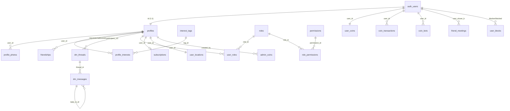

# Data Model

> The Supabase Postgres schema for peek-and-poke: tables, RLS policies, SECURITY DEFINER RPCs, and how migrations are managed. This is the schema reference for the whole app.

Live database: Supabase project **MyaouDB** (`ref: ttojvnwpnpuhkyjncwxn`, region eu-west-1, Postgres 17). The `TheBoys` project in the same org is INACTIVE and unrelated. There is **no local `supabase/` directory** — schema lives only in the cloud and is applied via the Supabase MCP server (see [Migrations](#migrations) and [MCP.md](./MCP.md)).

## Schema overview

All app tables live in `public`, key off `auth.users` via `profiles.id`, and have RLS enabled. Coins/locations/blocks reference `auth.users` directly; everything else references `profiles`.

## Tables

### Identity & profile
- **`profiles`** — one row per `auth.users` id (FK `profiles_id_fkey`). Public-facing card: `username` (unique), `display_name`, `bio` (≤500 chars), `avatar_url`, `cover_image_url`, `location_text`, `is_online`, `last_seen_at`, `onboarding_completed`, `stripe_customer_id`, `push_tokens` (jsonb array, default `[]`), `deleted_at` (soft delete). **RLS:** publicly SELECTable (`true`); INSERT/UPDATE only by `auth.uid() = id`. No DELETE policy — deletion is soft (set `deleted_at`).
- **`profile_photos`** — gallery + avatar. `storage_path`, `url`, `thumbnail_url`, `is_avatar`, `is_private`, `display_order`, plus a moderation pipeline: `approval_status` enum (`pending`/`approved`/`rejected`), `reviewed_by`, `reviewed_at`, `rejection_reason`. **RLS (non-obvious):** SELECT visible to owner, OR approved+public, OR approved+private *if viewer is a `subscriber`*, OR any moderator/admin. INSERT/DELETE owner-only; UPDATE by owner or moderator/admin. A `check_photo_limit` trigger caps photos per user.
- **`interest_tags`** — seeded catalog (`name` unique, `category`, `icon`, `display_order`). Publicly SELECTable.
- **`profile_interests`** — M:N join `profiles`↔`interest_tags`. SELECT visible to all authenticated; INSERT/DELETE owner-only. A `check_max_interests` trigger caps interests per user.

### Social graph & messaging
- **`friendships`** — `requester_id`/`addressee_id`, `status` enum (`pending`/`accepted`), `requested_at`/`responded_at`. **RLS:** SELECT/DELETE for either party; INSERT only as requester; UPDATE only by addressee (accept/reject). An `add_friendship_limit_trigger` enforces a max-friends cap (3 for base `user` role) plus a bidirectional-uniqueness constraint.
- **`dm_threads`** — `participant_1_id`/`participant_2_id`, denormalized `last_message_at`/`last_message_preview` (kept current by `update_dm_thread_last_message` trigger). **RLS:** SELECT only if you're a participant. No direct INSERT policy — threads are created via the `create_or_find_thread` RPC.
- **`dm_messages`** — `content` (≤4000 chars), `message_type` enum (`text`/`image`/`system`), `media_url`/`media_thumbnail_url`, `is_read`/`read_at`, `is_edited`, `is_deleted` (soft delete), `reply_to_id` (self-FK for replies). **RLS:** SELECT/INSERT scoped to thread participants; sender can DELETE own; any participant can UPDATE (used to mark read).
- **`user_blocks`** — `blocker_id`/`blocked_id` (both → `auth.users`). **RLS:** SELECT/INSERT/DELETE only where `auth.uid() = blocker_id`. Currently 0 rows; block enforcement runs through the `block_user`/`unblock_user` RPCs.

### Roles & permissions (RBAC)
- **`roles`** — `name` (unique), `priority`, `description`. Role names: `guest`, `user`, `subscriber`, `platinum`, `moderator`, `admin` (see `RoleName` in `src/types/database.ts:1`). Publicly SELECTable.
- **`user_roles`** — M:N junction `profiles`↔`roles` (`granted_at`). **A user can hold multiple roles.** SELECT own only. No INSERT/UPDATE/DELETE policy — mutated exclusively through `grant_role`/`revoke_role` (SECURITY DEFINER).
- **`permissions`** / **`role_permissions`** — fine-grained permission scaffolding (currently 0 rows). Authenticated read-only.

### Money & gamification
- **`subscriptions`** — Stripe mirror: `stripe_subscription_id` (unique), `stripe_customer_id`, `status` enum, `current_period_*`, `cancel_at_period_end`. SELECT own only; writes happen server-side via the webhook. See [PAYMENTS.md](./PAYMENTS.md).
- **`user_coins`** — `balance` int, **CHECK `balance >= 0 AND balance <= 5`**, default 5. PK is `user_id`. SELECT own only; all mutation is through atomic RPCs. Seeded for new users by the `handle_new_profile_coins` trigger.
- **`coin_transactions`** — append-only ledger: `amount`, `reason` (text; app enum `friend_request_sent`/`meeting_bonus`/`request_cancelled_refund`), `related_user_id`. SELECT own only.
- **`friend_meetings`** — `user_a_id`/`user_b_id`/`met_at`; records proximity meetings that grant coin bonuses. SELECT if you're a party.
- **`coin_bots`** — collectible map pins owned per user (`lat`/`lng`, `collected_at`). SELECT own only; spawned/collected via RPC.
- **`admin_coins`** — admin-placed map coins (`lat`/`lng`, `created_by`). **RLS:** any authenticated user can SELECT; full ALL access only for `admin` role.

### Location / presence
- **`user_locations`** — last-known position, PK `user_id`, `lat`/`lng`/`updated_at`. **RLS:** single `ALL` policy `users_manage_own_location` (`auth.uid() = user_id`) — you can only read/write your own row. Other users' positions are exposed *only* through the `nearby_users` / `mcp_nearby_users` SECURITY DEFINER RPCs. See [MAPS.md](./MAPS.md).

## RPC functions

The app talks to the DB almost entirely through RPCs rather than direct table writes — most are **SECURITY DEFINER** so they can enforce invariants (coin spend, friend limits, thread creation) and bypass per-table RLS in a controlled way. `nearby`, `coin`, and `meeting` ones are written to be **atomic** (single statement / row locks) to avoid race conditions.

| Function | Args | Purpose / atomicity | Called by (file:line) |
| --- | --- | --- | --- |
| `user_has_role` | `p_user_id, p_role_name` | Role check used for gating | `src/lib/auth.ts:43,44,95,134` |
| `get_user_roles` | `p_user_id` | Fetch a user's role list | `src/app/api/profile/route.ts:11,27` |
| `grant_role` / `revoke_role` | `p_user_id, p_role_name` | Add/remove role (SECURITY DEFINER); sole writer of `user_roles` | `src/lib/stripe-webhook.ts:24,40` |
| `get_preload` | `p_user_id` | Aggregated initial payload (profile, friends, threads, meetings count) | `src/app/api/preload/route.ts:6`, `src/lib/preload-server.ts:9` |
| `get_user_coins_data` | `p_user_id` | Coin balance + ledger snapshot | `src/app/api/preload/route.ts:7`, `src/lib/preload-server.ts:10` |
| `get_user_profile` | `p_target_id, p_viewer_id` | Viewer-scoped profile (respects privacy); **not** SECURITY DEFINER | `src/app/api/profile/[userId]/route.ts:13` |
| `get_friends` | `p_user_id` | Friends list; not SECURITY DEFINER | `src/app/api/friends/route.ts:8` |
| `send_friend_request` | `p_requester_id, p_addressee_id` | Atomic: spends a coin + inserts friendship | `src/app/api/friends/route.ts:25` |
| `respond_friend_request` | `p_friendship_id, p_user_id, p_action` | Accept/reject; not SECURITY DEFINER | `src/app/api/friends/[friendshipId]/route.ts:19` |
| `unfriend` | `p_friendship_id, p_user_id` | Remove friendship | `src/app/api/friends/[friendshipId]/route.ts:53` |
| `block_user` / `unblock_user` | `p_blocker_id, p_blocked_id` | Block management | `src/app/api/users/[userId]/block/route.ts:12,39` |
| `get_threads` | `p_user_id` | DM thread list | `src/app/api/dm/threads/route.ts:7` |
| `create_or_find_thread` | `p_user_a, p_user_b` | Idempotent thread creation (sole INSERT path for `dm_threads`) | `src/app/api/dm/threads/route.ts:21` |
| `get_conversation` | `p_thread_id, p_user_id` | Messages for a thread | `src/app/api/dm/[threadId]/route.ts:16` |
| `send_message` | `p_thread_id, p_sender_id, p_content, p_message_type, p_media_url, p_reply_to_id` | Insert DM + bump thread preview. **Overloaded** — older 5-arg form still exists | `src/app/api/dm/[threadId]/route.ts:52` |
| `clear_thread_messages` | `p_thread_id, p_user_id` | Soft-clear a thread for the caller | `src/app/api/dm/[threadId]/messages/route.ts:17` |
| `delete_thread_and_messages` | `p_thread_id, p_user_id` | Remove thread + its messages | `src/app/api/dm/[threadId]/delete/route.ts:17` |
| `nearby_users` | `p_lat, p_lng, p_radius_km=2` | Proximity search (default 2 km) | `src/app/api/nearby/route.ts:11` |
| `mcp_nearby_users` | `p_lat, p_lng, p_radius_km=5` | Same for the MCP transport (default 5 km) | `src/app/api/[transport]/route.ts:302,356` |
| `collect_coin_bot` | `p_bot_id, p_lat, p_lng` | Atomic: validates proximity + credits coins (capped at 5) | `src/app/api/bots/route.ts:33` |
| `record_meeting` | `p_user_a, p_user_b` | Atomic: records meeting + meeting-bonus coin | `src/app/api/coins/meeting/route.ts:21` |
| `accept_invite_link` | `p_inviter_id` | Auto-friend via invite link | `src/app/invite/[inviterId]/route.ts:21` |
| `set_avatar` | `p_user_id, p_photo_id` | Promote a photo to avatar | `src/app/api/profile/photos/[photoId]/route.ts:63` |
| `delete_photo` | `p_user_id, p_photo_id` | Delete a photo row (storage cleanup separate) | `src/app/api/profile/photos/[photoId]/route.ts:121` |
| `search_users` | `q, tag_ids, nearby_ids, result_limit` | Trigram + tag/nearby user search (anon revoked) | `src/hooks/useUserSearch.ts:31` |
| `search_interest_tags` | `q, result_limit=8` | Tag autocomplete | `src/hooks/useTagSuggestions.ts:13` |
| `resolve_interest_tags` | `names text[]` | Map tag names → ids | `src/lib/search/resolveTagIds.ts:18` |

Other DB-side functions exist but aren't called from app code: `get_moderation_queue` (moderation UI), `are_friends`, `spawn_coin_bots` (server/cron), plus triggers `handle_new_user`, `handle_new_profile_coins`, `assign_default_role`, `check_photo_limit`, `check_max_interests`, `update_dm_thread_last_message`, `update_updated_at`. The many `gtrgm_*`/`*_similarity*` functions are from the `pg_trgm` extension (search), not app code.

## RLS policies

Every `public` table has `rls_enabled = true`. The general approach:

- **Ownership by `auth.uid()`.** Most write policies are `col = (SELECT auth.uid())` — e.g. `profiles` ("Users can update own profile"), `profile_interests`, `user_blocks`, `user_locations` (`users_manage_own_location`), `user_coins`/`coin_transactions`/`friend_meetings`/`coin_bots` (SELECT-own only; writes via RPC).
- **Public read, owner write.** `profiles` and `roles`/`interest_tags` are world-readable ("Profiles are publicly viewable", "Roles are publicly viewable") while writes stay owner-scoped.
- **Participant-scoped messaging.** `dm_threads` ("Users can view own DM threads"), `dm_messages` ("Users can view DM messages in their threads" / "Users can send DMs in their threads" / "Recipients can mark messages as read" / "Users can delete own DMs") all gate on an `EXISTS` against `dm_threads` participants.
- **Friendship directionality.** `friendships` separates INSERT (requester only), UPDATE ("Addressee can respond to requests"), and SELECT/DELETE (either party).
- **Role-aware photo visibility.** `profile_photos` "Users can view profile photos" layers owner / approved-public / approved-private-for-subscribers / moderator / admin via `user_has_role(...)`.
- **Role-gated admin tables.** `admin_coins` "admin_coins_admin_all" grants full access only to the `admin` role; everyone authenticated can read.
- **RPC-only mutation.** `dm_threads`, `user_roles`, `user_coins`, and friend-request coin spend have *no* direct INSERT/UPDATE policy — those paths go exclusively through SECURITY DEFINER RPCs, so the function (not the policy) is the authorization boundary.

> Security posture (`get_advisors` type=security, WARN-level only — no ERROR): ~61 "Public/Signed-In Users Can Execute SECURITY DEFINER Function" notices (expected — that's the deliberate RPC-as-API-boundary design; tighten `EXECUTE` grants if you want defense-in-depth), 9 "Function Search Path Mutable", "Extension in Public" (pg_trgm), "Public Bucket Allows Listing" (`profile-photos` is a public bucket), and "Leaked Password Protection Disabled" (a Supabase Auth toggle). See [AUTH.md](./AUTH.md) for the auth-side items.

## Migrations

No local `supabase/` directory exists. Migrations are tracked in Supabase's `supabase_migrations.schema_migrations` table and applied through the **Supabase MCP server** (`apply_migration` for DDL, `list_migrations` to inspect, `execute_sql` for ad-hoc reads). List them with the MCP tools, not a CLI. See [MCP.md](./MCP.md).

~110 migrations recorded, named descriptively (timestamp + slug). The history shows several full `drop_all_tables_reset` → `recreate_schema_part1..4` rebuilds (around `20260204`), an RBAC overhaul (`create_roles_tables` → `role_system_refactor` → `create_user_roles_junction_table`), an abandoned dating feature (`phase_0_dating_schema_foundation` … later `remove_dating_feature`/`remove_dating_functions_and_triggers`), and a wave of `create_rpc_*` migrations (`20260216192854`+) that moved the app onto the RPC-driven model documented above. Recent: `search_users_rpc`, `coin_bots`, `add_reply_to_dm_messages`, `add_push_tokens_to_profiles`, `add_mcp_nearby_users_function`, `should_fix_rpcs` (`20260609185604`).

## Key files

| File | Role |
| --- | --- |
| `src/types/database.ts` | Hand-maintained TS types (source of truth for row shape used across the app) |
| `src/lib/auth.ts` | Role resolution via `user_has_role`/`get_user_roles` (moderator/admin gating) |
| `src/lib/preload-server.ts` | Server-side aggregate fetch (`get_preload` + `get_user_coins_data`) |
| `src/lib/stripe-webhook.ts` | Calls `grant_role`/`revoke_role` to sync subscription → roles |
| `src/lib/upload.ts` | Storage helpers (`storage.from(bucket)`, `getPublicUrl`) |
| `src/app/api/**/route.ts` | Thin route handlers; each wraps one RPC (see [API.md](./API.md)) |
| `src/hooks/useUserSearch.ts`, `useTagSuggestions.ts`, `src/lib/search/resolveTagIds.ts` | Search RPCs |

## Gotchas / invariants

- **Soft deletes everywhere.** Accounts via `profiles.deleted_at` (a `pg_cron` job purges deleted accounts — see migration `enable_pg_cron_cleanup_deleted_accounts`); DMs via `dm_messages.is_deleted`. Don't hard-delete; queries must filter these out.
- **Roles are multi-valued.** A user can hold several rows in `user_roles`; never assume one role. Use `user_has_role` / the `Profile.roles[]` array + helpers `hasRole`/`isPremium`/`isPlatinum` (`src/types/database.ts:35-49`). Mutate roles only via `grant_role`/`revoke_role`.
- **Coins are hard-capped at 5** by a CHECK constraint on `user_coins.balance`; new users seed to 5. All coin movement must go through the atomic RPCs (`send_friend_request`, `collect_coin_bot`, `record_meeting`) so the cap and the `coin_transactions` ledger stay consistent — never write `user_coins` directly.
- **DM threads & roles have no direct write RLS** — `create_or_find_thread` and `grant_role`/`revoke_role` are the only sanctioned paths.
- **Locations are private by row;** the only way to see others is the `nearby_users`/`mcp_nearby_users` RPCs (radius-limited).
- **`send_message` is overloaded** (5-arg legacy + 6-arg with `p_reply_to_id`). Postgres resolves by argument signature; the app calls the 6-arg form.
- **Storage:** only one bucket, **`profile-photos` (public)**, exists. `src/app/api/upload/route.ts` and `src/lib/upload.ts` reference a `"media"` bucket that is **not present** in the live project — uploads to it will fail until the bucket is created. > TODO: verify whether a `media` bucket is expected to exist.
- **FK target inconsistency:** newer tables (`user_coins`, `coin_transactions`, `coin_bots`, `friend_meetings`, `user_blocks`) FK to `auth.users` directly, while older ones FK to `public.profiles`. Both resolve to the same id, but joins must pick the right target.
- **Stale migrations vs. live schema:** migrations for `gpt_api_keys` and a `media` table were applied historically but those tables do not exist in the current schema — the migration log is not a reliable inventory of present tables; trust `list_tables` / `src/types/database.ts`.

## Related

- [ARCHITECTURE.md](./ARCHITECTURE.md) — hub / system overview
- [API.md](./API.md) — the route handlers that wrap these RPCs
- [AUTH.md](./AUTH.md) — `auth.users`, sessions, role gating
- [MCP.md](./MCP.md) — Supabase MCP tooling & how migrations are applied
- [MAPS.md](./MAPS.md) — `user_locations`, nearby search, coin bots on the map
- [PAYMENTS.md](./PAYMENTS.md) — Stripe → `subscriptions` → roles
- [PUSH.md](./PUSH.md) — `profiles.push_tokens`
