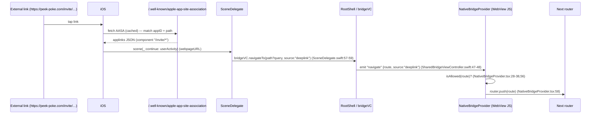

# Deep Links & Universal Links

> How an external `https://peek-poke.com/…` link (Apple Universal Link) or a `peekpoke://` custom-scheme URL opens the iOS app and lands the user on the right WebView route.

## How it works

Two entry paths feed the same single WebView (the persistent shell — see [ARCHITECTURE](./ARCHITECTURE.md)). Both end as a `navigate` (or `oauthCallback`) bridge event consumed by `NativeBridgeProvider`:

1. **https Universal Link** — iOS reads the Apple App Site Association (AASA) file off the claimed domain, matches the path, opens the app instead of Safari, and hands `SceneDelegate` an `NSUserActivity`. For supported paths the delegate fires a `navigate` event with `source: "deeplink"` (`ios/App/App/Native/SceneDelegate.swift:50-61`).
2. **Custom `peekpoke://` scheme** — used for the OAuth return bounce, captured via `openURLContexts` (warm) or `connectionOptions.urlContexts` (cold launch). The delegate posts a `.peekPokeOAuthCallback` notification (`ios/App/App/Native/SceneDelegate.swift:26-46`); the plugin re-emits it as the `oauthCallback` web event. The full OAuth handshake belongs to [AUTH](./AUTH.md#native-oauth) — not repeated here.



## App Site Association

iOS requires the AASA at exactly `https://<domain>/.well-known/apple-app-site-association` — **no file extension** and served as `application/json`. Next's static handling can't guarantee that, so the project serves it from an API route and rewrites the well-known path to it:

- Rewrite: `source: "/.well-known/apple-app-site-association" → destination: "/api/apple-app-site-association"` (`next.config.ts:12-21`). The in-file comment states the reason: Apple's exact-path/no-extension/`application/json` requirement, which the API route guarantees.
- Served handler: `src/app/api/apple-app-site-association/route.ts:8-25` returns
  ```json
  { "applinks": { "details": [
    { "appIDs": ["GNCXNSU2H8.com.peekpoke.app"],
      "components": [{ "/": "/invite/*" }] } ] } }
  ```
  with `cache-control: public, max-age=3600`. So the **only** Universal Link path actually advertised to iOS is `/invite/*`.

> TODO: verify — there is a **second, divergent** AASA handler at `src/app/.well-known/apple-app-site-association/route.ts:8-32` using the old `appID`/`paths` schema (`<TEAM_ID>.com.peekpoke.app`, paths `/profile/*`, `/chat/*`, `/inbox`, `/`) with a placeholder `APPLE_TEAM_ID ?? "XXXXXXXXXX"`. Because `next.config.ts` rewrites the well-known URL to `/api/apple-app-site-association`, that file route is shadowed and **not** what iOS receives. It should be deleted or reconciled — the two files disagree on both team ID and claimed paths.

## Native claims

- **Associated Domains** (`ios/App/App/App.entitlements:7-11`): `applinks:www.peek-poke.com` and `applinks:peek-poke.com`. iOS only honours Universal Links from these domains, and only after fetching their AASA.
- **Custom URL scheme** (`ios/App/App/Info.plist:35-45`): `CFBundleURLTypes` → one type named `com.peekpoke.app` with scheme `peekpoke`. This is what makes `peekpoke://…` resolve to this app (used for the OAuth callback bounce; see [AUTH](./AUTH.md#native-oauth)).

So the app claims: Universal Links on both `peek-poke.com` apexes (effective path `/invite/*` per the served AASA) plus the `peekpoke://` scheme.

## Routing a link into the WebView

`SceneDelegate` is the only native code that turns inbound links into bridge events:

- **Universal Link** — `scene(_:continue: userActivity)` first forwards to Capacitor's `ApplicationDelegateProxy`, then, if `userActivity.webpageURL.path` starts with `/invite`, reconstructs `path?query` and calls `shell?.bridgeVC.navigateTo(route, source: "deeplink")` (`ios/App/App/Native/SceneDelegate.swift:50-61`). `navigateTo` just emits the `navigate` bridge event (`ios/App/App/Native/SharedBridgeViewController.swift:47-48`).
- **Custom scheme** — `openURLContexts` / cold-launch `connectionOptions` both call `handleOpenURL`, which (after a `scheme == "peekpoke"` guard) posts `.peekPokeOAuthCallback` (`ios/App/App/Native/SceneDelegate.swift:26-46`). The plugin re-emits as `oauthCallback`.

On the web side, the `navigate` listener is **module-scoped and permanent** and filters every route through `isAllowed()` before `router.push` (`src/components/NativeBridgeProvider.tsx:52-60`). `isAllowed` permits `/` plus the `ALLOWED_PREFIXES` (`/profile`, `/admin`, `/chat`, `/onboarding`, `/login`, `/welcome`, `/invite`) and their `/`- or `?`-suffixed forms (`src/components/NativeBridgeProvider.tsx:20-38`). A deep-linked route outside this set is silently dropped. The event mechanics (`retainUntilConsumed`, why the listener is module-scoped) are documented in [BRIDGE](./BRIDGE.md#event-reference); the `oauthCallback` PKCE exchange is in [AUTH](./AUTH.md#native-oauth).

## Invite links

`src/app/invite/[inviterId]/route.ts` is a server route (the canonical Universal Link target):

- **Signed out** → `302` to `/login?invite=<inviterId>` (`:13-15`). The invite is preserved as a query param so it can be replayed after auth.
- **Self-invite** (`user.id === inviterId`) → `302` to `/profile` (`:17-19`).
- **Otherwise** → calls `supabase.rpc("accept_invite_link", { p_inviter_id: inviterId })` to record the referral, then `302` to `/profile/<inviterId>` (the inviter's profile) (`:21-22`).

The login → invite replay closes the loop via onboarding: `onboarding/page.tsx` reads `?invite` from the URL (`src/app/(main)/onboarding/page.tsx:63-66`) and, on completion, `router.replace`s to `/invite/<invite>` instead of `/` (`:98-104`). Onboarding gating itself (who is forced to `/onboarding`, the `pp_onboarded` cookie fast-path) lives in `src/middleware.ts` and is documented in [AUTH](./AUTH.md). The completion endpoint (`src/app/api/profile/complete-onboarding/route.ts`) only flips `onboarding_completed` and sets the `pp_onboarded` cookie after validating a real username + ≥ `MIN_INTERESTS_REQUIRED` interests.

## Key files

| File | Role |
| --- | --- |
| `src/app/api/apple-app-site-association/route.ts` | **Served** AASA (`appIDs` + `/invite/*` component) |
| `src/app/.well-known/apple-app-site-association/route.ts` | Stale/shadowed AASA (old schema, placeholder team ID) — see TODO above |
| `next.config.ts` (`:12-21`) | Rewrite `/.well-known/apple-app-site-association` → API route (guarantees content type) |
| `ios/App/App/App.entitlements` | `applinks:` domains (`peek-poke.com`, `www.peek-poke.com`) |
| `ios/App/App/Info.plist` (`:35-45`) | `CFBundleURLTypes` → `peekpoke://` scheme |
| `ios/App/App/Native/SceneDelegate.swift` | Universal Link → `navigate(source:"deeplink")`; `peekpoke://` → `.peekPokeOAuthCallback` |
| `ios/App/App/Native/SharedBridgeViewController.swift` (`:47`) | `navigateTo` → emits `navigate` event |
| `src/components/NativeBridgeProvider.tsx` | `isAllowed` allowlist + `navigate`/`oauthCallback` listeners → `router.push` |
| `src/app/invite/[inviterId]/route.ts` | Invite resolution + referral RPC + redirect |
| `src/app/(main)/onboarding/page.tsx` | Common deep-link destination; replays `?invite` |

## Gotchas / invariants

- **Exact AASA path & content type.** iOS demands `/.well-known/apple-app-site-association`, no extension, `application/json`. The rewrite (`next.config.ts:12-21`) → API route exists solely to satisfy this; don't replace it with a static file.
- **Two AASA files disagree.** Only the rewrite target (`/api/apple-app-site-association`) is live; the `src/app/.well-known/...` route is shadowed and carries a different team ID and path set. Editing the wrong one silently breaks Universal Links. (See TODO above.)
- **Universal Link routing is narrow.** Native only forwards `userActivity` paths starting with `/invite` (`SceneDelegate.swift:57`), and the AASA only advertises `/invite/*` — so `/profile/*`, `/chat/*`, `/inbox` are **not** functioning Universal Links today despite the stale file claiming them.
- **Web allowlist is a second gate.** Even a correctly-emitted `navigate` is dropped unless the route passes `isAllowed` (`NativeBridgeProvider.tsx:28-38`). Any new deep-link prefix must be added to `ALLOWED_PREFIXES`.
- **Scheme vs Universal Link split.** `peekpoke://` is reserved for the OAuth callback (it short-circuits to `oauthCallback`, never `navigate`); `https` Universal Links carry app navigation. They take different `SceneDelegate` branches.
- **Middleware excludes the auth/native handoff paths.** The matcher skips `auth/callback` and `auth/native-handoff` (`src/middleware.ts:138`) so the OAuth bounce isn't gated/redirected mid-handshake; details in [AUTH](./AUTH.md).
- **Signed-out deep link → login then replay.** `/invite/[inviterId]` redirects unauthenticated users to `/login?invite=…`; the invite is only consumed after onboarding completes and replays `/invite/<id>` (`onboarding/page.tsx:102`).

## Related

- [ARCHITECTURE](./ARCHITECTURE.md) — single-WebView shell overview.
- [BRIDGE](./BRIDGE.md) — `navigate` / `oauthCallback` event mechanics, `retainUntilConsumed`, listener lifecycle.
- [AUTH](./AUTH.md) — `peekpoke://oauth-callback` PKCE flow, middleware auth/onboarding gating, native handoff.
- [PUSH](./PUSH.md) — notification taps (a separate native → route path).
