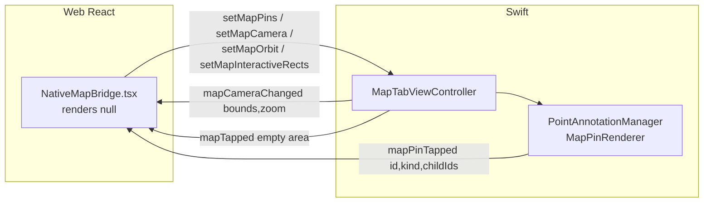

# Maps & Clustering
> The home-screen map: one persistent Mapbox surface (web `mapbox-gl` / native Mapbox-iOS) fed by the same Zustand pin pipeline and supercluster index, rendered either as a `react-map-gl` map (web) or a native map behind a transparent WebView (native).

## How it works

The map is the home route `/`. A single host, `PersistentMapHost`, decides at runtime whether it is web or native (`isNativeApp()`) and mounts exactly one of two map drivers — both reading the **same** Zustand store and running the **same** supercluster config. The web driver renders a real `react-map-gl` map and React `<Marker>` pins; the native driver renders nothing (`return null`) and instead streams pin/camera commands to a Swift Mapbox map living behind the WebView.

Source of truth is the Zustand `appStore`: `userLocation`, `nearbyUsers`, `bots`, `highlightedUserId`, `pendingUserId`, `selectedClusterUserIds`, `visibleUsers`, `onlineUsers`. Location flows in via `useGeolocation`; people via `useNearbyPresence` → `/api/nearby`; coin bots via `useBots` → `/api/bots`. All of these are mounted high in the tree (`PreloadProvider`) so the data exists regardless of which map driver is active.

```mermaid
flowchart TD
  geo[useGeolocation\nCapacitor / navigator] -->|setUserLocation| store
  near["useNearbyPresence → POST /api/nearby (2km, 10s poll)"] -->|setNearbyUsers| store
  botsapi["useBots → GET /api/bots"] -->|setBots| store
  store[(appStore\nuserLocation, nearbyUsers,\nbots, highlightedUserId, …)]
  store --> sc[Supercluster index\nradius 40, maxZoom 20\nexcludes highlighted user]
  sc -->|getClusters bounds, round zoom| feats[cluster + point features]
  feats --> webpins[Web: react-map-gl Markers]
  feats --> natpins[Native: MapPin[] → setMapPins]
```



Host & split: `src/components/map/PersistentMapHost.tsx:30` returns `<NativeMapBridge/>` on native, else a fixed full-bleed `<MapView/>` div (`PersistentMapHost.tsx:36-43`). The web div is **hidden but kept mounted** when off `/` via `visibility:hidden; pointer-events:none` (`PersistentMapHost.tsx:39`) so the WebGL context survives route changes. Mounted once in `src/app/(main)/layout.tsx:33`.

## Web rendering

- Stack: `react-map-gl/mapbox` `<Map>` + `<Marker>`, `mapbox-gl` CSS imported, `supercluster` (`MapView.tsx:4-6`). Token from `NEXT_PUBLIC_MAPBOX_TOKEN` (`MapView.tsx:219`).
- **SSR avoidance**: `MapView` is a dynamic import with `{ ssr: false }` (`MapViewDynamic.tsx:5-8`) — `mapbox-gl` touches `window`/WebGL and must never run server-side. Everything imports `MapView` from `MapViewDynamic`, never `MapView.tsx` directly.
- Camera: `DEFAULT_ZOOM=17`, `DEFAULT_PITCH=50`, style `mapbox://styles/mapbox/standard`, `minZoom={16}`, `maxPitch={85}` (`MapView.tsx:17-19,223-224`). On load it sets the Standard `lightPreset` (dawn/day/dusk/night) by local hour (`MapView.tsx:214-216`) — mirrored on native by `MapboxStyleManager`.
- View state is local React state driven by `onMove` (`MapView.tsx:201`); first GPS fix centers once via `hasCentered` ref (`MapView.tsx:62-71`).
- Pins (all React, anchored `center`):
  - `UserPin.tsx` (`UserPinContent`) — avatar or initial, variant classes for self/friend/highlighted; reused by cluster points, self pin, and highlighted pin.
  - `HighlightedPin.tsx` — the selected user; renders the pin in a `<Marker>` plus a portalled card (mobile bottom sheet / desktop top-right) with Say-hi / Profile CTAs.
  - `BotPin.tsx` — coin bot; amber + `presence-pulse` when `collectable`, gray otherwise; tap collects in-range or shows an inline "Get closer" hint.
  - Cluster pin — inline `<div className="user-pin-cluster">` showing `point_count` (capped `99+`), `-selected` modifier when tapped (`MapView.tsx:242-256`).
- Highlighted-user flow: `easeTo` to the user, then a `requestAnimationFrame` bearing orbit at 360°/60s, started after the ease completes; `isOrbitingRef` suppresses `onMove` writes during orbit (`MapView.tsx:93-121,201`).
- Floating UI lives in `src/app/(main)/page.tsx` over the map: `MapSearchBar`, `MapTopLabels`, `NearbySwiper` (mobile), `DesktopNearbyRail` (desktop ≥768px), `RecenterButton`, `BotHint`, `LocationGate`, dev `DevSeedButton`.

## Native rendering

The native Mapbox map (`ios/App/App/Native/MapTabViewController.swift`) sits **behind** the transparent Capacitor WebView. The web side renders `NativeMapBridge` (`return null`, `NativeMapBridge.tsx:352`) which only marshals store data to Swift.

Web → native (commands; see [BRIDGE](./BRIDGE.md) for marshaling):
- `setMapPins({ pins: MapPin[] })` — the full pin set (self, highlighted, clusters, individual users, bots), rebuilt and pushed on a RAF-debounced effect (`NativeMapBridge.tsx:241-350`). Swift diffs by pin id, reuses unchanged `PointAnnotation`s, and rebuilds images only when a pin's visual key changes (`MapTabViewController.swift:199-234`). Images are drawn by `MapPinRenderer` with async avatar fetch + cache (`MapTabAnnotations.swift:52-101`).
- `setMapCamera({lat,lng,zoom,pitch,bearing,animated,durationMs})` — center once on first fix, fly to highlighted user, recenter button (`NativeMapBridge.tsx:83-136`). Swift flies or snaps then re-emits `mapCameraChanged` so web recomputes clusters (`MapTabViewController.swift:247-275`).
- `setMapOrbit({active})` — starts/stops a `CADisplayLink` bearing rotation at 360°/60s, matching web's orbit (`MapTabViewController.swift:284-301`); any gesture or `setMapCamera` stops it (`:248,342-343`).
- `setMapInteractiveRects({rects})` — see passthrough below.
- `setMapClusterConfig` exists in the TS interface (`peekpoke-bridge.ts:108`) but is **not called** by the web map (clustering happens in JS); Swift treats it as reserved/no-op.

Native → web (events, consumed in `NativeMapBridge.tsx`):
- `mapCameraChanged` (`:142-156`) — carries exact `bounds [w,s,e,n]` + zoom from the native map on idle; drives `visibleUsers` (for the swiper) and the cluster recompute. Falls back to `boundsFromCamera()` (`:34-45`) before the first event.
- `mapPinTapped` (`:167-189`) — `cluster` selects the cluster ring + sets `selectedClusterUserIds`; `bot` collects in-range or dispatches `peekpoke:bot-hint`; `self_*` ids are ignored; otherwise `selectUser(id)`.
- `mapTapped` (`:200-205`) — empty-area tap clears cluster + highlighted selections (parity with web `onMapClick`).

**Transparent-WebView-over-native-map arrangement**: `MapPassthroughView.hitTest` (`MapTabViewController.swift:13-33`) routes a touch to the WebView only if it lands inside one of the published `interactiveRects`; otherwise it forwards the hit to the native map so pans/zooms/pin-taps work *through the holes* in the web UI. The web publishes those rects from `src/app/(main)/page.tsx:19-69`: it reads `getBoundingClientRect()` of every `.pointer-events-auto` element (the project's marker for floating cards/buttons) and pushes them via `setMapInteractiveRects`, re-publishing on `ResizeObserver`/`MutationObserver` changes. CSS `html.native-map` makes the page background transparent (`globals.css:536-541`) so only the floating cards paint over the map.

## Clustering pipeline

Identical config on both drivers — `new Supercluster({ radius: 40, maxZoom: 20 })` (`MapView.tsx:125`, `NativeMapBridge.tsx:217`):

1. **Index build** (memoized on `[nearbyUsers, highlightedUserId]`): map `nearbyUsers` → point features `{userId}` at `[lng,lat]`, **excluding** the highlighted user and anyone within 0.03 km of them (so the highlighted pin and its card don't fight a cluster) (`MapView.tsx:124-140`, `NativeMapBridge.tsx:216-238`).
2. **Cluster compute**: `supercluster.getClusters(bounds, Math.round(zoom))`. Web recomputes only when `viewState.zoom`, `mapBounds`, or `mapLoaded` change (`MapView.tsx:143-146`); bounds update on `onMoveEnd` (`MapView.tsx:149-159`). Native recomputes inside the push-pins effect using `camera.bounds` / `camera.zoom` from `mapCameraChanged` (`NativeMapBridge.tsx:282-291`).
3. **Render**: features with `cluster:true` become cluster pins (count `99+` cap); leaves become user pins. Bots and the highlighted pin are added outside the cluster set.
4. **Cluster tap / expand**: tapping a cluster does **not** zoom-expand — it calls `supercluster.getLeaves(cluster_id, Infinity)` and stores those user ids in `selectedClusterUserIds` (`MapView.tsx:180-184`; native via `childIds` precomputed at push time, `NativeMapBridge.tsx:296-307`). The `NearbySwiper` then shows that cluster's members (`NearbySwiper.tsx:24-27`). Selected cluster id (`selectedClusterId` web / `selectedClusterPinId` native) drives the highlight ring.

## Location & data sources

- **`useGeolocation`** (`src/hooks/useGeolocation.ts`): web uses `navigator.geolocation.watchPosition`; native uses Capacitor `Geolocation` (`requestPermissions` → `getCurrentPosition` for an instant center → `watchPosition`). Both debounce to 5 s and write `setUserLocation` + a `locationStatus` lifecycle (`idle|prompting|granted|denied`).
- **`LocationGate`** (`src/components/map/LocationGate.tsx`): full-screen cover until the first fix. `denied` shows a Settings deep link on native (`openExternal app-settings:`) / browser instructions on web. Needed because the native map otherwise shows a fallback city (Sofia `42.6977,23.3219`, `MapTabViewController.swift:106`) with no explanation.
- **People**: `useNearbyPresence` (`src/hooks/useNearbyPresence.ts`) POSTs `/api/location` on movement and polls `POST /api/nearby` every 10 s within a 2 km radius → `setNearbyUsers`. See [API](./API.md) / [DATA](./DATA.md) for the query.
- **Bots**: `useBots` (`src/hooks/useBots.ts`) fetches `GET /api/bots?lat&lng` once → `setBots`; `collectBot()` (`src/lib/bots.ts`) POSTs a collect within `BOT_COLLECT_RANGE_KM=0.05`, updates coins, and refills the pool.
- **Store location slice** (`src/stores/appStore.ts:519-576`, selectors `src/stores/selectors.ts:55-64`): `userLocation`, `locationStatus`, `nearbyUsers`, `visibleUsers`, `selectedClusterUserIds`, `highlightedUserId`, `pendingUserId`, `highlightedData`, `bots`. `selectUser(id)` (`appStore.ts:554-576`) sets `pendingUserId`, fetches `/api/profile/:id`, then promotes to `highlightedUserId` + `highlightedData`.

## Key files

| File | Role |
| --- | --- |
| `src/components/map/PersistentMapHost.tsx` | Web/native split; full-bleed hidden-but-mounted web map div |
| `src/components/map/MapView.tsx` | Web `react-map-gl` map, supercluster, camera/orbit, pin rendering |
| `src/components/map/MapViewDynamic.tsx` | `dynamic(..., {ssr:false})` wrapper so mapbox-gl never SSRs |
| `src/components/map/NativeMapBridge.tsx` | Invisible bridge: store → `setMapPins`/camera/orbit; native events → store |
| `src/components/map/UserPin.tsx` | Shared avatar/initial pin content (self/friend/highlighted variants) |
| `src/components/map/HighlightedPin.tsx` | Selected-user pin + portalled detail card with CTAs |
| `src/components/map/BotPin.tsx` | Coin bot pin (collectable amber vs gray) |
| `src/components/map/NearbySwiper.tsx` | Mobile bottom card carousel of visible / selected-cluster users |
| `src/components/map/DesktopNearbyRail.tsx` | Desktop 340px nearby list with filters/search |
| `src/components/map/RecenterButton.tsx` | Dispatches `recenter-map` window event |
| `src/components/map/MapSearchBar.tsx` / `MapTopLabels.tsx` | Mobile search/filter pill; online + coin pills |
| `src/components/map/LocationGate.tsx` | Pre-fix / permission-denied cover |
| `src/components/map/BotHint.tsx` | Transient "Get closer" pill for out-of-range native bot taps |
| `src/components/map/DevSeedButton.tsx` | Dev-only fake nearby users (`dev-seed-*`) |
| `src/lib/geo.ts` | `haversineKm`, `formatDistance` |
| `src/lib/bots.ts` | `collectBot`, `BOT_COLLECT_RANGE_KM` |
| `src/lib/peekpoke-bridge.ts` | `MapPin` type + map bridge method signatures |
| `src/hooks/useGeolocation.ts` / `useNearbyPresence.ts` / `useBots.ts` | Location, nearby polling, bot fetch |
| `src/app/(main)/page.tsx` | Floating map UI + `setMapInteractiveRects` publisher |
| `ios/App/App/Native/MapTabViewController.swift` | Native Mapbox map, passthrough hit-test, camera/orbit, tap events |
| `ios/App/App/Native/MapTabAnnotations.swift` | `MapPinData`, color palette, `MapPinRenderer` (pin images + avatar fetch) |
| `ios/App/App/Native/MapboxStyleManager.swift` | Time-of-day Standard `lightPreset` (mirrors web) |

## Gotchas / invariants

- **Never import `MapView.tsx` directly** — always via `MapViewDynamic` so `mapbox-gl` is excluded from SSR. Importing it server-side will crash on `window`.
- **Web map is hidden, not unmounted** off `/` (`visibility:hidden`) to preserve the WebGL context and avoid re-init cost (`PersistentMapHost.tsx:39`).
- **Store-level dedup**: `setNearbyUsers` / `setVisibleUsers` / `setBots` / `setOnlineUsers` early-return identical updates by shallow comparison (`appStore.ts:512-551`) — critical because polling runs every 10 s and the native RAF effect depends on `nearbyUsers` identity.
- **Dev-seed users** (`dev-seed-*`) are merged ahead of server results inside `setNearbyUsers` (`appStore.ts:539-540`) so a poll doesn't wipe seeded test pins.
- **Highlighted user is excluded from clustering** along with anyone within 30 m of them, on both drivers — keep these two filters in sync (`MapView.tsx:126-132`, `NativeMapBridge.tsx:218-230`).
- **Cluster config must stay identical** across web and native (`radius:40, maxZoom:20`); they cluster independently but must agree visually.
- **Color palette is mirrored three ways**: `avatarColor()` `PAL` (`src/lib/avatar-color.ts`), `pinColorIndex()` hash (`NativeMapBridge.tsx:24-30`, same `h*31+charCode` as `avatarColor`), and Swift `PIN_PALETTE` (`MapTabAnnotations.swift:28-35`). `colorIndex` is `Math.abs(hash) % 6`; changing one palette requires changing all three.
- **Interactive rects use `.pointer-events-auto`** as the contract — any floating element that must receive touches on native *must* carry that class, or its touches fall through to the map. Rects are CSS-px from the WebView frame; Swift converts touch points into the overlay's coord space before matching (`MapTabViewController.swift:24-31`).
- **Cached rects survive tab deactivation** (`setOverlayActive`, `MapTabViewController.swift:164-176`): the persistent WebView DOM doesn't change while another tab shows, so observers won't refire — clearing rects would permanently disable passthrough.
- **Annotation-vs-empty-tap race**: native suppresses an empty-map `mapTapped` within 0.3 s of an annotation tap (`MapTabViewController.swift:178-183,353`).
- **`self_` pin ids are prefixed** on native to avoid `selectUser` firing on a tap of your own pin; the highlighted pin uses the **raw** userId so its tap round-trips correctly (`NativeMapBridge.tsx:181,263-264`).
- **`setMapClusterConfig` is dead weight** on the map path — clustering is JS-side; the method exists for future native-side clustering but is a no-op today.

## Related
- [ARCHITECTURE](./ARCHITECTURE.md) — system hub and the single-WebView shell.
- [BRIDGE](./BRIDGE.md) — exact `PeekPokeBridge` method signatures, marshaling, and event plumbing.
- [API](./API.md) — `/api/nearby`, `/api/bots`, `/api/location`, `/api/profile/:id` endpoints.
- [DATA](./DATA.md) — `NearbyUser` shape and the nearby/bot queries.
- [AUTH](./AUTH.md) — session gating for `/api/*` map data.
</content>
</invoke>
