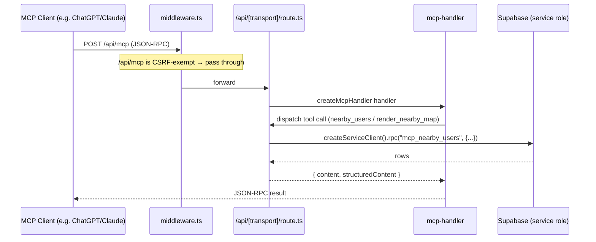

# MCP Server

> Peek & Poke ships its own Model Context Protocol server as a single Next.js dynamic route, exposing "nearby users" lookup tools (one text, one map-widget) backed by a Supabase RPC.

## How it works

The server is one App Router catch-all route: `src/app/api/[transport]/route.ts`. It is built with the [`mcp-handler`](https://www.npmjs.com/package/mcp-handler) package (`^1.1.0`, see `package.json:58`) on top of `@modelcontextprotocol/sdk` (`^1.26.0`, `package.json:34`).

`createMcpHandler(...)` returns a single request handler that is exported for all three HTTP verbs the protocol needs (`src/app/api/[transport]/route.ts:395`):

```ts
export { handler as GET, handler as POST, handler as DELETE };
```

The handler takes three arguments (`src/app/api/[transport]/route.ts:253-393`):

1. A builder callback `(server) => { ... }` that registers one resource and two tools.
2. Server options: `{ serverInfo: { name: "peek-poke", version: "0.1.0" } }` (`:386-388`).
3. Adapter options: `{ basePath: "/api", verboseLogs: NODE_ENV === "development" }` (`:389-392`).

### Transports & routing

`mcp-handler` derives its endpoint paths from `basePath`. With `basePath: "/api"` the package mounts (defaults from `node_modules/mcp-handler/dist/index.d.mts:84-86` and `index.js:143`):

| Transport | Path | Verb(s) |
| --- | --- | --- |
| Streamable HTTP | `/api/mcp` | GET / POST / DELETE |
| SSE (stream) | `/api/sse` | GET |
| SSE messages | `/api/message` | POST |

The `[transport]` dynamic segment is what lets one route file serve all of these — the segment value (`mcp`, `sse`, or `message`) is matched internally by `mcp-handler` against the configured endpoints. The same exported `handler` services every verb; routing by transport happens inside the package, not in this file.

> Note: the SSE transport in `mcp-handler` normally needs a Redis URL for cross-request message fan-out. This repo uses Upstash Redis elsewhere (`src/lib/rate-limit.ts`) but does **not** pass a `redisUrl` to `createMcpHandler`, so streamable HTTP (`/api/mcp`) is the reliable transport here. `> TODO: verify` SSE works without Redis in this deployment.

### Request lifecycle



The map widget (`render_nearby_map`) additionally streams `structuredContent` into an embedded HTML widget (the OpenAI "Apps"/skybridge UI template) that re-renders client-side via `ui/notifications/tool-result` / `openai:set_globals` messages (`src/app/api/[transport]/route.ts:218-228`).

## Tool reference

The server registers **one resource** and **two tools**. Both tools share the same input schema and the same Supabase RPC; they differ only in their text output and whether they bind the map widget.

| Tool | Input (zod) | Returns | Notes |
| --- | --- | --- | --- |
| `nearby_users` | `radius_km: z.number().min(0.1).max(50).optional().default(5)` | `content: [{type:"text", text: "Found N user(s)…"}]` + `structuredContent: { users, center, radius_km }` | Plain text list. Description nudges the model toward `render_nearby_map` for a visual map. `:284-330` |
| `render_nearby_map` | `radius_km: z.number().min(0.1).max(50).optional().default(5)` | Same `content`/`structuredContent` shape, text = "Showing map with N user(s)…" | Bound to the map widget via `_meta["openai/outputTemplate"] = WIDGET_URI`; renders interactive Mapbox UI. `:332-384` |

Plus one registered resource:

| Resource | URI | mimeType | Role |
| --- | --- | --- | --- |
| `nearby-map-widget` | `ui://widget/nearby-map.html` | `text/html+skybridge` | The full Mapbox GL JS HTML widget served to MCP-Apps-capable clients (`:255-282`). |

### `nearby_users` (`src/app/api/[transport]/route.ts:284-330`)

- **Input:** `radius_km` — kilometres, clamped to `[0.1, 50]`, default `5`.
- **Behavior:** calls `supabase.rpc("mcp_nearby_users", { p_lat: TEST_LAT, p_lng: TEST_LNG, p_radius_km: radius_km })` using a **service-role** client.
- **Returns:** a text summary listing matched usernames, plus `structuredContent: { users, center: { lat, lng }, radius_km }`. On RPC error it returns `{ content: [text], isError: true }` (`:308-313`).
- Rows are normalized from snake_case DB columns to camelCase by `mapUsers()` (`:242-251`): `userId, username, displayName, avatarUrl, lat, lng`.

### `render_nearby_map` (`src/app/api/[transport]/route.ts:332-384`)

Identical query path to `nearby_users`, but its registration carries `_meta` keys that tie the tool result to the widget resource (`:347-352`):

- `"openai/outputTemplate": WIDGET_URI` — bind output to the `nearby-map-widget` resource.
- `"openai/toolInvocation/invoking"` / `"invoked"` — progress strings.
- `"openai/widgetAccessible": true`.

The widget HTML (`WIDGET_HTML`, `:11-231`) is a self-contained Mapbox GL JS page: avatar pins, a dashed radius circle, click popups with distance, and an "Expand" → fullscreen button. It interpolates `process.env.NEXT_PUBLIC_MAPBOX_TOKEN` (`:8`, `:99`) and listens for `structuredContent` pushes to re-render.

### The hardcoded center (invariant worth flagging)

Both tools ignore the caller's real location and pass fixed coordinates `TEST_LAT = 43.2141`, `TEST_LNG = 27.9147` (Varna, Bulgaria) to the RPC (`:5-6`, `:302-306`, `:356-360`). The user-facing text even says "of Varna". This is test/demo scaffolding — there is no `lat`/`lng` input on either tool. `> TODO: verify` whether a real per-request location was intended.

### The data RPC

`mcp_nearby_users(p_lat double precision, p_lng double precision, p_radius_km double precision DEFAULT 5)` is a `SECURITY DEFINER` plpgsql function returning `TABLE(user_id uuid, username text, display_name text, avatar_url text, lat double precision, lng double precision)` (verified in the active Supabase project, `MyaouDB`/`ttojvnwpnpuhkyjncwxn`). It is **not** present in any local `.sql` file — it lives only in the remote database. Because it is `SECURITY DEFINER` and called with the service-role client, it bypasses RLS. See [DATA](./DATA.md) for the underlying location/profile tables.

## Auth & transport

**There is no authentication on the MCP tools.** The route never resolves a Supabase user, never inspects a `Bearer` token or token query param, and uses `createServiceClient()` (service-role key) for every call (`src/app/api/[transport]/route.ts:301`, `:355`; `src/lib/supabase/server.ts:52-63`). Any client that can reach `/api/mcp` can list nearby users for the hardcoded Varna center. This contrasts with the REST surface (see [API](./API.md)), which is user/cookie/Bearer scoped.

`createServiceClient()` builds a plain `@supabase/supabase-js` client with `SUPABASE_SERVICE_ROLE_KEY` and no session persistence (`src/lib/supabase/server.ts:52-63`).

### CSRF exemptions

The global middleware enforces an Origin-vs-Host CSRF check on every mutating (`POST/PATCH/PUT/DELETE`) request under `/api/`. The three MCP transport paths are explicitly exempt (`src/middleware.ts:13-28`):

```ts
const csrfExempt = ["/api/stripe/webhook", "/api/mcp", "/api/sse", "/api/message"];
```

The inline comment explains why: "MCP uses its own transport protocol" (`src/middleware.ts:15`). Without these exemptions, cross-origin MCP clients (which send no matching `Origin` header) would be rejected with `403 Forbidden`. The middleware short-circuits all `/api/` paths after the CSRF gate (`:30`), so the MCP route never runs the Supabase session/onboarding logic that applies to page routes. See [AUTH](./AUTH.md) for the cookie/session model the rest of the app uses.

## Key files

| File | Role |
| --- | --- |
| `src/app/api/[transport]/route.ts` | The entire MCP server: handler config, resource + two tool registrations, embedded Mapbox widget HTML. |
| `src/lib/supabase/server.ts` | `createServiceClient()` — service-role client used by both tools (`:52-63`). |
| `src/middleware.ts` | CSRF exemptions for `/api/mcp`, `/api/sse`, `/api/message` (`:16`). |
| `package.json` | Pins `mcp-handler@^1.1.0` (`:58`) and `@modelcontextprotocol/sdk@^1.26.0` (`:34`). |
| Supabase RPC `mcp_nearby_users` | Remote-only `SECURITY DEFINER` function returning nearby user rows. See [DATA](./DATA.md). |

## Gotchas / invariants

- **No auth.** Tools run as service-role and resolve no user. Treat `/api/mcp` as publicly readable for the demo dataset until this is gated.
- **Hardcoded location.** `radius_km` is the only real input; the center is always Varna (`TEST_LAT/TEST_LNG`, `:5-6`). Per-request lat/lng is not supported.
- **Service-role + SECURITY DEFINER bypasses RLS.** The RPC sees all matching users regardless of caller identity.
- **`mcp_nearby_users` is not in source control.** It exists only in the remote Supabase project; schema changes won't show up in repo diffs.
- **SSE may need Redis.** No `redisUrl` is passed to `createMcpHandler`; prefer the streamable HTTP endpoint `/api/mcp`. (`> TODO: verify` SSE reliability.)
- **Three verbs, one handler.** `GET/POST/DELETE` all map to the same `handler` (`:395`); transport selection is internal to `mcp-handler`.
- **Mapbox token is inlined into the widget HTML** (`NEXT_PUBLIC_MAPBOX_TOKEN`, `:8`/`:99`) — it is a public token by design. See [MAPS](./MAPS.md).

## Related

- [ARCHITECTURE](./ARCHITECTURE.md) — system hub.
- [API](./API.md) — the user-scoped REST surface (contrast with this unauthenticated MCP route).
- [DATA](./DATA.md) — tables behind `mcp_nearby_users` (profiles, locations).
- [AUTH](./AUTH.md) — Supabase session/cookie + Bearer model the rest of the app uses.
- [MAPS](./MAPS.md) — Mapbox usage and tokens shared by the widget.
