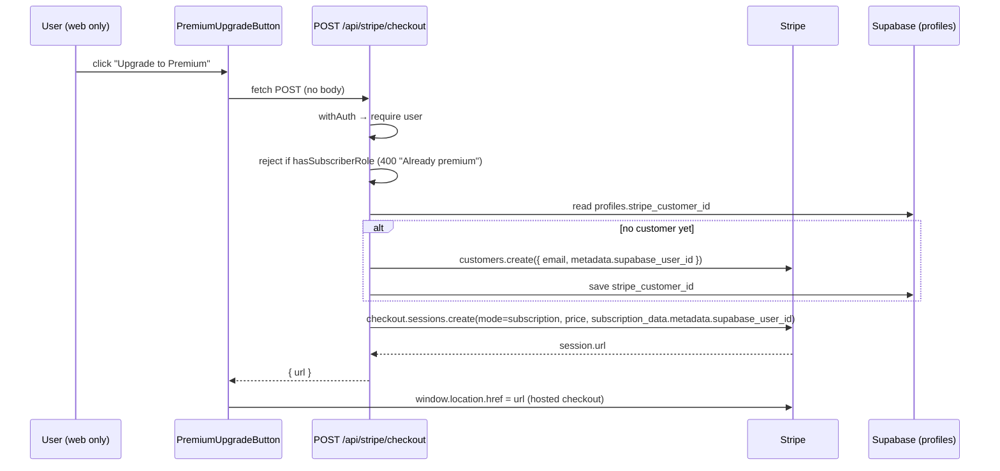
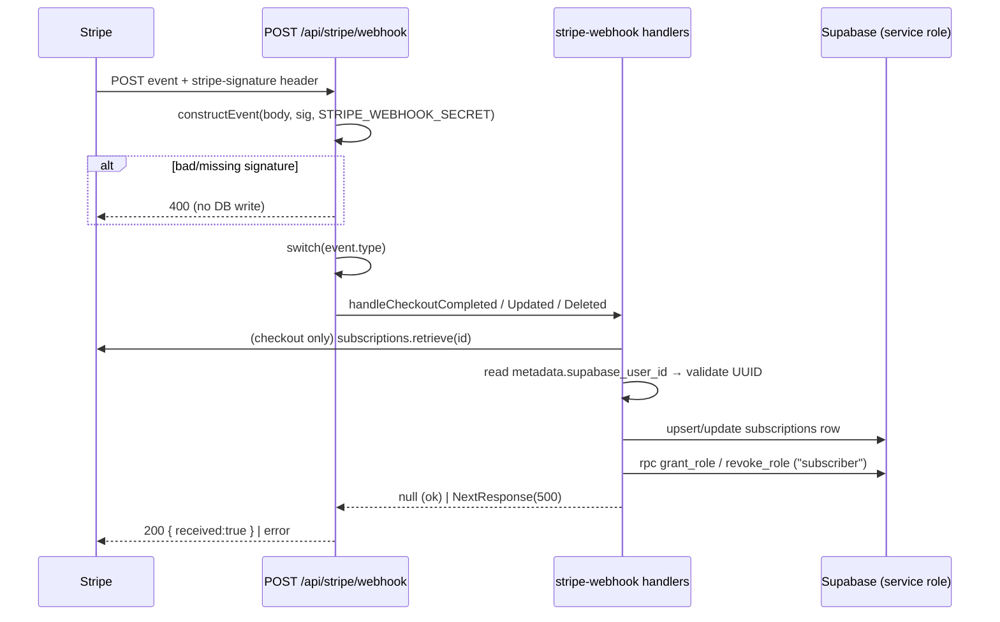

# Payments (Stripe)

> Sells the "Peek Premium" subscription via Stripe Checkout; a signature-verified webhook is the single source of truth that grants/revokes the `subscriber` role.

## How it works

Two flows. The **subscribe flow** is user-initiated and only creates a Stripe Checkout Session — it grants **no** entitlement. The **webhook flow** is Stripe-initiated and is the only place that writes the `subscriptions` table and the `subscriber` role. This split means premium access never depends on the success-redirect resolving; it is driven entirely by verified webhook events.

The `subscriber` role itself is read everywhere via `hasSubscriberRole` (`src/lib/auth.ts:130-139`), which calls the `user_has_role` RPC. See [AUTH](./AUTH.md) for role checks and [DATA](./DATA.md) for the role/`subscriptions` tables. This doc covers how the webhook **writes** that role.

### Flow 1 — subscribe / checkout

Entry point `src/components/profile/PremiumUpgradeButton.tsx:12-28`; route `src/app/api/stripe/checkout/route.ts:5-87`. The critical detail is `subscription_data.metadata.supabase_user_id` (`checkout/route.ts:67-69`) — that metadata rides onto the `Stripe.Subscription` object and is the only link the webhook has back to the Supabase user.

### Flow 2 — webhook → role grant

Verification + dispatch `src/app/api/stripe/webhook/route.ts:11-68`; side-effect handlers `src/lib/stripe-webhook.ts`.

## Routes

All under `src/app/api/stripe/`. Auth = `withAuth` wrapper (`src/lib/auth.ts:11-36`, 401 if no Supabase user) unless noted.

| Route | Method | Auth | Stripe call | Returns |
| --- | --- | --- | --- | --- |
| `checkout/route.ts:5` | POST | `withAuth` + `hasSubscriberRole` gate (400 if already premium, `:29-31`) | `customers.create` (if needed, `:38`), `checkout.sessions.create` (`:56-77`) | `{ url }` of hosted checkout (`:79`) |
| `payment-method-subscribe/route.ts:5` | POST | `withAuth` + `hasSubscriberRole` gate (`:17-19`) | `customers.create` (if needed), `paymentMethods.attach` (`:48`), `subscriptions.create` (`:51-57`) | `{ success: true }`, or `{ clientSecret }` if `status === "incomplete"` for 3DS (`:60-66`) |
| `portal/route.ts:5` | POST | `withAuth` | `billingPortal.sessions.create` (`:28-31`) | `{ url }` of Stripe billing portal; 400 "No subscription found" if no `stripe_customer_id` (`:20-25`) |
| `price/route.ts:4` | GET | **none (public)** | `prices.retrieve(STRIPE_PREMIUM_PRICE_ID)` (`:11`) | `{ amount, currency }` (falls back to `999` if `unit_amount` null, `:13`) |
| `webhook/route.ts:11` | POST | **signature, not session** — `constructEvent` w/ `STRIPE_WEBHOOK_SECRET` | none directly; handlers call `subscriptions.retrieve` | `{ received: true }` (200), or 400 on bad signature, or 500 from a handler |

Notes:
- `payment-method-subscribe` is the in-page card-element path (subscription created directly, server-side) vs `checkout` which redirects to Stripe-hosted checkout. Both set `metadata.supabase_user_id` on the subscription so the webhook can resolve the user.
- `checkout` and `payment-method-subscribe` lazily create-and-persist `profiles.stripe_customer_id` the first time (`checkout/route.ts:36-53`).

## Webhook events

Dispatched in `webhook/route.ts:35-63`. Each handler returns `null` on success (→ 200 `{received:true}`) or a `NextResponse` 500 on failure (Stripe will then retry). Handlers resolve the user from `subscription.metadata.supabase_user_id` and **validate it is a UUID** (`isValidUUID`) before any write; a missing/invalid id returns a 200 with a `warning` and writes nothing (`stripe-webhook.ts:51-56`, `:77-84`).

| Event type | Handler effect (file:line) |
| --- | --- |
| `checkout.session.completed` | `handleCheckoutCompleted` (`stripe-webhook.ts:58-120`). If no `session.subscription`, no-op (`:62`). Else `subscriptions.retrieve` the sub, then **upsert** the `subscriptions` row keyed on `stripe_subscription_id` (`:88-100`) and `grant_role(user, "subscriber")` (`:110`). Retrieve failure → 500; role-grant failure → 500. |
| `customer.subscription.updated` | `handleSubscriptionUpdated` (`stripe-webhook.ts:122-168`). Updates `status`, `current_period_end`, `cancel_at_period_end` on the row (`:138-146`). Then **grant** role if `status` is `active`/`trialing`, otherwise **revoke** it (`:134-158`). |
| `customer.subscription.deleted` | `handleSubscriptionDeleted` (`stripe-webhook.ts:170-208`). Sets row `status="canceled"` (`:182-188`) and `revoke_role(user, "subscriber")` (`:198`). |
| `customer.subscription.paused` | Routed to the **same** `handleSubscriptionUpdated` (`webhook/route.ts:56-60`). `paused` is not `active`/`trialing`, so the role is **revoked**. |
| `invoice.payment_failed` | Logged only — `console.error` with customer + invoice id (`webhook/route.ts:51-55`). **No DB write, no role change** (the eventual `subscription.updated`/`deleted` for `past_due`/`canceled` drives the role). |
| _any other_ | `default`: logged as "Unhandled" and 200 (`webhook/route.ts:61-62`). |

**Signature verification** is mandatory: the route 400s if either the `stripe-signature` header or `STRIPE_WEBHOOK_SECRET` env is missing (`webhook/route.ts:15-17`), and `stripe.webhooks.constructEvent` throwing → 400 "Invalid signature" before any DB access (`:21-30`). Confirmed by `src/app/api/__tests__/stripe-webhook.test.ts:57-75`.

**Idempotency** is structural rather than via a dedup table: `checkout.session.completed` uses an **upsert** with `onConflict: "stripe_subscription_id"` (`stripe-webhook.ts:99`), and the role RPCs `grant_role`/`revoke_role` are set-membership operations, so replaying any event converges to the same state. There is no separate "processed event id" ledger.

> TODO: verify — `grant_role`, `revoke_role`, and `user_has_role` RPCs and the `subscriptions`/role tables are not defined in any tracked `.sql` migration in this repo; they live in the remote Supabase project. See [DATA](./DATA.md) for their schema.

## Client UI & native behavior

UI lives in `src/components/profile/`:
- **`PremiumCard.tsx`** — shown on the profile page. If `isPremiumUser` it renders the "Active subscription" badge + `ManageSubscriptionButton` (`:18-34`); otherwise it shows price (hard-coded "€11.99 / month", `:65`) and `PremiumUpgradeButton` (`:59`).
- **`PremiumUpgradeButton.tsx`** — POSTs `/api/stripe/checkout` and `window.location.href = data.url` to the hosted checkout (`:19-28`).
- **`ManageSubscriptionButton.tsx`** — POSTs `/api/stripe/portal` and redirects to the Stripe billing portal (`:28-37`).
- **`src/components/ui/UpgradeDialog.tsx`** — a reusable upsell dialog; its "Upgrade Now" button also POSTs `/api/stripe/checkout` (`:64-70`).

**Native (iOS) behavior — Stripe is never opened in-app.** Both action buttons short-circuit when `isNativeApp()` is true (`src/lib/native.ts:7`) and show an explanatory dialog instead of hitting Stripe:
- Upgrade on native → `UpgradeDialog` renders the native branch ("Premium subscriptions aren't available in the iOS app yet — coming to the App Store soon", `UpgradeDialog.tsx:26-48`); `PremiumUpgradeButton.tsx:14-17` sets `showNativeNotice` and returns without fetching.
- Manage on native → `ManageSubscriptionButton.tsx:23-25` shows a "managed on the web" dialog (`:50-66`).

So there is **no** `openExternal`/Capacitor `Browser` handoff for payments — the native app deliberately blocks the Stripe flow entirely (App Store IAP rules; native checkout is deferred). See [BRIDGE](./BRIDGE.md) for the native shell. The success/cancel redirects (`checkout/route.ts:65-66`) point back to `/profile?payment=success|canceled` on the web app.

## Secrets & config

| Env var | Read at | Purpose |
| --- | --- | --- |
| `STRIPE_SECRET_KEY` | `src/lib/stripe.ts:3-9` | Server Stripe client; throws at module load if unset. API version pinned to `2025-12-15.clover` (`stripe.ts:8`). |
| `STRIPE_WEBHOOK_SECRET` | `webhook/route.ts:15,25` | Webhook signature verification (`constructEvent`). |
| `STRIPE_PREMIUM_PRICE_ID` | `checkout/route.ts:7`, `payment-method-subscribe/route.ts:6`, `price/route.ts:5` | The single premium price; routes 500 if unset. |
| `NEXT_PUBLIC_APP_URL` | `checkout/route.ts:65-66`, `portal/route.ts:30` | Builds checkout success/cancel and portal return URLs. |

The webhook (and only the webhook handlers) writes with the **service-role** Supabase client `createServiceClient()` (`webhook/route.ts:32`), bypassing RLS — required because the request carries no user session, only a verified Stripe signature. User-facing routes use the RLS-scoped `withAuth` client.

## Key files

| File | Role |
| --- | --- |
| `src/lib/stripe.ts` | Singleton Stripe client; secret key + pinned API version. |
| `src/lib/stripe-webhook.ts` | Pure handlers: `handleCheckoutCompleted` / `handleSubscriptionUpdated` / `handleSubscriptionDeleted`, plus `grantRole`/`revokeRole`/`getSubscriptionPeriod` helpers. |
| `src/app/api/stripe/webhook/route.ts` | Signature verification + event dispatch (service-role client). |
| `src/app/api/stripe/checkout/route.ts` | Hosted-checkout session creation. |
| `src/app/api/stripe/payment-method-subscribe/route.ts` | In-page card subscription (with 3DS `clientSecret` fallback). |
| `src/app/api/stripe/portal/route.ts` | Billing-portal session. |
| `src/app/api/stripe/price/route.ts` | Public price lookup. |
| `src/components/profile/{PremiumCard,PremiumUpgradeButton,ManageSubscriptionButton}.tsx`, `src/components/ui/UpgradeDialog.tsx` | Client UI + native gating. |
| `src/lib/auth.ts` | `withAuth`, `hasSubscriberRole` (entitlement read). |
| `src/lib/__tests__/stripe-webhook.test.ts`, `src/app/api/__tests__/stripe-*.test.ts` | Behavior tests for handlers + routes. |

## Gotchas / invariants

- **The webhook is the single source of truth.** `checkout`/`payment-method-subscribe` grant **no** entitlement; the `subscriber` role and `subscriptions` row are written only by webhook handlers. A successful redirect with a delayed/failed webhook means premium is not yet active.
- **`metadata.supabase_user_id` is the only user link.** Set on `subscription_data` at checkout (`checkout/route.ts:67-69`) and on `subscriptions.create` (`payment-method-subscribe/route.ts:56`). If absent/invalid the handler no-ops with a 200 `warning` and the user gets nothing (`stripe-webhook.ts:78-84`) — flagged in logs as "requires manual reconciliation".
- **Signature verification is non-negotiable** — no signature or no `STRIPE_WEBHOOK_SECRET` → 400, and verification runs before any DB access.
- **Idempotency is by upsert + set-membership RPCs**, not an event-id ledger; replays converge. Upsert conflict key is `stripe_subscription_id`.
- **Handlers return 500 to force Stripe retries** when a DB write or role RPC fails *after* partial progress (e.g. row upserted but `grant_role` failed → 500, `stripe-webhook.ts:110-117`). A failed role op is logged as "Critical".
- **Role lifecycle:** granted on `checkout.session.completed` and on `subscription.updated` when `active`/`trialing`; revoked on `subscription.deleted`, on `subscription.paused`, and on `subscription.updated` to any non-active status (`canceled`, `past_due`, `unpaid`, `incomplete*`). `past_due` is treated as **not entitled** (revokes) the moment an `updated` event carries that status.
- **`invoice.payment_failed` does not change entitlement** — it is log-only; revocation comes via the subsequent subscription status change.
- **Service-role writes bypass RLS** — keep the webhook handlers' user-id validation (`isValidUUID`) intact, since RLS is not there to backstop a bad id.
- **Native blocks payments entirely** — never wire `openExternal`/`Browser` into the upgrade/manage buttons without revisiting App Store IAP policy.
- **Period parsing reads `subscription.items.data[0].current_period_*`** (not the deprecated top-level fields), with a `Date.now()` fallback (`stripe-webhook.ts:10-17`).

## Related

- [ARCHITECTURE](./ARCHITECTURE.md) — system hub.
- [AUTH](./AUTH.md) — `withAuth`, `hasSubscriberRole`, role checks.
- [DATA](./DATA.md) — `subscriptions` table + role tables and `grant_role`/`revoke_role`/`user_has_role` RPCs.
- [API](./API.md) — broader API route conventions.
- [BRIDGE](./BRIDGE.md) — native WebView shell / `isNativeApp`.
