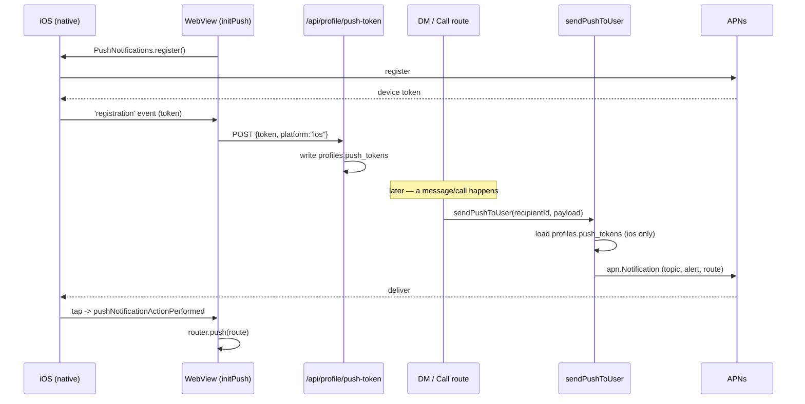

# Push Notifications

> APNs push delivery for the iOS app: device-token registration, server-side sends via `@parse/node-apn`, deep-link-on-tap, and app/tab badge counts.

## How it works

End to end, a push starts on the device (token registration) and ends on the device (display + tap navigation), with the server as the sender:

1. **Register** — On a native launch with a signed-in user, `initPushNotifications` requests permission, registers with APNs, and uploads the returned token (`src/components/NativeBridgeProvider.tsx:233`, `src/lib/push-notifications.ts:32`).
2. **Native token plumbing** — APNs hands the device token to `AppDelegate`, which forwards it to the Capacitor plugin (`ios/App/App/AppDelegate.swift:19`).
3. **Store** — The web layer POSTs the token to `/api/profile/push-token`, which writes it into the `profiles.push_tokens` jsonb array (`src/app/api/profile/push-token/route.ts:17`). See [DATA](./DATA.md).
4. **Trigger** — A server event (new DM message, incoming call) calls `sendPushToUser(userId, payload)` (`src/lib/push/send.ts:29`).
5. **Send** — `sendPushToUser` loads the recipient's iOS tokens, builds an `apn.Notification`, and sends through the shared `apn.Provider` to APNs (`src/lib/push/send.ts:46`, `src/lib/push/apns.ts:13`).
6. **Display / tap** — iOS shows the alert (`presentationOptions`, `capacitor.config.ts:34`). A tap fires `pushNotificationActionPerformed`, which validates the deep-link `route` and navigates (`src/lib/push-notifications.ts:64`).



## Server send path

**Provider** (`src/lib/push/apns.ts`). A single lazily-created `apn.Provider` is memoized in module scope (`providerSingleton`, `src/lib/push/apns.ts:3-26`). It authenticates with a JWT token credential: the `.p8` private key, key id, and team id. `getKey()` accepts either raw `.p8` contents or a base64-encoded blob — it base64-decodes unless it already contains `BEGIN PRIVATE KEY` (`src/lib/push/apns.ts:5-11`). `production` is set from `APNS_PRODUCTION === "true"` (`src/lib/push/apns.ts:24`) — this selects the APNs production vs sandbox gateway and MUST match the build's provisioning (see Gotchas). `getBundleId()` returns the APNs `topic` from `APNS_BUNDLE_ID` (`src/lib/push/apns.ts:29-33`).

**Send helper** (`src/lib/push/send.ts`). `sendPushToUser(userId, payload)`:

- Short-circuits silently if `APNS_KEY_ID` is unset, so push is a no-op when unconfigured (`src/lib/push/send.ts:30`).
- Loads `push_tokens` from `profiles` via a **service-role** client and filters to iOS tokens (`src/lib/push/send.ts:32-44`).
- Builds the notification: `topic = bundle id`, `alert = {title, body}`, `sound = "default"`, optional `threadId` (iOS coalescing key) and `badge`, plus a custom `payload` that merges `data` with `route` (`src/lib/push/send.ts:46-55`).
- `PushPayload` shape: `title`, `body`, optional `route` (deep link), `threadId`, `badge`, `data` (`src/lib/push/send.ts:5-16`).

**Dead-token cleanup.** After `provider.send`, failures are inspected (`src/lib/push/send.ts:57-83`):

- Non-410 rejections (bad topic, environment mismatch, etc.) are logged for diagnostics but tokens are kept (`src/lib/push/send.ts:60-70`).
- Status `410` / reason `Unregistered` means the device unregistered; those tokens are pruned and the trimmed array is written back to `profiles.push_tokens` (`src/lib/push/send.ts:72-83`).

All errors are caught and logged — pushes are best-effort and never throw into the calling request (`src/lib/push/send.ts:27`, `:84-86`).

## Triggers

`sendPushToUser` has exactly two call sites today (no friend-request or meeting pushes are wired up):

| Event | Trigger site (`file:line`) | Notification content |
|-------|---------------------------|----------------------|
| New DM message | `src/app/api/dm/[threadId]/route.ts:108` | title = sender display name / username (fallback "New message"); body = text truncated to 140 chars, or "Sent a photo" / "Sent a message"; `route=/chat/<threadId>`, `data.kind="dm"` (`:102-114`) |
| Incoming video call | `src/app/api/dm/[threadId]/call/route.ts:93` | title "📹 Incoming video call"; body "`<callerName>` is calling you"; `route=/chat/<threadId>`, `data.kind="call"`, includes `callId` (`:91-99`). Fire-and-forget (`void`) alongside the realtime ring broadcast |

Both run server-side inside authed API routes; the DM send is awaited inside a `try/catch` helper (`notifyRecipient`, `src/app/api/dm/[threadId]/route.ts:115-117`), the call send is fire-and-forget.

## Device registration & handling

**`initPushNotifications`** (`src/lib/push-notifications.ts:32`). Idempotent; bails immediately if not a native app (`:35`). Checks permission, prompts only on `prompt` / `prompt-with-rationale`, and returns early if the result is not `granted` (`:37-42`). Registers three listeners then calls `PushNotifications.register()` (`:44-70`):

- `registration` — caches the token in `currentDeviceToken` and POSTs it to `/api/profile/push-token` (`:45-60`).
- `registrationError` — logs (`:61-63`).
- `pushNotificationActionPerformed` (tap) — reads `data.route`, runs it through `safeRoute`, and calls `onNavigate` (`:64-67`). `safeRoute` allowlists only `/inbox`, `/chat`, `/profile`, `/admin` prefixes to prevent open-redirect-style deep links (`:6`, `:14-21`).

Returns a cleanup that removes the listeners (`:72-74`). It is wired in `NativeBridgeProvider`, started after `getUser()` confirms a signed-in user and re-run on `SIGNED_IN`, with `onNavigate: router.push` (`src/components/NativeBridgeProvider.tsx:223-252`). On explicit sign-out, `unregisterPushNotifications(getCurrentPushToken())` deletes the token server-side so the next user on the device doesn't receive stale pushes (`src/lib/push-notifications.ts:81-95`, called from `src/components/profile/SettingsSheet.tsx:70-73`).

**AppDelegate methods** (`ios/App/App/AppDelegate.swift`) — see Gotchas; these are a hard requirement for `@capacitor/push-notifications`:

- `didRegisterForRemoteNotificationsWithDeviceToken` → posts `.capacitorDidRegisterForRemoteNotifications` (`:19-21`).
- `didFailToRegisterForRemoteNotificationsWithError` → posts `.capacitorDidFailToRegisterForRemoteNotifications` (`:23-25`).

**Token storage** (`src/app/api/profile/push-token/route.ts`). `POST` (auth-gated via `withAuth`) validates `{token, platform: "ios"|"android"}` with zod, then reads the current `profiles.push_tokens` array, removes any duplicate of the same token, prepends `{token, platform}`, and caps the list at **20** entries (`:17-56`). `DELETE` removes a single token by value (`:59-99`). The column is a `jsonb NOT NULL DEFAULT '[]'` array on `profiles` (`:15-16`). See [DATA](./DATA.md) for the schema; [AUTH](./AUTH.md) for `withAuth`.

## Badges

Badge numbers are driven entirely by **`totalUnread`** in the client app store, not by the push itself. `PreloadProvider` subscribes to `totalUnread` (`src/components/PreloadProvider.tsx:36`) and, on every change, pushes it to both the inbox tab badge and the app-icon badge via the bridge (`src/components/PreloadProvider.tsx:66-71`):

```ts
PeekPokeBridge.setTabBadge({ tab: "inbox", count: totalUnread });
PeekPokeBridge.setAppBadge({ count: totalUnread });
```

`totalUnread` is maintained in `src/stores/appStore.ts` (set from preload data at `:253`, updated via `updateTotalUnread` at `:427`, decremented and clamped to `0` on `markThreadRead` at `:436`) and read through the `useTotalUnread` selector (`src/stores/selectors.ts:27`). The push payload *can* carry a `badge` field (`src/lib/push/send.ts:51`) but the current triggers do not set one, so the live badge comes from the store/bridge path. The bridge mechanics of `setAppBadge` / `setTabBadge` are in [BRIDGE](./BRIDGE.md).

## Secrets & config

Server-side, read in `src/lib/push/apns.ts` and `src/lib/push/send.ts`:

| Env var | Purpose | Read at |
|---------|---------|---------|
| `APNS_KEY_P8` | APNs auth key `.p8` contents (raw or base64) | `apns.ts:6` |
| `APNS_KEY_ID` | Key ID for the `.p8` (also the "is push configured?" flag) | `apns.ts:16`, `send.ts:30` |
| `APNS_TEAM_ID` | Apple Developer team ID | `apns.ts:17` |
| `APNS_BUNDLE_ID` | APNs `topic` — must be `com.peekpoke.app` | `apns.ts:30` |
| `APNS_PRODUCTION` | `"true"` → production APNs gateway; otherwise sandbox | `apns.ts:24` |

The bundle id `com.peekpoke.app` is also the Capacitor `appId` (`capacitor.config.ts:14`). `APPLE_TEAM_ID` is a separate var used only for the Apple App Site Association file (`src/app/.well-known/apple-app-site-association/route.ts:5`), not for APNs.

Native presentation behavior is set in `capacitor.config.ts:34-36`: `PushNotifications.presentationOptions: ["badge", "sound", "alert"]` (mirrored into `ios/App/App/capacitor.config.json`), so notifications show even while the app is foregrounded.

## Key files

| File | Role |
|------|------|
| `src/lib/push/apns.ts` | Memoized `apn.Provider`, key/key-id/team-id/topic config, prod-vs-sandbox flag |
| `src/lib/push/send.ts` | `sendPushToUser` — load tokens, build notification, send, prune dead tokens |
| `src/app/api/dm/[threadId]/route.ts` | DM-message push trigger (`:108`) |
| `src/app/api/dm/[threadId]/call/route.ts` | Incoming-call push trigger (`:93`) |
| `src/lib/push-notifications.ts` | `initPushNotifications` / `unregisterPushNotifications` — permission, register, listeners, tap navigation |
| `src/components/NativeBridgeProvider.tsx` | Calls `initPushNotifications` after sign-in (`:233`) |
| `src/app/api/profile/push-token/route.ts` | POST/DELETE token storage into `profiles.push_tokens` |
| `ios/App/App/AppDelegate.swift` | Required APNs registration callbacks → Capacitor |
| `src/components/PreloadProvider.tsx` | Drives app/tab badge from `totalUnread` (`:66-71`) |
| `capacitor.config.ts` | `PushNotifications.presentationOptions`, `appId` |

## Gotchas / invariants

- **CRITICAL: `@capacitor/push-notifications` needs the AppDelegate registration methods.** `didRegisterForRemoteNotificationsWithDeviceToken` and `didFailToRegisterForRemoteNotificationsWithError` must exist in `AppDelegate` and post the `.capacitorDidRegister…` / `.capacitorDidFailToRegister…` NotificationCenter events (`ios/App/App/AppDelegate.swift:19-25`). If they are missing or stop forwarding, `PushNotifications.register()` silently never fires the `registration` listener — no token ever reaches the server and push appears "broken" with no error. (A third method, `didReceiveRemoteNotification`, is only required for background/silent `content-available` data pushes — this app sends only `alert` pushes, so its absence is intentional. Add it if silent pushes are introduced.) Treat the presence of these methods as a release invariant.
- **Sandbox vs production must match the build.** `APNS_PRODUCTION` (`apns.ts:24`) picks the APNs gateway. A debug/TestFlight build uses sandbox tokens; an App Store build uses production. A mismatch yields `400 BadDeviceToken` rejections that are *logged but not pruned* (only `410` is treated as dead, `send.ts:72-74`), so tokens linger and pushes silently fail.
- **Dead tokens are pruned only on `410`/`Unregistered`.** Other failures (e.g. `BadDeviceToken`, bad topic) are logged for diagnostics but left in `push_tokens` (`send.ts:60-83`).
- **Push is a silent no-op when unconfigured.** `sendPushToUser` returns early if `APNS_KEY_ID` is unset (`send.ts:30`); the provider also throws on first use if `APNS_TEAM_ID`/`APNS_KEY_P8` are missing (`apns.ts:7,18`).
- **Permission prompt timing.** `initPushNotifications` only runs in the native app and only after a user is confirmed signed in (`NativeBridgeProvider.tsx:231-233`); iOS shows the OS prompt once per install, and a declined permission means `register()` is never called (`push-notifications.ts:37-42`).
- **Deep-link allowlist.** Only `/inbox`, `/chat`, `/profile`, `/admin` routes navigate on tap; any other `route` in the payload is ignored (`push-notifications.ts:6,14-21`).
- **Service-role read.** `sendPushToUser` uses the service client to read another user's `push_tokens` (`send.ts:32`), bypassing RLS — keep this server-only.

## Related

- [ARCHITECTURE](./ARCHITECTURE.md) — system hub
- [BRIDGE](./BRIDGE.md) — `setAppBadge` / `setTabBadge` and the PeekPokeBridge channel
- [DATA](./DATA.md) — `profiles.push_tokens` schema
- [AUTH](./AUTH.md) — `withAuth` gating the push-token route
- [API](./API.md) — DM / call routes that trigger sends
