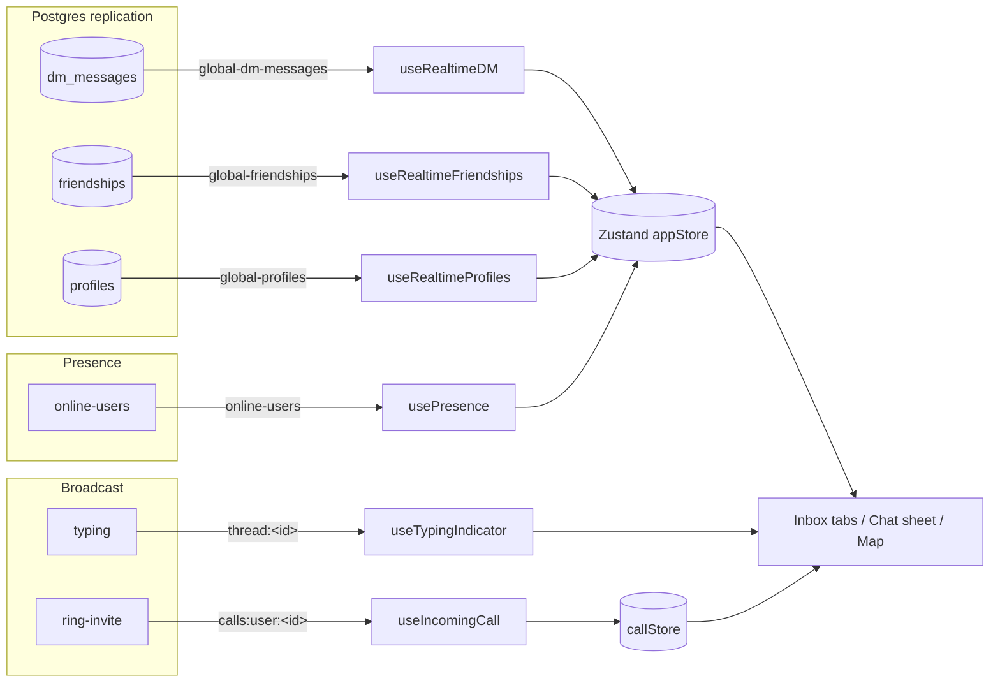

# Realtime

> Supabase Realtime channels (postgres_changes, broadcast, presence) that keep the single Zustand store live, so DM threads, friendships, presence, typing, and call rings update without page reloads.

## How it works

Every realtime hook follows the same shape:

1. Grab the singleton browser Supabase client — `createClient()` returns one shared `createBrowserClient` instance for the whole tab (`src/lib/supabase/client.ts:6`), so all channels share one WebSocket and one auth session.
2. Open a channel with `supabase.channel(<topic>)` and attach handlers via `.on("postgres_changes" | "broadcast" | "presence", …)`.
3. `.subscribe()`.
4. Inside the handler, call a **store action** (`useAppStore` setter) — never local React state, except `useTypingIndicator` which keeps a local list. Because the store is a single Zustand instance, the mutation propagates to every selector subscriber.
5. React components subscribed via selectors (`src/stores/selectors.ts`) re-render. Most list selectors use `useShallow` and several setters short-circuit on equality (see Gotchas), so unrelated screens don't thrash.

The `postgres_changes` hooks listen to Postgres replication on tables in the Realtime publication (the publication + table list live in [DATA](./DATA.md)). `broadcast` hooks are ephemeral pub/sub (typing, call signaling). `presence` is the soft online-roster.

### Composition under DeferredEffects

All the *global* hooks are mounted once, after preload, by `PreloadProvider`. `DeferredEffects` is only rendered after `requestIdleCallback` flips `deferred` true and only when a `profile.id` exists (`src/components/PreloadProvider.tsx:56-64`, `:75`):

```
DeferredEffects (src/components/PreloadProvider.tsx:19-27)
├─ useRealtimeSync()          → composes the three postgres_changes hooks
│   ├─ useRealtimeDM
│   ├─ useRealtimeFriendships
│   └─ useRealtimeProfiles
├─ usePresence(profileId)     → "online-users" presence channel
├─ useGeolocation()           → feeds userLocation (see MAPS)
├─ useNearbyPresence(profileId)→ polls /api/nearby (no realtime channel)
├─ useMeetingDetection(profileId)
└─ useIncomingCall(profileId) → "calls:user:<id>" ring broadcast (see CALLING)
```

`useRealtimeSync` is purely an orchestrator: it pulls the store setters once and hands them to three sub-hooks (`src/hooks/useRealtimeSync.ts:18-49`). Each sub-hook owns its own channel lifecycle and cleanup.

Per-screen (NOT global): `useTypingIndicator(threadId)` mounts inside the chat sheet, scoped to the open thread; `useWebRTCCall` (in [CALLING](./CALLING.md)) opens a `call:<threadId>` channel only during an active call.



## Channel reference

| Hook | Channel / topic | Mechanism | Store action(s) | Mounted by |
|---|---|---|---|---|
| `useRealtimeDM` (`src/hooks/useRealtimeDM.ts:113`) | `global-dm-messages` | postgres_changes — `dm_messages` INSERT + UPDATE, no filter | `addMessage`, `updateMessage`, `markThreadRead`, debounced `setThreads`/`updateTotalUnread` via `/api/dm/threads` | `useRealtimeSync` → DeferredEffects |
| `useRealtimeFriendships` (`src/hooks/useRealtimeFriendships.ts:71`) | `global-friendships` | postgres_changes — `friendships` event `*`, no filter | debounced refetch → `setFriends`, `setRequests`, `setSentRequests`, `updateStats` | `useRealtimeSync` → DeferredEffects |
| `useRealtimeProfiles` (`src/hooks/useRealtimeProfiles.ts:26`) | `global-profiles` | postgres_changes — `profiles` UPDATE, filter `id=eq.<currentUserId>` | `setProfile` (merged) | `useRealtimeSync` → DeferredEffects |
| `usePresence` (`src/hooks/usePresence.ts:34`) | `online-users` | presence (key = userId) | `setOnlineUsers` | DeferredEffects |
| `useNearbyPresence` (`src/hooks/useNearbyPresence.ts:12`) | — (HTTP poll, no channel) | `setInterval` POST `/api/nearby` every 10 s | `setNearbyUsers` | DeferredEffects |
| `useTypingIndicator` (`src/hooks/useTypingIndicator.ts:17`) | `thread:<threadId>` | broadcast — event `typing` | local `setTypingUserIds` (not the store) | per-screen (chat sheet) |
| `useIncomingCall` (`src/hooks/useIncomingCall.ts:34`) | `calls:user:<userId>` | broadcast — event `ring-invite` | `callStore.setIncomingInvite` / `clearInvite` — see [CALLING](./CALLING.md) | DeferredEffects |
| `useWebRTCCall` (`src/hooks/useWebRTCCall.ts:205`) | `call:<threadId>` | broadcast — event `call-signal`, `broadcast.self:false` | WebRTC SDP/ICE signaling — see [CALLING](./CALLING.md) | per-call |

## Presence

**`usePresence(userId)`** maintains the soft online roster. It opens `online-users` with `config.presence.key = userId` (`src/hooks/usePresence.ts:34-40`), so each user occupies one presence slot keyed by their id. On `presence` `sync`, it reads `channel.presenceState<PresenceState>()`, takes the first presence per key, and collects `user_id`s into an array passed to `setOnlineUsers` (`:43-54`). On `SUBSCRIBED` it `track({ user_id, online_at })` (`:57-64`).

Lifecycle nuances:
- **Visibility-aware**: `visibilitychange` `hidden` → `untrack()`, `visible` → re-`track()` (`:69-86`); `beforeunload` → `untrack()` (`:89-93`). So backgrounding a tab drops you from the roster.
- `setOnlineUsers` stores a `Set` and **short-circuits** if the membership is unchanged (`src/stores/appStore.ts:512-517`), so periodic syncs that don't change the roster cause no re-render.
- Consumers: `useIsUserOnline(userId)` reads the set (`src/hooks/usePresence.ts:112-116`); the chat header (`ChatSheetContent.tsx:94`, `:253`) and `FriendsTab`/`ChatsTab` (via `useOnlineUsers`, `src/components/inbox/FriendsTab.tsx:22`, `ChatsTab.tsx:28`) show online dots.

**`useNearbyPresence(userId)`** despite the name does **not** use a Realtime channel — it is HTTP polling. One effect debounce-POSTs the user's own location to `/api/location` when `userLocation` changes (`src/hooks/useNearbyPresence.ts:22-34`); a second effect POSTs `/api/nearby` (radius 2 km) immediately and then every 10 s, writing the result to `setNearbyUsers` (`:37-64`). `setNearbyUsers` preserves any `dev-seed-*` entries and short-circuits when the list is positionally identical (`src/stores/appStore.ts:538-546`). The nearby list feeds the map pins — see [MAPS](./MAPS.md).

## Typing indicators

`useTypingIndicator(threadId)` (`src/hooks/useTypingIndicator.ts`) is a *per-thread* broadcast hook returning `{ typingUserIds, sendTyping }`:

- **Receive**: subscribes to `thread:<threadId>`, listens for `broadcast` event `typing`, and appends the incoming `payload.userId` to a local `typingUserIds` state with a 3 s auto-expiry timer per user (`:17-45`). State is local to the hook, not the global store.
- **Send**: `sendTyping()` POSTs `/api/dm/<threadId>/typing`, debounced to once per 2 s (`:47-54`). The server (not the client) emits the broadcast: `/api/dm/[threadId]/typing/route.ts` verifies the caller is a thread participant, then POSTs the Supabase Realtime `/realtime/v1/api/broadcast` REST endpoint with the service-role key, topic `thread:<threadId>`, event `typing`, payload `{ userId }`. So typing fans out server-side and only legitimate participants can emit.

> TODO: verify — `useTypingIndicator` is defined and wired to the typing endpoint, but no component currently imports it (`grep` for `useTypingIndicator`/`sendTyping` finds no consumer outside the hook file). The broadcast pipeline is complete; the UI binding appears not yet mounted.

## DM live updates

The realtime path and the optimistic REST path coexist; the store dedups them.

**New messages (INSERT)** — `useRealtimeDM` (`src/hooks/useRealtimeDM.ts:115-155`):
1. Enrich the raw row with a sender profile from cached sources (`getKnownProfile` checks current profile, `profileCache`, friends, thread participants, existing messages — `:11-41`) to avoid a fetch.
2. `addMessage(thread_id, msg)` — appends to `threadMessages[threadId]`, **skipping if the id already exists** (`src/stores/appStore.ts:400-413`). This is what prevents the realtime echo from duplicating a message the sender already inserted optimistically via the POST response.
3. If sender wasn't cached, `fetchAndCacheProfile` then `updateMessage(...{ sender })` backfills it (`:132-142`).
4. If the user is currently viewing that thread (`activeThreadId === thread_id`) and isn't the sender, auto-POST `/api/dm/<id>/read` then `markThreadRead` (`:145-150`).
5. `debouncedRefetchThreads()` (500 ms) re-pulls `/api/dm/threads` to refresh unread counts and thread ordering (`:96-103`, `:152`).

**Edits / soft-deletes (UPDATE)** — the UPDATE handler calls `updateMessage(thread_id, id, msg)` (`:156-169`), which merges into the matching message in `threadMessages` (`appStore.ts:414-426`). Edits and `is_deleted` flips flow through the same path.

**Threads & unread** — `setThreads` / `updateTotalUnread` are driven by the debounced `/api/dm/threads` refetch, plus a throttled (30 s) refetch on tab `visibilitychange` `visible` to recover after backgrounding (`useRealtimeDM.ts:173-184`). `totalUnread` also drives the native tab + app badge (`PreloadProvider.tsx:66-71`).

**What re-renders:**
- Inbox `ChatsTab` reads `useThreads()` (`src/components/inbox/ChatsTab.tsx:26`) → new message / unread / reorder updates the list.
- Friends/requests tabs read `useFriends`/`useSentRequests`/`useRequests` (`FriendsTab.tsx:22`, `RequestsTab.tsx`) → friendship realtime updates them.
- Open chat `ChatSheetContent` reads `useThreadMessages(threadId)` (`ChatSheetContent.tsx:63`); `ChatMessageList` maps over `messages` with a memo comparator (`ChatMessageList.tsx:154`), so only the changed message bubble re-renders. `ChatComposer`, `ChatHeader`, `ChatProximityBanner` are presentational.

The DM REST endpoints (`/api/dm/...`) are documented in [API](./API.md); the `dm_messages` / `friendships` / `profiles` tables and which are in the Realtime publication are in [DATA](./DATA.md).

## Key files

| File | Role |
|---|---|
| `src/lib/supabase/client.ts` | Singleton browser client — one WebSocket/session for all channels |
| `src/hooks/useRealtimeSync.ts` | Orchestrator; composes DM + friendships + profiles hooks |
| `src/hooks/useRealtimeDM.ts` | `global-dm-messages` INSERT/UPDATE → message + thread store mutations |
| `src/hooks/useRealtimeFriendships.ts` | `global-friendships` `*` → debounced friends/requests refetch |
| `src/hooks/useRealtimeProfiles.ts` | `global-profiles` self-only UPDATE → `setProfile` merge |
| `src/hooks/usePresence.ts` | `online-users` presence track/sync → `setOnlineUsers`; `useIsUserOnline` selector |
| `src/hooks/useNearbyPresence.ts` | HTTP poll of `/api/nearby` → `setNearbyUsers` (map feed) |
| `src/hooks/useTypingIndicator.ts` | `thread:<id>` typing broadcast receive + debounced send |
| `src/hooks/useIncomingCall.ts` | `calls:user:<id>` ring broadcast → callStore |
| `src/components/PreloadProvider.tsx` | Mounts global hooks in `DeferredEffects` after preload + idle |
| `src/stores/appStore.ts` | Target of all store mutations (`addMessage`, `updateMessage`, `setOnlineUsers`, …) |
| `src/stores/selectors.ts` | `useShallow`/equality selectors the UI subscribes through |
| `src/app/api/dm/[threadId]/typing/route.ts` | Server-side broadcast emitter for typing |

## Gotchas / invariants

- **Echo dedup**: `addMessage` is an id-keyed no-op if the message already exists (`appStore.ts:404-406`). The sender's optimistic insert (from the POST response in `ChatSheetContent.tsx:121-128`) and the realtime INSERT echo converge to one bubble. Without this, every sent message would double.
- **One-time setup guard**: every global hook uses an `isSetupRef` flag plus `isMounted` so React StrictMode double-invoke / re-renders don't open duplicate channels; cleanup resets `isSetupRef` and `removeChannel`s. Missing the reset would leak channels on remount.
- **Gated on preload + auth**: hooks early-return while `isPreloading` and (for profiles/presence/calls) until a `userId` exists. `DeferredEffects` only renders with `profile?.id` and after `requestIdleCallback` (`PreloadProvider.tsx:75`). Because the SPA never hard-reloads on native (persistent WebView), a sign-out/sign-in changes `profileId`, which remounts `DeferredEffects` and re-subscribes the channels with the new identity.
- **Debounce/throttle**: DM thread refetch debounced 500 ms (`useRealtimeDM.ts:62`), friendships refetch debounced 1500 ms to avoid racing optimistic updates (`useRealtimeFriendships.ts:14`), visibility refetch throttled 30 s, typing send debounced 2 s, nearby poll fixed at 10 s.
- **Equality short-circuits**: `setOnlineUsers`, `setNearbyUsers`, `setBots`, `setVisibleUsers` return `{}` (no state change) when content is unchanged (`appStore.ts:512-551`), preventing wasteful re-renders from periodic syncs/polls.
- **Profile merge preserves derived fields**: `useRealtimeProfiles` re-applies `roles` from the in-memory profile after merging the DB row, because `roles` come from an RPC and aren't in the replicated `profiles` row (`useRealtimeProfiles.ts:42`). The channel is filtered to `id=eq.<currentUserId>` — you only get your own profile updates.
- **Typing/call broadcasts are server-emitted**: clients never broadcast directly; they POST an authenticated endpoint that uses the service-role key to call Supabase's broadcast REST API. This keeps emit authority server-side.

## Related

- [ARCHITECTURE](./ARCHITECTURE.md) — system hub
- [DATA](./DATA.md) — tables + which are in the Realtime publication
- [API](./API.md) — the `/api/dm/*`, `/api/friends/*`, `/api/nearby`, `/api/location` endpoints these hooks call
- [MAPS](./MAPS.md) — consumes the nearby-users feed
- [CALLING](./CALLING.md) — WebRTC signaling over `call:<threadId>` and the `calls:user:<id>` ring channel
- [PUSH](./PUSH.md) — out-of-app notifications (complement to in-app realtime)
