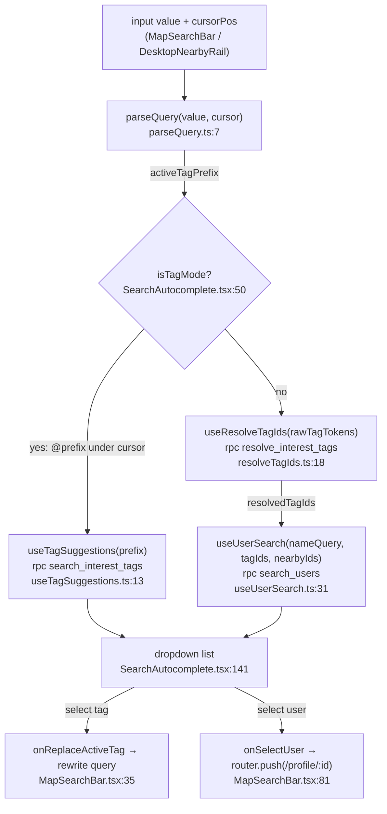

# Search

> Map search bar + autocomplete that finds people by name and `@interest` tags, hitting Supabase RPCs directly from the client.

## How it works

A raw input string is parsed into a name query plus `@tag` tokens. Tag names are resolved to interest-tag UUIDs, then two RPCs run in parallel paths: `search_users` (people) and `search_interest_tags` (tag autocomplete). Results render in a dropdown; selecting a user navigates to their profile.

Both call sites (`MapSearchBar` for mobile, `DesktopNearbyRail` for the desktop rail) render the same `SearchAutocomplete` and pass the same `onSelectUser`/`onReplaceActiveTag` handlers (`MapSearchBar.tsx:76`, `DesktopNearbyRail.tsx:146`). The map markers are filtered locally and separately — see [MAPS](./MAPS.md).

## Query parsing

`parseQuery(raw, cursorPos)` (`parseQuery.ts:7`) tokenizes on whitespace (`/\S+/g`, `parseQuery.ts:16`) and classifies each token:

- A token starting with `@` **and** under the cursor becomes `activeTagPrefix` (the lowercased text after `@`), driving tag autocomplete (`parseQuery.ts:30-31`). Cursor hit-test is inclusive on both ends so the cursor sitting on the `@` or the last char still activates the token (`parseQuery.ts:28`).
- Any other `@token` (non-empty after the `@`) is a completed tag, pushed lowercased into `rawTagTokens` (`parseQuery.ts:32-36`).
- Everything else joins into `nameQuery` with single spaces (`parseQuery.ts:37-43`).

Resulting shape `ParsedQuery = { nameQuery, rawTagTokens, activeTagPrefix }` (`parseQuery.ts:1-5`). Empty input short-circuits to all-empty (`parseQuery.ts:8-10`).

`useResolveTagIds(rawTagTokens)` (`resolveTagIds.ts:8`) maps those completed tag names to UUIDs via the `resolve_interest_tags(names)` RPC (`resolveTagIds.ts:18`), building a `ResolvedTagMap` keyed by lowercased name (`resolveTagIds.ts:29-37`, type at `types.ts:19`). It also exposes `unresolvedTokens` — tokens with no matching tag (`resolveTagIds.ts:39-42`). The query is gated on `rawTagTokens.length > 0` and cached for 5 min (`resolveTagIds.ts:25-26`).

## Data sources

There is **no dedicated search API route** — every search query goes straight from the browser to Supabase RPCs via `createClient()` (`@/lib/supabase/client`), wrapped in TanStack Query `useQuery`. Three RPCs (defined server-side in the remote Supabase project, not in-repo; tables in [DATA](./DATA.md)):

| Hook | RPC | Args | Returns |
| --- | --- | --- | --- |
| `useUserSearch` (`useUserSearch.ts:31`) | `search_users` | `q`, `tag_ids`, `nearby_ids` | `SearchUserResult[]` (`types.ts:1`) |
| `useTagSuggestions` (`useTagSuggestions.ts:13`) | `search_interest_tags` | `q` (prefix) | `SearchTagResult[]` (`types.ts:12`) |
| `useResolveTagIds` (`resolveTagIds.ts:18`) | `resolve_interest_tags` | `names` | `{id,name,icon}[]` |

> The static interests list (`/api/interests`, `interests/route.ts`) and username updates (`/api/profile/username`) are separate routes and are **not** part of the search path — they query `interest_tags` / `profiles` directly. See [API](./API.md).

Debouncing & gating:
- `useDebounce<T>(value, delay = 200)` (`useDebounce.ts:5`) is the lone debounce primitive — a `setTimeout`-backed `useState` cleared on change.
- `SearchAutocomplete` debounces the raw value at **200 ms** for *data fetching only* (`SearchAutocomplete.tsx:47`), then re-parses the debounced value with `cursor = debouncedValue.length` (end of string) (`SearchAutocomplete.tsx:48`). Live (un-debounced) parse is used only for the cursor-sensitive `isTagMode` decision (`SearchAutocomplete.tsx:41,50`).
- `useUserSearch` is enabled only when `nameQuery !== '' || tagIds.length > 0`, `staleTime` 30 s (`useUserSearch.ts:40-41`). `useTagSuggestions` is enabled only when `prefix !== null` (`useTagSuggestions.ts:18`).
- `search_users` results are split client-side into `nearby` vs `others` on `is_nearby` (`useUserSearch.ts:45-46`); `nearby_ids` is supplied by the caller from the map's nearby users (`MapSearchBar.tsx:18`).

## UI & result selection

`SearchAutocomplete` (`SearchAutocomplete.tsx:27`) always calls all three hooks (enabled flags gate the fetches, `SearchAutocomplete.tsx:52-64`) and renders one of: skeleton (loading), `TagSection` (tag mode), or `UserSection` grouped into **Nearby** then **People** (`SearchAutocomplete.tsx:156-172`, `247-276`). A flat item list backs Arrow/Enter keyboard nav (`SearchAutocomplete.tsx:67-132`); clicks use `onMouseDown` + `preventDefault` to avoid blurring the input before selection fires (`SearchAutocomplete.tsx:203-206,298-301`). The dropdown closes on click-outside or Escape (`SearchAutocomplete.tsx:89-101,106-109`) and renders nothing for empty input (`SearchAutocomplete.tsx:135`).

Selecting a **tag** calls `onReplaceActiveTag({ name })`, which rewrites the query: it finds the last `@` before the cursor and replaces the active token with `@name ` (consuming any trailing space to avoid a double space), then repositions the cursor (`MapSearchBar.tsx:35-46`).

Selecting a **user** calls `onSelectUser(userId)`. In both call sites this is `router.push('/profile/${userId}')` (`MapSearchBar.tsx:81`, `DesktopNearbyRail.tsx:151`) — it navigates to the profile page rather than highlighting on the map.

> Note: search selection does **not** call the appStore `selectUser`/`highlightedUserId` map-highlight flow. The map bar's local text filter (`handleSearch`) only narrows `visibleUsers` (`MapSearchBar.tsx:20-33`, `appStore.ts:547`); the autocomplete dropdown is the discovery surface. The `selectUser` → `/api/profile/:id` prefetch + `highlightedUserId` highlight path (`appStore.ts:554`) is driven by map pin taps, documented in [MAPS](./MAPS.md).

## Key files

| File | Role |
| --- | --- |
| `src/lib/search/parseQuery.ts` | Tokenize raw query → `nameQuery` / `rawTagTokens` / `activeTagPrefix`. |
| `src/lib/search/resolveTagIds.ts` | `useResolveTagIds` — tag names → UUIDs via `resolve_interest_tags` RPC. |
| `src/lib/search/types.ts` | `SearchUserResult`, `SearchTagResult`, `ResolvedTagMap` shapes. |
| `src/hooks/useUserSearch.ts` | Debounced people search via `search_users` RPC; splits nearby/others. |
| `src/hooks/useTagSuggestions.ts` | Tag autocomplete via `search_interest_tags` RPC. |
| `src/hooks/useDebounce.ts` | Generic 200 ms-default debounce primitive. |
| `src/components/search/SearchAutocomplete.tsx` | Dropdown UI, keyboard nav, orchestrates the three hooks. |
| `src/components/map/MapSearchBar.tsx` | Mobile map search pill; rewrites query on tag select, routes on user select. |
| `src/components/map/DesktopNearbyRail.tsx` | Desktop rail; second mount of `SearchAutocomplete`. |

## Gotchas / invariants

- **No dedicated search route.** All three RPCs run client-side through `createClient()`; filtering/ranking (incl. blocked/self exclusion) happens inside the Postgres functions, not in this code — verify policy in [DATA](./DATA.md). `SearchUserResult.rank` (`types.ts:9`) is computed server-side and is not re-sorted client-side.
- **Two parses, two cursors.** `isTagMode` uses the *live* parse (cursor-sensitive); fetches use the *debounced* parse with cursor forced to end-of-string. Mixing them up would make tag mode lag a frame behind typing (`SearchAutocomplete.tsx:41-50`).
- **200 ms debounce** applies to the value, not per-hook; there is no separate min-query-length guard beyond the `enabled` conditions (empty `nameQuery` + no `tagIds` ⇒ no user fetch).
- **Tag tokens are lowercased** on parse and on resolution-map keys; `resolve_interest_tags` and the `ResolvedTagMap` lookup both assume lowercase (`parseQuery.ts:31,33`; `resolveTagIds.ts:33,40`). Unresolvable `@tokens` silently drop out of `resolvedTagIds` (they're not sent to `search_users`).
- **Query-key stability:** array args are `[...].sort()`ed into the TanStack key (`useUserSearch.ts:26-28`, `resolveTagIds.ts:15`) so order-only changes don't refetch. `resolveTagIds` additionally de-dupes via `new Set` in its key but passes the raw (possibly duplicated) `rawTagTokens` to the RPC.
- **Click handlers use `onMouseDown`+`preventDefault`** intentionally; switching to `onClick` would blur the input first and the click-outside handler would close the dropdown before selection.
- **Selection ≠ map highlight.** Picking a user navigates to `/profile/:id`; it does not set `highlightedUserId`. The map's local `handleSearch` text filter is independent of the autocomplete RPC results.

## Related

- [MAPS](./MAPS.md) — map markers, `selectUser`/`highlightedUserId`, nearby users, visible-user filtering.
- [DATA](./DATA.md) — `profiles`, `interest_tags`, and the `search_users` / `search_interest_tags` / `resolve_interest_tags` RPC definitions, ranking, and block/self filtering.
- [API](./API.md) — `/api/interests` and `/api/profile/username` (adjacent, not part of search).
- [ARCHITECTURE](./ARCHITECTURE.md) — doc hub.
