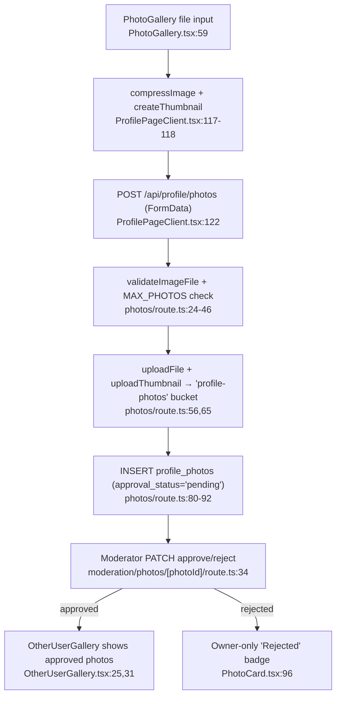

# Image Upload & Moderation

> How profile photos and cover images are compressed in the browser, stored in Supabase Storage, recorded as rows, and gated through a moderator approval queue before they become public.

## How it works

The live, working path is **profile photo upload**. A user picks a file in `PhotoGallery`, the client compresses it (full image + thumbnail) with `browser-image-compression`, then POSTs a `multipart/form-data` body to `/api/profile/photos`. The route validates, writes both files to the `profile-photos` Storage bucket, and inserts a `profile_photos` row with `approval_status: "pending"`. A moderator later approves/rejects it via `/api/moderation/photos/[photoId]`. Only `approved` photos are shown to other users; `pending`/`rejected` are visible only to the owner.

## Client compression

`src/lib/image-compression.ts` wraps `browser-image-compression`:

- `compressImage(file, maxSizeMB = 0.5)` — returns the file untouched if it is under 100 KB (`image-compression.ts:4`); otherwise compresses to a `maxSizeMB` target of **0.5 MB** with `maxWidthOrHeight: 1920` and `useWebWorker: true` (`image-compression.ts:6-10`).
- `createThumbnail(file)` — a separate ~50 KB / 300 px thumbnail (`maxSizeMB: 0.05`, `maxWidthOrHeight: 300`) (`image-compression.ts:13-19`).

`src/components/profile/ProfilePageClient.tsx` runs both and builds the `FormData` (`ProfilePageClient.tsx:100-104`, `117-121`): the compressed full image goes in `file`, the thumbnail in `thumbnail`. **Upload mechanism: there is no signed URL / direct-to-Storage path.** The browser POSTs the `FormData` to the Next.js route, and the route's server-side Supabase client writes to Storage. The shared `uploadFile`/`uploadThumbnail` helpers in `src/lib/upload.ts` call `supabase.storage.from(bucket).upload(...)` and return the public URL via `getPublicUrl` (`upload.ts:21-28`, `44-53`).

## Upload endpoint

There are three server routes that accept image uploads; all use `withAuth` (authenticated user required, see [AUTH](./AUTH.md)) and the same validation helpers in `src/lib/upload.ts`.

**`/api/profile/photos` (POST) — the live photo path.** `ProfilePageClient` calls this. Behavior (`profile/photos/route.ts`):
- Accepts `multipart/form-data`: `file` (required `File`), `thumbnail` (optional `File`), `is_private` (string `"true"`).
- Enforces `MAX_PHOTOS = 12` via a count query (`route.ts:24-31`) **and** relies on a DB constraint that raises `P0001`/`PHOTO_LIMIT_REACHED` as a backstop (`route.ts:100-102`).
- Validates with `validateImageFile` — MIME must be in `ALLOWED_IMAGE_TYPES`, size `≤ MAX_FILE_SIZE` (2 MB) (`upload.ts:4-8`, `constants.ts:2-4`).
- **Bucket: `profile-photos`** (`route.ts:56,65`). Object key is `${user.id}/${timestamp}.${ext}`; thumbnail is `${user.id}/${timestamp}_thumb.${ext}` (`route.ts:51,53`). Extension is sanitized against `ALLOWED_EXTENSIONS` (`upload.ts:10-13`).
- Returns `{ photo }` (the inserted row) with `201`.

**`/api/upload` (POST).** A generic helper that uploads to the **`media`** bucket (`upload/route.ts:23,32,36`) and returns `{ url, thumbnailUrl }` without creating any DB row. > TODO: verify — no app code calls this endpoint (only its test references it), and the `media` bucket does not exist in the live project (see Gotchas), so it would fail at upload time.

**`/api/profile/cover` (POST).** Uploads to the **`covers`** bucket (`cover/route.ts:22`) and updates `profiles.cover_image_url` (`cover/route.ts:28-31`), returning `{ coverImageUrl }`. > TODO: verify — no app code POSTs to this route, `ProfileCover.tsx` only *renders* `coverImageUrl`, and the `covers` bucket does not exist live, so cover upload is effectively wired-but-unreachable.

For the canonical bucket inventory, see [DATA](./DATA.md) (its storage section flags the missing `media` bucket; this doc confirms `covers` is also missing and only `profile-photos` exists).

## Photo & cover records

**Creation** (`profile/photos/route.ts:80-92`): a `profile_photos` row is inserted with `user_id`, `storage_path` (the bucket key, not the URL), `url`, `thumbnail_url`, `display_order`, `is_private`, and `approval_status: "pending"`.

**Ordering**: `display_order` is computed as `max(display_order) + 1` per user (`route.ts:69-77`); `GET /api/profile/photos` returns rows ordered by `display_order ascending` (`route.ts:11`). Order/flags are mutated through `PATCH /api/profile/photos/[photoId]` (`photoUpdateSchema`: `display_order`, `is_avatar`, `is_private`).

**Avatar / private rules** (`[photoId]/route.ts`):
- Setting `is_avatar` requires `approval_status === "approved"` and a non-private photo (`route.ts:54-60`), then goes through the atomic `set_avatar` RPC which clears other avatars and syncs `profiles.avatar_url` in one call (`route.ts:63-78`).
- Making a photo private that is the current avatar clears `is_avatar` and nulls `profiles.avatar_url` (`route.ts:40-50`).

**Deletion** (`[photoId]/route.ts:101-158`): ownership is checked, then the atomic `delete_photo` RPC removes the row and clears `profiles.avatar_url` if it was the avatar. Storage cleanup is **best-effort, after** the DB delete — the main object and the derived `_thumb` path are removed and failures are only logged, not fatal (`route.ts:139-155`).

**Cover**: stored as a scalar `profiles.cover_image_url` (no per-cover table); the column is replaced on each upload but the old Storage object is **not** deleted (`cover/route.ts:28-31`).

## Moderation

Two routes under `/api/moderation/photos`, both gated by `requireModeratorRole` which 403s unless the caller holds the `moderator` or `admin` role via the `user_has_role` RPC (`auth.ts:38-50`; see [AUTH](./AUTH.md) for the role model).

- **`GET /api/moderation/photos`** (`moderation/photos/route.ts`) — paginated queue filtered by `status` (`pending` default / `approved` / `rejected`), joined to the owner and reviewer profiles, ordered oldest-first (`route.ts:8-27`).
- **`PATCH /api/moderation/photos/[photoId]`** (`[photoId]/route.ts`) — `moderationActionSchema` requires `action: "approve" | "reject"` and a non-empty `reason` when rejecting (`validators.ts:63-71`). It sets `approval_status` to `approved`/`rejected`, stamps `reviewed_by`, `reviewed_at`, and `rejection_reason` (cleared on approve) (`[photoId]/route.ts:22-42`).

**How non-approved photos are handled in the UI:**
- **Owner** sees all their photos in `PhotoGallery`/`PhotoCard` with status badges: a yellow "Pending" badge (`PhotoCard.tsx:90-95`) and a red "Rejected" badge whose `title` shows `rejection_reason` plus a dark X overlay (`PhotoCard.tsx:69-73`, `96-104`). Set-as-avatar and make-private actions are only offered on `approved` photos (`PhotoCard.tsx:135,144`).
- **Other viewers** never see non-approved photos: `OtherUserGallery` filters to `approval_status === "approved"` before rendering (`OtherUserGallery.tsx:25,31`).

**`BlurredPhoto.tsx` is a premium gate, not a moderation gate.** In `OtherUserGallery`, *approved-but-private* photos are blurred for non-premium viewers behind a "Premium Only" lock (`OtherUserGallery.tsx:67-78`, `BlurredPhoto.tsx`); premium viewers see them in full. Unmoderated (pending/rejected) photos are simply omitted, not blurred. See [PAYMENTS](./PAYMENTS.md) for the premium tier.

## Key files

| File | Role |
| --- | --- |
| `src/lib/image-compression.ts` | Client `compressImage` (0.5 MB / 1920 px) + `createThumbnail` (0.05 MB / 300 px) |
| `src/lib/upload.ts` | `validateImageFile`, `sanitizeExtension`, `uploadFile`/`uploadThumbnail` (Storage helpers + `getPublicUrl`) |
| `src/lib/constants.ts` | `ALLOWED_IMAGE_TYPES`, `ALLOWED_EXTENSIONS`, `MAX_FILE_SIZE` (2 MB), `MAX_THUMBNAIL_SIZE` (512 KB), `MAX_PHOTOS` (12) |
| `src/app/api/profile/photos/route.ts` | GET list + POST create → `profile-photos` bucket, inserts `profile_photos` (pending) |
| `src/app/api/profile/photos/[photoId]/route.ts` | PATCH (order/avatar/private via `set_avatar`) + DELETE (`delete_photo` RPC + Storage cleanup) |
| `src/app/api/profile/cover/route.ts` | POST cover → `covers` bucket, updates `profiles.cover_image_url` (bucket missing live) |
| `src/app/api/upload/route.ts` | Generic upload → `media` bucket; no DB row, no app caller (bucket missing live) |
| `src/app/api/moderation/photos/route.ts` | Moderator-gated review queue (paginated, by status) |
| `src/app/api/moderation/photos/[photoId]/route.ts` | Moderator approve/reject + reason |
| `src/components/profile/{PhotoGallery,PhotoCard}.tsx` | Owner gallery: upload trigger, grid, status badges, per-photo menu |
| `src/components/profile/OtherUserGallery.tsx` | Visitor gallery: approved-only filter + premium private gating |
| `src/components/profile/BlurredPhoto.tsx` | "Premium Only" blurred placeholder for private photos |
| `src/components/profile/ProfileCover.tsx` | Renders `cover_image_url` (display only; no upload UI) |

## Gotchas / invariants

- **Only the `profile-photos` bucket exists live.** Verified against the project DB: a single bucket `profile-photos` (public, 2 MB limit, MIME allowlist `jpeg/png/webp/gif`). The `media` bucket (`/api/upload`) and the `covers` bucket (`/api/profile/cover`) referenced in code **do not exist** — those endpoints would error on upload. This corroborates and extends the DATA TODO (which only flagged `media`). See [DATA](./DATA.md).
- **Public URLs, not signed.** `uploadFile` returns `getPublicUrl` (`upload.ts:27`); there is no signing/expiry. The `profile-photos` bucket is public, which also means it "allows listing" (a known WARN-level Supabase advisory noted in [DATA](./DATA.md)). Access control for private photos is enforced in the app layer (filtering + blur), not by Storage.
- **Two independent size limits.** `MAX_FILE_SIZE = 2 MB` (`constants.ts:4`) is validated server-side; the client only targets 0.5 MB and *skips compression entirely for files under 100 KB* (`image-compression.ts:4`), so a borderline original can still be rejected by the 2 MB check.
- **MIME allowlist mismatch with extension fallback.** Allowed types include `image/gif` (`constants.ts:2`), and `sanitizeExtension` falls back to `jpg` for any unrecognized extension (`upload.ts:11-12`) — a `.gif` stored as `.jpg` keeps its real bytes/contentType but a misleading object key.
- **New photos default to `pending` and are invisible to others** until a moderator approves; the owner can't set a pending photo as avatar (`[photoId]/route.ts:54`).
- **Photo-count cap is enforced twice** — an app-side count (`route.ts:24-31`) and a DB constraint backstop (`P0001`/`PHOTO_LIMIT_REACHED`, `route.ts:100-102`) — to avoid races.
- **Orphaned files on failure/replace.** On a failed row insert the route removes the just-uploaded objects (`route.ts:96-99`), but Storage cleanup on DELETE is best-effort/non-fatal (`[photoId]/route.ts:142-155`) and cover replacement never deletes the previous object — both can leak orphaned files.
- **Avatar and delete mutations must go through RPCs** (`set_avatar`, `delete_photo`) so `profiles.avatar_url` stays in sync atomically; don't write `profile_photos`/`profiles.avatar_url` directly.
- **`BlurredPhoto` ≠ moderation.** It is the premium gate for *approved private* photos; do not assume blurred = unmoderated.

## Related

- [DATA](./DATA.md) — Storage bucket inventory, `profile_photos`/`profiles` schema, `set_avatar`/`delete_photo` RPCs.
- [AUTH](./AUTH.md) — `withAuth`, `requireModeratorRole`, and the moderator/admin role model.
- [API](./API.md) — route-handler conventions (`apiError`, `parseBody`, Zod validators).
- [PAYMENTS](./PAYMENTS.md) — premium tier that unlocks private photos.
- [ARCHITECTURE](./ARCHITECTURE.md) — doc hub.
